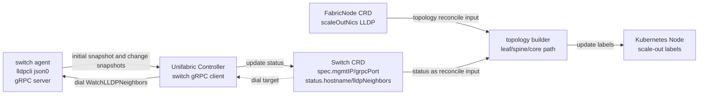

# Scale-Out Topology Discovery

## Overview

This document describes a topology discovery design for scale-out networks with leaf, spine, and core tiers. A lightweight switch agent runs on each switch and periodically collects LLDP neighbor information. The Unifabric Controller actively establishes long-lived gRPC subscriptions to receive these neighbor snapshots and writes the results into the `status` of the `Switch` CRD. The Controller then combines that switch-side data with host NIC information recorded in `FabricNode` and computes the full scale-out topology. The resulting leaf, spine, and core assignments for GPU nodes are written back as Kubernetes Node labels. In the current version, `Switch` is the switch-side API resource and Node labels are the scheduling-facing topology output; no separate group CRD is installed.

Earlier leaf-only grouping could only express the direct leaf layer for a node. This design replaces that path with a unified control-plane flow for leaf, spine, and core topology. The Controller continuously consumes switch neighbor data, maintains topology groups internally, and writes the results back to Node labels.

## Motivation

AI and ML workloads typically require heavy Pod-to-Pod communication to make progress. To preserve runtime performance and control total cost, it is important to ensure that the running Pods have high-throughput network connectivity between them. Topology information helps the scheduler place workload Pods onto nodes that are close to each other in the network fabric.

Today, the main input comes from `FabricNode.status.scaleOutNics`. That data can only tell the Controller which leaf switches are directly connected to a given GPU node. It cannot answer two additional questions.

1. Which spine and core tiers exist above those leaf switches.
2. How those tiering results should be written into objects and Node labels that a scheduler can consume directly.

That is also the boundary of the earlier leaf-only model. It is not suitable for carrying spine and core results, and it cannot directly express the relationship between switches and nodes. With only that input path, schedulers such as Kueue still cannot consume a stable and reusable scale-out topology model.

This proposal brings switch-side LLDP neighbor data into the Controller, fills in switch-to-switch and switch-to-node relationships, and combines that data with node-side inputs to compute the full scale-out topology. From those inputs, the Controller can generate the corresponding leaf, spine, and core Node labels. At the same time, the solution still needs to keep implementation complexity under control and avoid giving every switch its own Kubernetes credentials or a complicated per-switch TLS configuration.

### Goals

- Identify leaf, spine, and core tiers in the scale-out network of a GPU cluster instead of stopping at leaf-only discovery.
- Continuously write topology results into stable and consumable Kubernetes Node labels that can be used directly by schedulers such as Kueue.
- Allow GPU cluster administrators to apply topology-aware scheduling based on those labels to improve runtime performance and control overall cost.
- Keep switch onboarding and certificate operations at an acceptable complexity level.

### Non-goals

- This phase does not cover topology discovery for scale-up networks or storage networks. The scope stays focused on scale-out only.

## Solution

The solution has four parts.

1. `unifabric-switch-agent` runs on each switch, periodically collects LLDP neighbor information, and exposes full snapshots through a gRPC server.
2. The Controller acts as a gRPC client, actively subscribes to LLDP snapshots from each switch, and writes the result into `Switch.status`.
3. `SwitchTopologyDiscoveryController` takes `FabricNode` and `Switch` as inputs, computes the leaf, spine, and core tiers for GPU nodes, and keeps the topology groups as an internal projection.
4. The Controller writes the final topology results back to Kubernetes Node labels according to the `topologyLabels` configuration in the chart.

Scale-out topology discovery and label reconciliation are handled by `SwitchTopologyDiscoveryController`; no leaf-group CR is installed. The Controller uses `Switch.spec` to obtain dial targets, establishes secure connections with global pinned mTLS, persists the returned `switch_name` into `Switch.status.hostname`, and uses that reported hostname as the alias source when reconciling switch-side and node-side topology data.

### User story

#### Story 1 Topology-aware scheduling in a GPU cluster

As a GPU cluster administrator, I want Unifabric to automatically discover leaf, spine, and core topology in the scale-out network and write the results into stable Kubernetes Node labels. That allows me to use topology-aware scheduling capabilities in systems such as Kueue without directly handling raw LLDP data, switch vendor differences, or multi-hop topology calculations.

### Constraints and considerations

- The Unifabric Controller actively connects to the switch agent gRPC service. That keeps connection lifecycle management, authentication, and reconnect logic centralized in the Controller.
- The transport uses long-lived gRPC connections. The current design starts with a server-streaming RPC: the initial connection sends a full snapshot, and later updates send a new full snapshot only when LLDP changes.
- The current design uses global pinned mTLS instead of per-switch certificates. The Controller holds one client certificate, the switch agent holds one server certificate, and each side validates that the peer certificate matches the expected value directly. There are no per-switch Secrets, SNI requirements, or IP SAN requirements.
- The current priority is NVIDIA Cumulus, NVIDIA SONiC, and community SONiC.
- Scale-out topology functionality is designed around `Switch` inputs and Node label outputs; no separate leaf-group CR is installed.
- The `Switch` CRD and the switch topology discovery controller path form the implementation.
- Internal topology groups represent the performance domains for leaf, spine, and core tiers. The tiering semantics follow the network topology layering ideas used by Volcano. Whether CIDR-based grouping is needed, and whether a higher-level `Topology` CRD is needed later, remain future evolution topics.

### Risks and mitigations

- One risk is that if the long-lived connection breaks or switch-side collection fails, the neighbor data stored in `Switch.status` becomes stale and delays Node label updates. The mitigation is to keep exponential backoff reconnects and periodic resyncs on the Controller side, and expose data freshness and connection state through `status.healthy` and conditions.
- One risk is that global pinned mTLS proves the peer role but does not prove the specific device identity by itself. The current implementation mitigates topology correlation by persisting the returned `switch_name` into `Switch.status.hostname` and using that reported hostname as the alias source when matching switch-side and node-side LLDP data. If stricter device identity pinning is required later, the optional `expected_switch_name` request field can be enabled to reject mismatches.
- One risk is that very large switch neighbor tables lead to oversized messages or CRD bloat. The mitigation is to set `maxRecvMsgSize` explicitly on both sides of gRPC and store only the structured neighbor table instead of the full raw JSON long-term.
- One risk is that auto-generated certificates rotate unexpectedly during `helm upgrade`. The mitigation is for the chart to reuse Helm-owned Secrets through `lookup` when auto-generation is enabled, instead of re-issuing them on every render.

### Rollout

The switch-driven path is the scale-out topology implementation. The rollout sequence should keep that ownership boundary explicit.

1. Build or publish a matched controller image, node agent image, and switch-agent image for the same code revision.
2. Prepare switch-side pinned mTLS materials and deploy `unifabric-switch-agent` to every scale-out switch before enabling switch-driven discovery in the cluster.
3. Create one `Switch` resource per managed scale-out switch so the Controller has dial targets for every switch-agent endpoint.
4. Enable `switchTopologyDiscovery.enabled=true` so the Controller starts the switch-driven scale-out path.
5. Verify that `Switch.status` becomes healthy and GPU node labels are written from the switch-driven path.

## Design details

### Overall architecture



### Supported scope and validation status

- The current priority is NVIDIA Cumulus, NVIDIA SONiC, and community SONiC.

### Data sources

There are two categories of input data.

- On the node side, `FabricNode.status.scaleOutNics[*].lldpNeighbor` provides the connection between a GPU node and its leaf switches. Only scale-out NICs are used. Storage NICs and scale-up NICs are ignored.
- On the switch side, `Switch.status.hostname` carries the switch-reported hostname, and `Switch.status.lldpNeighbors` stores aggregated LLDP relationships for switch-to-switch and switch-to-node links. That data is used to correlate switch aliases, classify remote peers, and identify the spine and core tiers above each leaf.

### Switch agent

Each switch runs `unifabric-switch-agent`. It does not require Kubernetes permissions. Its only job is to collect local LLDP neighbor snapshots and expose a gRPC stream that the Controller can subscribe to.

The core flow is as follows.

1. Parse configuration such as the local hostname, management IP, gRPC listen address, server certificate and private key, the expected Controller client certificate, and the collection interval.
2. Periodically enter the host mount and network namespaces and execute the host `lldpcli`:

```bash
nsenter --mount=/host/proc/1/ns/mnt --net=/host/proc/1/ns/net -- lldpcli show neighbors -f json0
```

3. Compare the result with the previous snapshot and generate a new full snapshot if LLDP has changed.
4. Expose a gRPC server and wait for the Controller to establish a subscription.
5. After the Controller connects, return the current full snapshot first, then push new full snapshots on the same stream whenever LLDP changes.
6. After the stream disconnects, the Controller reconnects with exponential backoff. The agent does not need to buffer incremental events.

The switch agent only sends full snapshots on the initial connection and when LLDP changes. It does not send deltas. The Controller can treat each message as the current full neighbor view of that switch and does not need to handle deletion logic or out-of-order incremental updates.

### gRPC subscription interface

The switch agent exposes a dedicated gRPC server. The Controller acts as a gRPC client and maintains long-lived connections to each switch. Global dial behavior and global pinned mTLS are configured through Helm values. Each switch only provides its dial target in `Switch.spec`.

```yaml
switchTopologyDiscovery:
  enabled: true
  dialTimeout: 5s
  reconnectBackoff: 30s
  maxRecvMsgSize: 4194304
  keepaliveTime: 30s
  defaultGrpcPort: 8090
  mtls:
    autoGenerate: true
    validityDays: 36500
    controllerSecretName: switch-controller-mtls-controller
    switchAgentSecretName: switch-controller-mtls-agent
  ignoreSwitchPorts:
    - mgmt*
    - Management*
    - oob*
```

`controllerSecretName` and `switchAgentSecretName` are not two copies of the same certificate. They store the mTLS identity materials for the Controller and the switch agent separately. Technically, both private keys could be stored in one Secret, but the current design intentionally splits the certificate bundles so that exporting switch-agent certificates to a switch does not also export the Controller private key outside the cluster.

`ignoreSwitchPorts` is applied by the Controller before writing `Switch.status` and before building the topology graph. The switch agent always reports full LLDP snapshots.

#### Subscription service

The recommendation is to define a dedicated proto such as:

```proto
service SwitchReporter {
  rpc WatchLLDPNeighbors(WatchLLDPNeighborsRequest) returns (stream LLDPNeighborSnapshot);
}

message WatchLLDPNeighborsRequest {
  string expected_switch_name = 1;
}

message LLDPNeighborSnapshot {
  string switch_name = 1;
  repeated LLDPNeighbor lldp_neighbors = 2;
  uint64 generation = 3;
}

message LLDPNeighbor {
  string local_device_name = 1;
  string local_port = 2;
  string remote_system_name = 3;
  string remote_port_id = 4;
}
```

The subscription semantics are as follows.

- The Controller reads `spec.mgmtIP` and the optional `spec.grpcPort` from each switch through list/watch on `Switch` resources and uses that data to establish the gRPC connection.
- When `spec.mgmtIP` is empty, the Controller does not establish a subscription stream for that switch.
- The actual dial target is `spec.mgmtIP:spec.grpcPort`. If `grpcPort` is empty, the global `defaultGrpcPort` is used.
- `metadata.name` does not need to match the switch-reported hostname. The Controller persists the returned `switch_name` into `Switch.status.hostname` and uses that reported hostname as the alias source when reconciling topology.
- If `Switch.spec.mgmtIP` or `Switch.spec.grpcPort` changes, the Controller must close the old connection and rebuild the subscription with the new configuration.
- `expected_switch_name` remains an optional request field. The current Controller leaves it empty. When a caller sets it, the agent validates it against the local switch hostname and may return `FailedPrecondition` on mismatch.
- After the agent accepts the connection, it immediately returns the current full snapshot and later pushes a new full snapshot whenever LLDP changes.
- `lldp_neighbors` uses a structured array rather than passing through raw `lldpcli json0` output.
- Each neighbor entry contains at least `local_device_name`, `local_port`, `remote_system_name`, and `remote_port_id`.
- `switch_name` must match `local_device_name` in each neighbor entry, or both must normalize to the same DNS-1123 name.
- `generation` is monotonically increasing per switch so that the Controller can drop duplicate or out-of-order snapshots.

The interface constraints are as follows.

- Use a server-streaming RPC. The Controller actively connects and the agent pushes snapshots on the stream.
- Every message represents the current full LLDP neighbor view of the switch. The Controller can overwrite the old state directly.
- The Controller client must set `maxRecvMsgSize`, and the agent server must set a matching send limit, so that large switch neighbor tables are not rejected by default size limits.
- When there is no LLDP change, no empty snapshot is sent. Link liveness relies on gRPC keepalive and Controller-side reconnect behavior.
- If the Controller later needs to send debugging commands or dynamic filters on the same connection, the API can be extended to bidirectional streaming, but that is out of scope for this proposal.

#### Authentication and exposure

This proposal uses global pinned mTLS.

- By default, the chart auto-generates two sets of pinned mTLS identity materials: one for the Controller as the client certificate and private key, and one for the switch agent as the server certificate and private key. The default validity period is `36500` days, about `100` years.
- When auto-generation is enabled, the chart uses Helm certificate helpers during installation to generate the two pinned certificate bundles and uses `lookup` to reuse existing Helm-owned Secrets, so that `helm upgrade` does not reissue certificates on every render.
- The Controller loads its own client certificate, private key, and the expected switch-agent server certificate from `mtls.controllerSecretName`. The Secret should include `tls.crt`, `tls.key`, and `peer.crt`.
- The switch agent loads its own server certificate, private key, and the expected Controller client certificate from the bundle referenced by `mtls.switchAgentSecretName`. That bundle should also include `tls.crt`, `tls.key`, and `peer.crt`.
- The Controller-side Secret is mounted directly by the chart. The switch-agent certificate bundle is generated by the chart and then exported with `kubectl get secret` so it can be copied to each switch.
- The design intentionally uses two Secrets instead of putting both private keys into one Secret. The switch side only needs the switch-agent private key and should not receive the Controller private key.
- No serverName, SNI, or IP SAN is required, and the `Switch` resource does not store per-switch Secret or TLS fields.
- In this model, all switch agents may share the same server certificate. TLS only proves that the peer is a valid switch agent or Controller. It does not prove which device it is, so the current implementation relies on the reported `switch_name` written to `Switch.status.hostname` for topology alias resolution. If stricter device identity pinning is needed later, the optional `expected_switch_name` check can be enabled.
- If the management network is trusted and plaintext gRPC is needed temporarily for development or debugging, mTLS may be disabled, but that is not the default deployment mode.
- If the organization already has an existing certificate infrastructure, `autoGenerate` can be disabled and existing values can be provided for `controllerSecretName` and `switchAgentSecretName`.

If finer-grained device identity is needed later, the design can evolve to per-switch certificates or switch back to a standard CA + SAN TLS model.

### Switch resource model

`Switch` is a cluster-scoped resource that represents a switch management address and the latest observed LLDP state. `spec` only describes where the Controller should connect. It does not carry per-switch authentication materials. Authentication and TLS are handled by global Controller and agent settings. `status` is refreshed continuously by the Controller based on the subscription stream, stores the reported switch hostname separately from the Kubernetes resource name, and keeps aggregated LLDP neighbors grouped by remote system. The switch agent never writes Kubernetes API objects directly.

Example:

```yaml
apiVersion: unifabric.io/v1beta1
kind: Switch
metadata:
  name: rack-a-leaf1
spec:
  mgmtIP: 10.0.0.11
  grpcPort: 8090
status:
  hostname: leaf1
  healthy: true
  conditions:
    - type: Connected
      status: "True"
      reason: StreamReady
      message: Controller is receiving LLDP snapshots from switch agent
  lldpNeighborCount: 2
  lldpNeighbors:
    - remoteSystemType: KubernetesNode
      remoteSystemName: node-a
    - remoteSystemType: Switch
      remoteSystemName: spine1
```

Recommended fields:

| Field | Meaning |
| --- | --- |
| `metadata.name` | Switch resource name. It must be unique in the cluster, but it does not need to match the switch-reported hostname. |
| `spec.mgmtIP` | Switch management IP, used for operator visibility, troubleshooting, and default dial target generation. |
| `spec.grpcPort` | Optional. If the switch gRPC server port is not set, the global `defaultGrpcPort` is used. |
| `status.hostname` | The switch-reported hostname from the latest accepted snapshot. It is used as the alias source when matching switch-side data with node-side LLDP hostnames. |
| `status.healthy` | Whether the current observed switch state is healthy, based on connection state, authentication result, and snapshot freshness. |
| `status.conditions` | Connection state and data readiness state, such as `Connected` and `Ready`. |
| `status.lldpNeighborCount` | The number of aggregated remote-system entries in `lldpNeighbors`, for quick visibility and troubleshooting. |
| `status.lldpNeighbors` | Unique remote neighbors observed for this switch. |
| `status.lldpNeighbors[*].remoteSystemType` | Whether the remote system resolves to a Kubernetes Node or another switch. |
| `status.lldpNeighbors[*].remoteSystemName` | The remote host or switch name for this neighbor entry. |

### Topology computation flow

Add `SwitchTopologyDiscoveryController` as the target controller for scale-out topology. It is responsible for computing leaf, spine, and core topology groups, maintaining the topology tiers, and writing labels back to nodes.

This controller is the only Unifabric writer for scale-out topology labels and is responsible for writing leaf, spine, and core labels.

#### Triggers

The controller reconciles on these events.

1. `FabricNode` create, delete, or status change.
2. `Switch` create, delete, or status change.
3. Periodic resync to recompute topology and compensate for missed events.
4. Controller restart after configuration changes.

#### Main flow

Each reconcile performs the following steps.

1. List all `FabricNode` objects.
2. List all `Switch` objects.
3. Partition switches by `Switch.spec.role` and build one topology graph per role.
4. Compute leaf, spine, and core topology groups for each role-specific graph.
5. Update topology labels on the corresponding Kubernetes Nodes from the `ScaleOut` graph.


### Topology label value naming

Writing results back to Kubernetes Nodes has two parts: the label key and the label value. The label key is configurable through the chart-level `topologyLabels` fields. The scale-out-related configuration is:

```yaml
topologyLabels:
  scaleOutLeaf: unifabric.io/scale-out-leaf
  scaleOutSpine: unifabric.io/scale-out-spine
  scaleOutCore: unifabric.io/scale-out-core
```

These label keys may be customized for each cluster during deployment. The Controller must read those values and write the leaf, spine, and core topology results back to the corresponding configurable Node labels.

The label value must be stable, comparable, compliant with Kubernetes label value limits, and support two formats.

- The name format sorts the switch names in a stable order and joins them with `-`. If the group contains only one switch, the switch name is used directly, for example `leaf1`. If the group contains multiple switches, `-group` is appended, for example `leaf1-leaf2-leaf3-leaf4-group`.
- The hash format generates a short hash from the same normalized input, similar to a git short SHA such as `7f3a9c2`. The normalized input should be the sorted switch names joined into one string.

Regardless of which format is chosen, the leaf, spine, and core label values should be generated from the same switch set and remain stable and reproducible. The Controller writes the selected value directly to the Node label.

At the same time, logs and metrics should include the switch set behind each group so operators can trace a label value back to the actual switches.

### RBAC and permissions

The Controller needs these additional permissions:

```yaml
- apiGroups: ["unifabric.io"]
  resources: ["switches"]
  verbs: ["get", "list", "watch", "create", "update", "patch", "delete"]
- apiGroups: ["unifabric.io"]
  resources: ["switches/status"]
  verbs: ["get", "update", "patch"]
- apiGroups: [""]
  resources: ["nodes"]
  verbs: ["get", "list", "watch", "patch", "update"]
```

### Observability

The Controller exposes the following metrics.

| Metric | Type | Meaning |
| --- | --- | --- |
| `unifabric_switch_count` | Gauge | The number of switches currently managed by the control plane and included in topology computation. |
| `unifabric_switch_lldp_parse_success_total` | Counter | The number of times the Controller successfully parsed and accepted LLDP neighbor data reported by switches. |
| `unifabric_switch_lldp_parse_failure_total` | Counter | The number of times the Controller failed to parse or validate LLDP neighbor data from switches, including missing fields, malformed input, or validation failure. |

Logs should include the following information.

- Subscription and neighbor update summaries for each switch, including switch name, peer address, generation, and link count.
- Topology computation summaries, including the number of switches, nodes, links, topology groups, and Node label updates.

### Test plan

#### Unit tests

- Unit tests for the switch-side LLDP JSON0 parser, covering missing fields and case normalization.
- Proto encode and decode tests, plus generation de-duplication and out-of-order snapshot handling tests.
- Configuration tests to verify that when switch-driven discovery is enabled, the Controller processes the switch-driven path.
- Tests that verify `Switch.spec.mgmtIP` and `spec.grpcPort` changes trigger a redial.
- Tests for topology graph building, topology group projection, and Node label reconciliation.

#### End-to-end tests

- Verify that when switch-driven discovery is enabled, leaf labels are generated by the switch-driven path.
- Verify that the Controller can establish a gRPC stream with the switch agent and write the initial full snapshot into `Switch.status`.
- Verify that Helm-generated pinned mTLS Secrets do not rotate unexpectedly after `helm upgrade` because of template re-rendering.
- Verify that leaf, spine, and core GPU Node topology labels are correct. The label keys must come from `topologyLabels.scaleOutLeaf`, `topologyLabels.scaleOutSpine`, and `topologyLabels.scaleOutCore`, and the label values must follow the selected format, either the name format or the short-hash format.
- Simulate a switch-agent stop or gRPC stream disconnection and verify that reconnect behavior and topology result updates are correct.

### Acceptance criteria

This capability should satisfy at least the following conditions.

- Leaf, spine, and core scale-out topology results are expressed through Node labels.
- The Controller can maintain stable gRPC subscription connections to switches and recover automatically after disconnections.
- `Switch.status` can continuously reflect the latest LLDP snapshot, connection state, and health state.
- GPU nodes on the target platform receive the correct leaf, spine, and core labels.
- Auto-generated pinned mTLS certificates do not rotate unexpectedly across install, upgrade, and recovery workflows.

## Implementation history

## Drawbacks

- This solution requires deploying and operating `unifabric-switch-agent` on each switch.

## Alternatives

- Retrieve LLDP information through gNMI. Vendor support is inconsistent.
