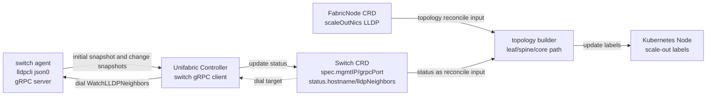
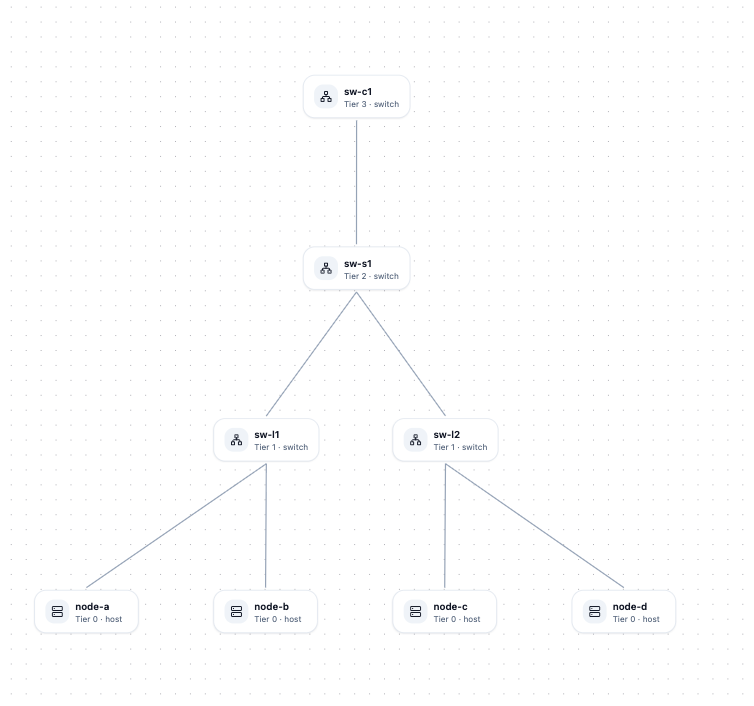

# Scale-Out 网络拓扑发现

## 概述

本文讨论一套面向 scale-out 网络的 leaf、spine、core 拓扑识别方案。交换机侧运行轻量级 switch agent 周期性采集 LLDP 邻居信息，Unifabric Controller 主动发起 gRPC 长连接订阅这些邻居信息，并将结果写入 `Switch` CRD 的 `status`。随后，Controller 再结合节点侧 `FabricNode` 记录的主机网卡信息，计算完整的 scale-out 网络拓扑，并将 GPU 节点所属的 leaf、spine、core 层级写回 Kubernetes Node label。当前版本中，`Switch` 是交换机侧 API 资源，Node label 是调度侧拓扑输出；不再安装单独的分组 CRD。

早期 leaf-only 分组只能表达节点直连 leaf 这一层结果。本文改为一条面向 leaf、spine、core 的统一控制面链路。Controller 持续消费交换机邻居数据，在内部维护拓扑分组，并把结果写回 Node label。

## 动机

AI / ML 工作负载通常需要大量的 Pod 间通信才能推进任务。因此，为了保证运行时性能并控制整体成本，确保运行中的 Pod 之间具备高吞吐量的网络连接非常重要。这些拓扑信息可以帮助工作负载的所有 Pod 被调度到彼此接近的节点上。

当前已有的输入主要来自 `FabricNode.status.scaleOutNics`，它只能告诉 Controller 某个 GPU 节点直连哪些 leaf switches。它回答不了另外两类问题。

1. 这些 leaf 之上有哪些 spine、core 分层。
2. 这些分层结果又该怎样写成调度系统能直接消费的对象和 Node label。

这也是早期 leaf-only 模型的边界。它不适合承载 spine、core 结果，也不能直接表达交换机与节点之间的引用关系。只靠这一路输入，Kueue 等调度系统仍然拿不到一组稳定、可复用的 scale-out 拓扑结果。

因此，本提案把交换机侧的 LLDP 邻居信息接入 Controller，补齐 switch-to-switch 和 switch-to-node 关系，再与节点侧信息一起计算整张 scale-out 拓扑。顺着这组输入，Controller 可以统一生成 leaf、spine、core 对应的 Node label。与此同时，方案仍然需要控制实现复杂度，避免让每台交换机都携带单独的 Kubernetes 凭据或复杂的 per-switch TLS 配置。

### 目标

- 识别 GPU 集群中 scale-out 网络的 leaf、spine、core 拓扑层级，而不再停留在 leaf 识别。
- 将拓扑结果持续写回稳定、可消费的 Kubernetes Node label，供 Kueue 等调度系统直接使用。
- 支撑 GPU 集群管理员基于这些标签实施拓扑亲和调度，以提升运行时性能并控制整体成本。
- 交换机接入和证书运维复杂度控制在可接受范围内。

### 非目标

- 不在本阶段覆盖 scale-up 网络或 storage 网络的拓扑识别，范围只聚焦于 scale-out 网络。

## 方案

方案包含四个部分。

1. 交换机侧 `unifabric-switch-agent` 周期性采集 LLDP 邻居信息，并通过 gRPC server 对外提供全量快照。
2. Controller 作为 gRPC client 主动订阅每台交换机的 LLDP 快照，并将结果写入 `Switch.status`。
3. `SwitchTopologyDiscoveryController` 以 `FabricNode` 和 `Switch` 为输入，计算 GPU 节点对应的 leaf、spine、core 层级，并在内部维护拓扑分组。
4. Controller 按 chart 中的 `topologyLabels` 配置，将最终拓扑结果写回 Kubernetes Node label。

scale-out 拓扑发现和标签写回统一由 `SwitchTopologyDiscoveryController` 承担，不再安装 leaf-group CR。Controller 通过 `Switch.spec` 获取拨号目标，通过全局 pinned mTLS 建立安全连接，并将返回快照中的 `switch_name` 持久化到 `Switch.status.hostname`，再把这个上报 hostname 作为交换机别名来源，用于关联交换机侧与节点侧的拓扑数据。

### 用户故事

#### 故事 1 GPU 集群中的拓扑亲和调度

作为 GPU 集群管理员，我希望 Unifabric 能自动识别 scale-out 网络中的 leaf、spine、core 拓扑，并把结果写成稳定的 Kubernetes Node labels，这样我就可以在 Kueue 等调度系统中使用基于网络拓扑的亲和调度能力，而不需要直接处理 LLDP 原始数据、交换机厂商差异或多跳拓扑计算细节。

### 约束和注意事项

- 由 Unifabric Controller 主动连到 switch agent 的 gRPC 服务。这样连接生命周期、认证和重连逻辑都集中在 Controller 侧管理。
- 传输层使用 gRPC 长连接。当前方案先使用 server-streaming RPC，首次建连发送全量快照，后续仅在 LLDP 变化时推送新的全量快照。
- 当前方案使用全局 pinned mTLS，不为每台交换机单独配置证书。Controller 只持有一张客户端证书，switch agent 只持有一张服务端证书，双方直接校验对端证书是否匹配预期值，不引入 per-switch secret、SNI 或 IP SAN。
- 当前优先覆盖 NVIDIA Cumulus、NVIDIA SONiC 和社区 SONiC。
- scale-out 拓扑能力围绕 `Switch` 输入和 Node label 输出设计，不再安装单独的 leaf-group CR。
- `Switch` CRD 和交换机拓扑发现控制器链路构成当前实现。
- 内部拓扑分组用于表达 leaf、spine、core 三类拓扑性能域，分层语义参考 Volcano 的网络拓扑层级设计。是否需要引入基于 CIDR 的分组能力，以及未来是否增加总览型 `Topology` CRD，仍属于后续演进议题。

### 风险与缓解

- 风险是长连接中断或交换机侧采集异常后，`Switch.status` 中保存的邻居数据变旧，进而影响 Node label 的更新时效。缓解方式是 Controller 侧维护指数退避重连、周期性 resync，并通过 `status.healthy` 和 conditions 明确暴露数据新鲜度与连接状态。
- 风险是全局 pinned mTLS 只能证明对端角色，不能单独证明设备身份。当前实现通过把返回的 `switch_name` 持久化到 `Switch.status.hostname`，并在匹配交换机侧与节点侧 LLDP 数据时把它作为别名来源，来降低拓扑关联错误的风险。如果后续需要更严格的设备身份钉住，可以启用可选的 `expected_switch_name` 请求字段来拒绝不匹配的快照。
- 风险是大型交换机邻居表导致消息过大或 CRD 膨胀。缓解方式是 gRPC 双端显式设置 `maxRecvMsgSize`，只存结构化邻居表而不长期保存完整原始 JSON。
- 风险是自动生成证书在 `helm upgrade` 时被非预期轮换。缓解方式是 Chart 在自动生成模式下使用 `lookup` 复用 Helm 已管理的 Secret，避免重复签发。

## 设计细节

### 总体架构



### 适配范围与验证状态

- 当前优先覆盖 NVIDIA Cumulus、NVIDIA SONiC 和社区 SONiC。

### 数据源

数据源分两类。

- 节点侧使用 `FabricNode.status.scaleOutNics[*].lldpNeighbor` 提供 GPU 节点到 leaf switch 的连接关系。只使用 scale-out NIC，不使用 storage NIC 和 scale-up NIC。
- 交换机侧使用 `Switch.status.hostname` 保存交换机上报的 hostname，并使用 `Switch.status.lldpNeighbors` 保存按远端系统聚合后的 switch-to-switch 和 switch-to-node LLDP 连接关系。它们共同用于关联交换机别名、识别远端类型，并推导 leaf 上层的 spine/core。

### 交换机 Agent

交换机上运行 `unifabric-switch-agent`，它不需要 Kubernetes 权限，只负责采集本机 LLDP 邻居快照，并对外提供可被 Controller 订阅的 gRPC 流。

核心流程如下。

1. 解析本机 hostname、管理 IP、gRPC listen address、服务端证书/私钥、预期 Controller 客户端证书、采集间隔等配置。
2. 周期性进入宿主机 mount 和 network namespace，执行宿主机上的 `lldpcli`：

```bash
nsenter --mount=/host/proc/1/ns/mnt --net=/host/proc/1/ns/net -- lldpcli show neighbors -f json0
```

3. 对比上一版快照，如果 LLDP 发生变化，则生成新的全量快照。
4. 对外暴露 gRPC server，等待 Controller 建立订阅连接。
5. Controller 建立连接后，先返回一份当前全量快照，后续在同一 stream 上按变化推送新的全量快照。
6. stream 断开后由 Controller 按指数退避重连，agent 不需要缓存增量事件。

Switch Agent 只在首次建连和 LLDP 变化时发送全量快照，不发送增量。Controller 收到消息后，可以直接把它视为该交换机当前的完整邻居视图，避免处理复杂的删除和乱序增量。

### gRPC 订阅接口

Switch Agent 暴露一个独立的 gRPC server。Controller 作为 gRPC client 维护到每台交换机的长连接。全局拨号行为和全局 pinned mTLS 通过 Helm values 配置，每台交换机只在 `Switch.spec` 中提供拨号目标。

```yaml
switchTopologyDiscovery:
  enabled: true
  dialTimeout: 5s
  reconnectBackoff: 30s
  maxRecvMsgSize: 4194304
  keepaliveTime: 30s
  defaultGrpcPort: 8090
  mtls:
    autoGenerate: true
    validityDays: 36500
    controllerSecretName: switch-controller-mtls-controller
    switchAgentSecretName: switch-controller-mtls-agent
  ignoreSwitchPorts:
    - mgmt*
    - Management*
    - oob*
```

这里的 `controllerSecretName` 和 `switchAgentSecretName` 不是把同一张证书拆成两份，而是分别保存 controller 和 switch-agent 的 mTLS 身份材料。技术上可以把两端私钥都放进同一个 Secret，但当前设计刻意拆成两个证书包，避免在导出 switch-agent 证书到交换机侧时把 controller 私钥一并带出集群。

`ignoreSwitchPorts` 由 controller 在写入 `Switch.status` 和构建拓扑图前应用，switch-agent 始终上报全量 LLDP 快照。

#### 订阅服务

建议定义独立 proto，例如

```proto
service SwitchReporter {
  rpc WatchLLDPNeighbors(WatchLLDPNeighborsRequest) returns (stream LLDPNeighborSnapshot);
}

message WatchLLDPNeighborsRequest {
  string expected_switch_name = 1;
}

message LLDPNeighborSnapshot {
  string switch_name = 1;
  repeated LLDPNeighbor lldp_neighbors = 2;
  uint64 generation = 3;
}

message LLDPNeighbor {
  string local_device_name = 1;
  string local_port = 2;
  string remote_system_name = 3;
  string remote_port_id = 4;
}
```

订阅语义如下。

- Controller 通过 list/watch `Switch` 资源读取每台交换机的 `spec.mgmtIP` 和可选 `spec.grpcPort`，并据此建立 gRPC 连接。
- 当 `spec.mgmtIP` 为空时，Controller 不为该交换机建立订阅流。
- 实际拨号地址为 `spec.mgmtIP:spec.grpcPort`，若 `grpcPort` 为空，则使用全局 `defaultGrpcPort`。
- `metadata.name` 不需要与交换机上报的 hostname 一致。Controller 会把返回的 `switch_name` 持久化到 `Switch.status.hostname`，并把这个上报 hostname 作为拓扑关联时的交换机别名来源。
- 如果 `Switch.spec.mgmtIP` 或 `Switch.spec.grpcPort` 发生变化，Controller 需要关闭旧连接并按新配置重建订阅。
- `expected_switch_name` 仍然是可选请求字段。当前 Controller 不设置它；当调用方显式设置时，agent 会用它校验本机 hostname，不匹配时可返回 `FailedPrecondition`。
- agent 建连成功后立即返回一份当前全量快照，后续每次 LLDP 变化时再推送新的全量快照。
- `lldp_neighbors` 使用结构化数组，而不是透传原始 `lldpcli json0`。
- 每个邻居项至少包含 `local_device_name`、`local_port`、`remote_system_name`、`remote_port_id`。
- `switch_name` 必须与每个邻居项中的 `local_device_name` 一致，或标准化后得到同一个 DNS-1123 名称。
- `generation` 在每台交换机内单调递增，便于 Controller 丢弃乱序或重复快照。

接口约束如下。

- 使用 server-streaming RPC，由 Controller 主动建连、agent 在 stream 上推送快照。
- 每条消息都表示该交换机当前的完整 LLDP 邻居视图，Controller 收到后直接覆盖旧状态即可。
- Controller client 需要设置 `maxRecvMsgSize`，agent server 需要设置匹配的发送上限，防止大型交换机邻居表被默认限制拒绝。
- 在没有 LLDP 变化时，不发送空快照，链路存活依赖 gRPC keepalive 和 Controller 侧重连机制。
- 后续如需要让 Controller 在同一连接里下发调试指令或动态过滤条件，可以扩展为 bidi streaming，但不在当前提案范围内。

#### 认证和暴露方式

本提案采用全局 pinned mTLS。

- Chart 默认通过 Helm 模板自动生成两套 pinned mTLS 身份材料：一套给 Controller 作为客户端证书和私钥，另一套给 switch agent 作为服务端证书和私钥。默认有效期为 `36500` 天，约等于 `100` 年。
- 自动生成时，chart 在安装阶段使用 Helm 证书 helper 生成两套 pinned 证书包，并通过 `lookup` 复用 Helm 已管理的 Secret，避免每次 `helm upgrade` 都重签证书。
- Controller 通过 `mtls.controllerSecretName` 加载自己的客户端证书、私钥和预期 switch agent 服务端证书。建议 Secret 中包含 `tls.crt`、`tls.key`、`peer.crt`。
- Switch agent 通过 `mtls.switchAgentSecretName` 对应的证书包加载自己的服务端证书、私钥和预期 Controller 客户端证书。建议同样包含 `tls.crt`、`tls.key`、`peer.crt`。
- Controller 侧 Secret 直接由 chart 挂载。switch agent 侧证书包由 chart 生成后通过 `kubectl get secret` 导出，再拷贝到交换机本地使用。
- 之所以默认拆成两个 Secret，而不是把两端私钥放进同一个 Secret，是为了保持最小暴露面：交换机侧只需要 switch-agent 自己的私钥，不应该接触 controller 私钥。
- 不要求 serverName、SNI 或 IP SAN，也不在 `Switch` 资源中保存 per-switch secret 或 TLS 字段。
- 这种模式下，所有 switch agent 可以共用同一张服务端证书。TLS 只证明「对端是合法的 switch agent / Controller」，不直接证明是哪一台设备，因此当前实现依赖写入 `Switch.status.hostname` 的 `switch_name` 作为拓扑别名解析来源。如果后续需要更严格的设备身份钉住，可以再启用可选的 `expected_switch_name` 校验。
- 如果管理网可信且为了开发调试需要，允许临时关闭 mTLS 使用明文 gRPC，但不作为默认部署方式。
- 如果组织已有现成证书体系，也可以关闭 `autoGenerate`，改为提供已存在的 `controllerSecretName` 和 `switchAgentSecretName`。

后续如需更细粒度的设备身份，可以扩展为每台交换机独立证书，或切回标准 CA + SAN 的 TLS 体系。

### Switch 资源模型

`Switch` 是 cluster-scoped 资源，表示一台交换机的管理地址和最新 LLDP 观测状态。`spec` 只描述 Controller 需要连接到哪里，不承载 per-switch 认证材料。认证和 TLS 由 Controller/agent 的全局配置负责。`status` 由 Controller 根据订阅流持续刷新，单独保存交换机上报的 hostname，并按远端系统聚合保存 LLDP 邻居。Switch Agent 不直接写 Kubernetes API。

示例

```yaml
apiVersion: unifabric.io/v1beta1
kind: Switch
metadata:
  name: rack-a-leaf1
spec:
  mgmtIP: 10.0.0.11
  grpcPort: 8090
status:
  hostname: leaf1
  healthy: true
  conditions:
    - type: Connected
      status: "True"
      reason: StreamReady
      message: Controller is receiving LLDP snapshots from switch agent
  lldpNeighborCount: 2
  lldpNeighbors:
    - remoteSystemType: KubernetesNode
      remoteSystemName: node-a
    - remoteSystemType: Switch
      remoteSystemName: spine1
```

建议字段

| 字段 | 含义 |
| --- | --- |
| `metadata.name` | 交换机资源名。它需要在集群内唯一，但不要求与交换机上报的 hostname 一致 |
| `spec.mgmtIP` | 交换机管理 IP，用于运维展示、排障和默认拨号目标生成 |
| `spec.grpcPort` | 可选，该交换机 gRPC server 的端口未设置时使用全局 `defaultGrpcPort` |
| `status.hostname` | 最近一次被接受快照中的交换机上报 hostname。它用于把交换机侧数据和节点侧 LLDP hostname 做别名关联 |
| `status.healthy` | 交换机当前观测状态是否健康，可由连接状态、认证结果和快照新鲜度综合判断 |
| `status.conditions` | 连接状态和数据就绪状态，例如 `Connected`、`Ready` |
| `status.lldpNeighborCount` | 当前 `lldpNeighbors` 中按远端系统聚合后的条目数，用于快速观测和排错 |
| `status.lldpNeighbors` | 当前交换机观测到的唯一远端邻居列表 |
| `status.lldpNeighbors[*].remoteSystemType` | 远端系统解析后是 Kubernetes Node 还是另一台交换机 |
| `status.lldpNeighbors[*].remoteSystemName` | 该邻居条目对应的远端主机名或交换机名 |

### 拓扑计算流程

新增 `SwitchTopologyDiscoveryController`，作为 scale-out 网络拓扑的目标控制器，负责计算 leaf、spine、core 拓扑分组，维护分层结果，并写回节点标签。

该控制器统一负责 leaf、spine、core 标签写回。

#### 触发条件

触发条件如下。

1. `FabricNode` 创建、删除或 status 变化。
2. `Switch` 创建、删除或 status 变化。
3. 周期性 resync，用于重新计算拓扑和补偿漏事件。
4. Controller 配置变更后重启。

#### 主流程

每次 reconcile 执行以下步骤。

1. List 所有 `FabricNode`。
2. List 所有 `Switch`。
3. 按 `Switch.spec.role` 对交换机分区，并为每个 role 单独构建拓扑图。
4. 针对每个 role 对应的拓扑图，计算 leaf、spine、core 拓扑分组。
5. 从 `ScaleOut` 这一批结果中更新对应 Kubernetes Node 的拓扑 label。



### 拓扑 label value 命名

写回到 Kubernetes Node 时包含两部分，即标签 key 和标签 value。标签 key 支持通过 chart 顶层 `topologyLabels` 自定义，scale-out 相关配置如下

```yaml
topologyLabels:
  scaleOutLeaf: unifabric.io/scale-out-leaf
  scaleOutSpine: unifabric.io/scale-out-spine
  scaleOutCore: unifabric.io/scale-out-core
```

部署时可以按集群约定修改这些 label key。本提案要求 Controller 读取对应配置，并将 leaf、spine、core 拓扑结果写回这些可配置的 Node labels。

标签 value 必须稳定、可比较、符合 Kubernetes label value 限制，并支持两种格式。

- 名字格式是将一个 group 内的交换机名称按稳定顺序排序后用 `-` 连接。如果 group 中只有一台交换机，则直接使用交换机名称，例如 `leaf1`。如果 group 中包含多台交换机，则在拼接结果后追加 `-group`，例如 `leaf1-leaf2-leaf3-leaf4-group`。
- hash 格式是对同一份规范化输入生成短 hash，格式类似 git short sha，例如 `7f3a9c2`。规范化输入建议为 group 内交换机名称排序后拼接得到的字符串。

无论使用哪种格式，leaf、spine、core 的 label value 都应基于同样的交换机集合生成，并保持稳定可复现。Controller 直接按所选格式写回 Node label。

同时在日志和指标中输出该 group 对应的交换机集合，便于从 label value 反查实际 switch 列表。

### RBAC 和权限

Controller 需要新增权限。

```yaml
- apiGroups: ["unifabric.io"]
  resources: ["switches"]
  verbs: ["get", "list", "watch", "create", "update", "patch", "delete"]
- apiGroups: ["unifabric.io"]
  resources: ["switches/status"]
  verbs: ["get", "update", "patch"]
- apiGroups: [""]
  resources: ["nodes"]
  verbs: ["get", "list", "watch", "patch", "update"]
```

### 可观测性

Controller 暴露以下指标。

| Metric | 类型 | 含义 |
| --- | --- | --- |
| `unifabric_switch_count` | Gauge | 当前纳入控制面管理并参与拓扑计算的交换机数量。 |
| `unifabric_switch_lldp_parse_success_total` | Counter | Controller 成功解析并接受交换机上报 LLDP 邻居信息的次数。 |
| `unifabric_switch_lldp_parse_failure_total` | Counter | Controller 解析交换机上报 LLDP 邻居信息失败的次数，包括字段缺失、格式错误或校验失败等情况。 |

日志中需要包含以下内容。

- 交换机订阅与邻居更新摘要，包含 switch name、peer address、generation、link count。
- 拓扑计算摘要，包含 switch 数、node 数、link 数、拓扑分组数以及节点 label 更新结果。

### 测试计划

#### 单元测试

- Switch-side LLDP JSON0 parser 单元测试，覆盖字段缺失和大小写标准化。
- proto 编解码测试和快照 generation 去重/乱序处理测试。
- 配置测试，验证启用交换机拓扑链路后只处理交换机拓扑逻辑。
- `Switch.spec.mgmtIP` / `spec.grpcPort` 变更触发重拨逻辑测试。
- 拓扑构建、拓扑分组投影与节点 label 写回逻辑测试。

#### e2e 测试

- 验证启用交换机拓扑链路后，leaf 标签由交换机拓扑链路生成。
- 验证 Controller 能否与 switch agent 建立 gRPC stream，并将首次全量快照写入 `Switch.status`。
- 验证 Helm 自动生成的 pinned mTLS Secret 在 `helm upgrade` 后不会因为模板重渲染而发生非预期轮换。
- 验证 leaf、spine、core GPU Node 拓扑 label 是否正确，校验所使用的 label key 应来自 chart 的 `topologyLabels.scaleOutLeaf`、`topologyLabels.scaleOutSpine` 和 `topologyLabels.scaleOutCore` 配置，label value 则应符合所选格式要求，即名字格式或短 hash 格式。
- 模拟某台 switch agent 停止或 gRPC stream 断开后，验证重连和拓扑结果更新是否正确。

### 验收标准

该能力应至少满足以下条件。

- leaf、spine、core scale-out 拓扑结果都通过 Node label 表达。
- Controller 能够稳定维护到交换机的 gRPC 订阅连接，并在断连后自动恢复。
- `Switch.status` 可以持续反映最新 LLDP 快照、连接状态和健康状态。
- 目标平台上的 GPU 节点能够正确获得 leaf、spine、core 相关标签。
- 自动生成的 pinned mTLS 证书在安装、升级和恢复流程中不会发生非预期轮换。

## 实现历史

## 缺点

- 该方案要求在交换机侧额外部署并维护 `unifabric-switch-agent`。

## 备选方案

- 通过 gNMI 接口获取 LLDP 信息，厂商支持参次不齐。
