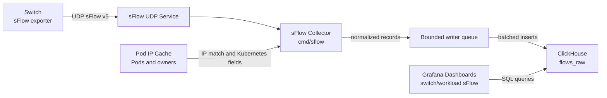

# sFlow Processing

## Overview

This document describes the Unifabric sFlow processing design. Switches push
sFlow v5 datagrams to an independent `sflow` collector. The collector decodes
sampled flow records, matches source and destination IP addresses against the
current Kubernetes Pod inventory, fills Pod, Node, and top-level workload owner
fields, and writes the result to the ClickHouse `flows_raw` table.
`chart/files/switch-sflow.json` and `chart/files/workload-sflow.json` query this
table directly.

The collector is deployed separately from the existing Controller and Agent. It
is enabled only when `sflow.enabled=true`, exposes one UDP port for switches,
and does not change CRDs, Node labels, or the existing RDMA metrics collection
path. The current design focuses on one path: receive switch sFlow, fill
Kubernetes fields, write ClickHouse rows, and make those fields available to the
dashboards.

## Motivation

RDMA metrics can show NIC, port, and RDMA counters from the Node and Pod point
of view, but they do not directly answer how traffic looks from the switch side.
For example, an operator may need to know which workloads produced the most
traffic on a switch, or which switches carried traffic for a selected workload.
Switch-pushed sFlow data provides that perspective.

Raw sFlow records contain sampled network-layer and transport-layer information,
but they do not contain Kubernetes fields. If raw records are written directly
to ClickHouse, dashboards can aggregate by IP, port, or protocol, but not by
Pod, Node, or workload owner. The collector therefore needs to connect endpoint
IPs to the current Kubernetes Pod inventory before writing rows.

The scope of this path is intentionally narrow. The collector only fills fields
for current sampled flow records and writes them; it does not rewrite historical
rows and does not try to build a topology model for all network paths. When an
endpoint IP does not match a Pod, Kubernetes fields stay empty and dashboards
can still show the base traffic data.

### Goals

- Expose one UDP port that receives sFlow v5 datagrams pushed by one or more
  switches.
- Decode supported sFlow flow samples into normalized flow records that can be
  written to ClickHouse.
- Use the current Pod IP cache to fill Pod namespace, Pod name, Node name, and
  top-level workload owner fields for the source and destination sides.
- Write records with Kubernetes fields to ClickHouse `flows_raw` in batches.
- Expose health checks and Prometheus metrics for receive, decode, write, and
  overload status.
- Package the collector, UDP Service, ConfigMap, and RBAC through the Helm
  chart with disabled-by-default values.

### Non-Goals

- Collector high availability, sharded ingest, and cross-instance deduplication
  are out of scope for this phase.
- Historical flow rows are not rewritten; later Pod or owner changes do not
  modify rows already written to ClickHouse.
- Existing Controller, Agent, CRDs, Node labels, and RDMA metrics semantics are
  not changed.
- The reference `gosflow/` directory is not committed or imported as production
  code.

## Proposal

The design has four parts.

1. `cmd/sflow` starts an independent process, loads config, creates the
   Kubernetes client, health checks, metrics endpoint, Pod cache updater, and
   UDP collector.
2. `pkg/sflow` decodes sFlow datagrams, extracts records from IPv4, IPv6, and
   sampled Ethernet headers, and converts them into the shared `FlowRecord`
   shape.
3. The collector periodically refreshes the Pod IP cache and uses `src_addr`
   and `dst_addr` to match Pod / Workload information before writing rows.
4. The writer flushes records to ClickHouse `flows_raw` by batch size or flush
   interval; dashboards query that table directly.

The collector uses a bounded queue between UDP receive and ClickHouse writes.
When writes slow down, the queue can absorb short bursts. When the queue is
full, the collector drops new normalized records and increments overload
metrics, which prevents unbounded memory growth.

### User Story

#### Story 1: View Kubernetes Workloads for Switch sFlow

As a cluster operator, I want Unifabric to receive switch-pushed sFlow data and
fill Pod and workload fields before writing ClickHouse rows. This lets me use
the switch and workload dashboards to inspect switch-observed traffic by
Kubernetes object without manually maintaining IP-to-Pod mappings.

### Constraints and Notes

- The collector is disabled by default. Deployment, Service, ConfigMap, and RBAC
  are rendered only when `sflow.enabled=true`.
- sFlow input uses UDP. The collector does not open reverse connections to
  switches.
- ClickHouse uses the native protocol address configured by
  `sflow.clickhouse.address`.
- ClickHouse password can be provided inline or through a Secret exposed as
  `SFLOW_CLICKHOUSE_PASSWORD`.
- Pod / Workload fields come from the Pod cache visible to the collector and may
  briefly lag the live cluster state.
- Endpoints that do not match Pod IPs keep empty Kubernetes fields and do not
  block row writes.
- The `flows_raw` initialization SQL is stored in
  `docs/sql/sflow-flows-raw.sql`.
- Dashboards depend on fixed `flows_raw` fields. Schema changes must be checked
  against dashboard SQL.

### Risks and Mitigations

- Risk: slow ClickHouse writes may cause too many records to accumulate behind
  UDP receive. Mitigation: use a bounded writer queue, drop new records when the
  queue is full, and expose overload through
  `unifabric_sflow_records_dropped_total` and logs.
- Risk: the Pod cache may briefly differ from live Pod state, so some records
  may miss Pod or owner fields. Mitigation: refresh the cache periodically and
  keep unmatched fields empty without blocking base traffic rows.
- Risk: owner lookup may fail or a related CRD may be absent. Mitigation:
  preserve matched Pod fields, leave owner fields empty, and keep the collector
  running.
- Risk: dashboards may drift from the ClickHouse schema. Mitigation: verify
  that `switch-sflow.json` and `workload-sflow.json` raw SQL only use fields
  present in `docs/sql/sflow-flows-raw.sql`.
- Risk: reference code under `gosflow/` may be committed accidentally or enter
  the image build context. Mitigation: ignore it in `.gitignore` and
  `.dockerignore`, and verify production code does not import it.

## Design Details

### Architecture



### Components

- `cmd/sflow`: process entrypoint, config loading, manager startup, health
  checks, metrics endpoint, Pod cache updates, and collector wiring.
- `pkg/sflow/decoder.go`: sFlow v5 datagram decoding and flow normalization.
- Pod IP cache code in `pkg/sflow`: maintains the IP-to-Pod mapping and fills
  Kubernetes fields for the source and destination sides.
- `pkg/sflow/owner.go`: best-effort top-level Kubernetes owner lookup.
- `pkg/sflow/clickhouse.go`: ClickHouse connection, row mapping, and batched
  writes to `flows_raw`.
- `chart/templates/SFlow*.yaml`: disabled-by-default Deployment, ConfigMap,
  UDP Service, ServiceAccount, and RBAC.

### Data Flow

1. Switches send sFlow datagrams to the collector UDP Service.
2. The collector decodes supported flow samples and normalizes packet metadata.
3. Source and destination IPs are matched against the current Pod IP cache.
4. Matched endpoints receive Pod namespace, Pod name, Node name, and top-level
   owner fields.
5. Records enter a bounded writer queue.
6. The writer flushes records to ClickHouse by batch size or flush interval.
7. Grafana dashboards query `flows_raw` directly.

Unsupported sFlow records are skipped. Malformed datagrams increment decode
error metrics and do not stop the UDP receive loop.

### Decoding Model

The decoder accepts standard flow samples and expanded flow samples. It extracts
flow records from sampled IPv4 records, sampled IPv6 records, and sampled
Ethernet headers that contain IPv4 or IPv6 payloads.

Each normalized record contains:

- receive time and flow observation time
- sequence number and sampling rate
- switch sampler address normalized to 16 bytes
- sampled bytes and packets
- source and destination IPs normalized to 16 bytes
- Ethernet type, IP protocol, and transport ports when present
- source and destination AS values when gateway extensions are present

Records without usable endpoint addresses are not written to ClickHouse.

### Kubernetes Field Filling Rules

The collector periodically refreshes a Pod IP cache from Kubernetes Pods. Only
Running Pods with assigned Pod IPs are indexed.

Field filling follows these rules.

- A source IP match fills `src_k8s_*` fields.
- A destination IP match fills `dst_k8s_*` fields.
- Unmatched endpoints keep empty Kubernetes fields.
- Host-network Pods are covered when the observed endpoint IP matches a Pod IP.
- Stored rows are not rewritten; later Pod or owner changes do not modify
  historical rows.

Owner lookup follows the first owner reference until the highest readable owner.
If lookup fails, the collector preserves Pod fields and leaves owner fields
empty, or keeps the highest owner already resolved.

### ClickHouse Contract

The committed initialization schema is `docs/sql/sflow-flows-raw.sql`. It
creates `default.flows_raw` with base flow fields plus source and destination
Kubernetes Pod, Node, and top-level owner fields.

Dashboard queries depend on these fields:

- `time_flow_start`, `sampler_address`, `bytes`, `packets`, `sampling_rate`
- `src_k8s_pod_*`, `dst_k8s_pod_*`
- `src_k8s_top_owner_*`, `dst_k8s_top_owner_*`
- `src_k8s_node_name`, `dst_k8s_node_name`
- `proto`

The initialization SQL keeps data for three days by default. Operators can
adjust TTL according to their storage policy.

### Helm Configuration

The sFlow collector is controlled by the chart `sflow` values. Defaults keep it
disabled.

```yaml
sflow:
  enabled: false
  listen:
    bindAddress: ":6343"
    port: 6343
  service:
    enabled: true
    type: NodePort
    port: 6343
    nodePort: 0
  clickhouse:
    address: ""
    database: default
    username: default
    password: ""
    passwordSecret:
      name: ""
      key: ""
    table: flows_raw
  writer:
    batchSize: 2000
    flushInterval: 2s
    queueSize: 65536
```

`NodePort` is the default Service type because switch sFlow datagrams usually
arrive from outside the cluster. `nodePort: 0` lets Kubernetes allocate the UDP
node port; operators can set a fixed value when switches require a stable
target. `LoadBalancer` remains supported for environments with UDP external load
balancing.

When `sflow.enabled=false`, no sFlow collector resources are rendered. When
`sflow.enabled=true`, the chart renders the ConfigMap, Deployment, UDP Service,
ServiceAccount, ClusterRole, and ClusterRoleBinding. sFlow dashboards are
rendered when `grafanaDashboard.enabled=true` and `sflow.enabled=true`.

### Overload Behavior

UDP receive is isolated from ClickHouse writes by a bounded in-process queue.
When writes slow down and the queue is full, the collector drops new normalized
records, increments `unifabric_sflow_records_dropped_total`, and logs a
structured warning. This bounds memory use and keeps the receive loop available
for current switch telemetry.

Write failures increment `unifabric_sflow_write_errors_total`. Failed batches
are not retried indefinitely because stale flow samples have limited
troubleshooting value, while the collector still needs to keep receiving current
traffic.

### RBAC and Permissions

The collector needs read access to Pods and common workload owner objects to
fill Pod / Workload fields.

```yaml
- apiGroups: [""]
  resources: ["pods"]
  verbs: ["get", "list", "watch"]
- apiGroups: ["apps"]
  resources: ["daemonsets", "deployments", "replicasets", "statefulsets"]
  verbs: ["get"]
- apiGroups: ["batch"]
  resources: ["cronjobs", "jobs"]
  verbs: ["get"]
- apiGroups: ["kubeflow.org"]
  resources: ["mpijobs", "pytorchjobs", "tfjobs", "xgboostjobs"]
  verbs: ["get"]
- apiGroups: ["ray.io"]
  resources: ["rayjobs"]
  verbs: ["get"]
- apiGroups: ["sparkoperator.k8s.io"]
  resources: ["sparkapplications"]
  verbs: ["get"]
```

### Observability

The collector exposes controller-runtime health checks on the configured health
bind address:

- `/healthz`
- `/readyz`

It also exposes Prometheus metrics on the configured metrics bind address.

| Metric | Type | Meaning |
| --- | --- | --- |
| `unifabric_sflow_datagrams_accepted_total` | Counter | sFlow datagrams accepted by the collector. |
| `unifabric_sflow_decode_errors_total` | Counter | Datagrams that failed decoding. |
| `unifabric_sflow_records_decoded_total` | Counter | Normalized records decoded from datagrams. |
| `unifabric_sflow_records_dropped_total` | Counter | Records dropped because the writer queue was full. |
| `unifabric_sflow_records_written_total` | Counter | Records successfully written to ClickHouse. |
| `unifabric_sflow_write_errors_total` | Counter | ClickHouse write failures. |
| `unifabric_sflow_queue_depth` | Gauge | Records currently waiting to be written. |

Logs should include:

- datagram decode failures with remote address and error
- writer queue full warnings
- ClickHouse write failures with batch record count and error

### Test Plan

#### Unit Tests

- Config parsing and validation tests for defaults, bind addresses, ClickHouse
  address, table name, batch size, queue size, and flush interval.
- Decoder tests for IPv4, IPv6, sampled headers, multi-record datagrams, and
  malformed input.
- Pod field filling tests for source match, destination match, unmatched
  endpoints, host-network Pods, and owner fallback.
- ClickHouse row mapping tests for 16-byte IP mapping and Kubernetes field
  mapping.
- Collector queue tests for batch flush, overload drops, and metrics updates.
- Command wiring tests for metrics / health server options and startup wiring.

#### Helm and Documentation Tests

- `helm template unifabric ./chart` verifies the default chart render does not
  contain sFlow collector resources.
- `helm template unifabric ./chart --set sflow.enabled=true --set sflow.clickhouse.address=...`
  verifies the sFlow collector, UDP Service, RBAC, and dashboards render.
- `make helm-docs` verifies `chart/README.md` stays synchronized with values.
- Check that `switch-sflow.json` and `workload-sflow.json` raw SQL only use
  fields present in `docs/sql/sflow-flows-raw.sql`.

### Acceptance Criteria

This capability should satisfy at least these conditions.

- The collector can receive valid sFlow datagrams and produce normalized records
  from supported samples.
- Source or destination endpoints that match Pod IPs can receive Pod, Node, and
  top-level workload owner fields.
- Base flow records can still be written to ClickHouse when Pod IP matching or
  owner lookup fails.
- `flows_raw` fields support the switch and workload sFlow dashboard queries.
- When the writer queue is full, the collector avoids unbounded memory growth
  and exposes drops through metrics.
- The chart does not expose a new UDP port by default; related resources render
  only after `sflow.enabled=true`.
- `gosflow/` is not imported by production code and does not enter the image
  build context.

## Implementation History

- This implementation adds `cmd/sflow` and `pkg/sflow`, deployed by the Helm
  chart as an independent Deployment.
- The original `1.sql` has moved to `docs/sql/sflow-flows-raw.sql`.
- User-provided `switch-sflow.json` and `workload-sflow.json` remain dashboard
  assets under `chart/files/`.

## Drawbacks

- The current design uses a single collector instance for UDP sFlow receive. If
  high availability or horizontal sharding is required, load distribution and
  duplicate sample handling need a follow-up design.
- Pod / Workload fields depend on the current Pod cache, so records may briefly
  miss Pod or owner fields.
- Failed ClickHouse batches are not retried indefinitely, so an extended
  ClickHouse outage can lose sampled records.

## Alternatives

- Put sFlow processing into the existing Controller process. This would add UDP
  ingest and ClickHouse writes to the control-plane reconcile process, increasing
  the impact on existing Controller behavior.
- Write raw sFlow data first and fill Pod fields at query time. This would make
  dashboard queries depend on historical Pod state or an additional dimension
  table.
- Port the full reference `gosflow/` directory. This would add unnecessary
  sample-code maintenance cost, so production code only follows the needed
  behavior and does not import that directory.
