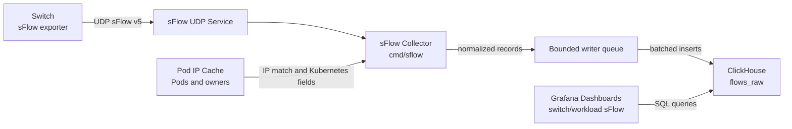

# sFlow 信息处理

## 概述

本文讨论 Unifabric 中的 sFlow 信息处理方案。交换机侧将 sFlow v5 datagram 推送到独立的 `sflow` collector。collector 解码采样流记录，用源端和目的端 IP 匹配当前 Kubernetes Pod 信息，补充 Pod、Node 和顶层 workload owner 字段，然后写入 ClickHouse `flows_raw` 表。`chart/files/switch-sflow.json`、`chart/files/workload-sflow.json` 和 `chart/files/workload-pair-sflow.json` dashboard 直接查询这张表。

collector 和已有 Controller、Agent 分开部署。它只在 `sflow.enabled=true` 时启用，对交换机暴露一个 UDP 端口，不修改 CRD、Node label，也不改变已有 RDMA metrics 采集链路。当前方案聚焦一条路径：接收交换机 sFlow，补充 Kubernetes 字段，写入 ClickHouse，并让 dashboard 能基于这些字段查询。

## 动机

RDMA metrics 能从节点和 Pod 视角观察网卡、端口和 RDMA 计数器，但它不能直接回答交换机侧看到的流量分布。例如，运维人员可能需要知道某台交换机上哪些 workload 产生了最多流量，或者某个 workload 的流量经过了哪些交换机。交换机推送的 sFlow 数据可以提供这个视角。

原始 sFlow record 只包含采样包的网络层和传输层信息，缺少 Kubernetes 字段。如果直接把原始记录写入 ClickHouse，dashboard 只能按 IP、端口或协议聚合，不能按 Pod、Node、workload owner 过滤。因此，collector 需要在写入前把端点 IP 与当前 Kubernetes Pod 信息关联起来。

这条链路的边界也比较明确。collector 只处理采样流记录的实时字段补充和写入，不回写历史记录，也不尝试为所有网络路径建立拓扑模型。没有命中 Pod IP 的端点会保留空 Kubernetes 字段，dashboard 仍然可以展示基础流量数据。

### 目标

- 提供一个 UDP 端口，接收一台或多台交换机推送的 sFlow v5 datagram。
- 解码支持的 sFlow flow sample，生成可写入 ClickHouse 的规范化流记录。
- 基于当前 Pod IP cache，为源端和目的端补充 Pod namespace、Pod name、Node name 和顶层 workload owner。
- 将补充字段后的记录批量写入 ClickHouse `flows_raw`。
- 暴露健康检查和 Prometheus metrics，便于观察接收、解码、写入和过载状态。
- 通过 Helm chart 以默认关闭的方式部署 collector、UDP Service、ConfigMap 和 RBAC。

### 非目标

- 不在本阶段提供 collector 高可用、分片 ingest 或跨实例去重能力。
- 不回写历史流记录；Pod 或 owner 后续变化不会修改已经写入的 ClickHouse 行。
- 不修改已有 Controller、Agent、CRD、Node label 或 RDMA metrics 语义。
- 不把参考目录 `gosflow/` 作为生产代码提交或导入。

## 方案

方案包含四个部分。

1. `cmd/sflow` 启动独立进程，加载配置，创建 Kubernetes client、健康检查、metrics endpoint、Pod cache updater 和 UDP collector。
2. `pkg/sflow` 解码 sFlow datagram，提取 IPv4、IPv6 和 sampled Ethernet header 中的流记录，并转换为统一的 `FlowRecord`。
3. collector 周期性刷新 Pod IP cache，写入前用 `src_addr` 和 `dst_addr` 分别匹配 Pod / Workload 信息。
4. writer 按 batch size 或 flush interval 将记录写入 ClickHouse `flows_raw`，dashboard 直接查询该表。

collector 使用有界队列隔离 UDP 接收和 ClickHouse 写入。写入变慢时，队列可以吸收短时突发；队列满后会丢弃新的规范化记录并增加过载指标，避免内存无界增长。

### 用户故事

#### 故事 1 查看交换机 sFlow 对应的 Kubernetes Workload

作为集群运维人员，我希望 Unifabric 能接收交换机推送的 sFlow 数据，并在写入 ClickHouse 前补充 Pod 和 workload 信息。这样我可以在 switch / workload dashboard 中按 Kubernetes 对象查看交换机观测到的流量，不需要手工维护 IP 到 Pod 的映射关系。

### 约束和注意事项

- collector 默认关闭，只有 `sflow.enabled=true` 时才渲染 Deployment、Service、ConfigMap 和 RBAC。
- sFlow 输入使用 UDP，collector 不对交换机建立反向连接。
- ClickHouse 使用 native protocol 地址，配置项为 `sflow.clickhouse.address`。
- ClickHouse password 支持 inline value，也支持通过 Secret 注入到 `SFLOW_CLICKHOUSE_PASSWORD`。
- Pod / Workload 字段来自 collector 当前看到的 Pod cache，可能存在短暂滞后。
- 未命中 Pod IP 的端点保留空 Kubernetes 字段，不阻塞流记录写入。
- `flows_raw` 由 sFlow collector 启动阶段的 ClickHouse schema migration 创建和维护。
- dashboard 查询依赖 `flows_raw` 中的固定字段，表结构变更需要同步检查 dashboard SQL。

### 风险与缓解

- 风险是 ClickHouse 写入变慢后，UDP 接收侧积压过多记录。缓解方式是使用有界 writer queue，队列满时丢弃新记录，并通过 `unifabric_sflow_records_dropped_total` 和日志暴露过载状态。
- 风险是 Pod cache 与真实 Pod 生命周期存在短暂偏差，导致部分记录缺少 Pod 或 owner 字段。缓解方式是周期性刷新 cache，并让未命中字段保持为空，不影响基础流量记录写入。
- 风险是 owner 解析失败或相关 CRD 不存在。缓解方式是保留已经匹配到的 Pod 字段，owner 字段为空，collector 不因 owner 缺失停止处理。
- 风险是 dashboard 与 ClickHouse schema 不一致。缓解方式是在实现阶段核对 `switch-sflow.json`、`workload-sflow.json` 的 raw SQL 只使用 Go migration 中创建的字段。
- 风险是参考代码 `gosflow/` 被误提交或进入镜像构建上下文。缓解方式是在 `.gitignore` 和 `.dockerignore` 中排除该目录，并确认生产代码不导入它。

## 设计细节

### 总体架构



### 组件

- `cmd/sflow`：进程入口，负责配置加载、manager 启动、健康检查、metrics endpoint、Pod cache 更新和 collector 接线。
- `pkg/sflow/decoder.go`：sFlow v5 datagram 解码和流记录规范化。
- `pkg/sflow` 中的 Pod IP cache 代码：维护 IP 到 Pod 信息的映射，并填充源端 / 目的端 Kubernetes 字段。
- `pkg/sflow/owner.go`：尽力解析顶层 Kubernetes owner。
- `pkg/sflow/clickhouse.go`：ClickHouse 连接、行映射和 `flows_raw` 批量写入。
- `chart/templates/SFlow*.yaml`：默认关闭的 Deployment、ConfigMap、UDP Service、ServiceAccount 和 RBAC。

### 数据流

1. 交换机把 sFlow datagram 发送到 collector UDP Service。
2. collector 解码支持的 flow sample，并规范化包元数据。
3. 源端和目的端 IP 与当前 Pod IP cache 匹配。
4. 命中的端点会补充 Pod namespace、Pod name、Node name 和顶层 owner 字段。
5. 记录进入有界 writer queue。
6. writer 根据 batch size 或 flush interval 把记录刷入 ClickHouse。
7. Grafana dashboard 直接查询 `flows_raw`。

不支持的 sFlow record 会被跳过。格式错误的 datagram 会增加 decode error 指标，但不会停止 UDP 接收循环。

### 解码模型

decoder 接受标准 flow sample 和 expanded flow sample。当前会从 sampled IPv4 record、sampled IPv6 record，以及包含 IPv4 或 IPv6 payload 的 sampled Ethernet header 中提取流记录。

每条规范化记录包含：

- 接收时间和流观测时间
- sequence number 和 sampling rate
- 归一化为 16 字节的交换机 sampler address
- sampled bytes 和 packets
- 归一化为 16 字节的源 IP 和目的 IP
- Ethernet type、IP protocol，以及存在时的传输层端口
- 存在 gateway extension 时的源 AS 和目的 AS

没有可用端点地址的记录不会写入 ClickHouse。

### Kubernetes 字段补充规则

collector 周期性从 Kubernetes Pod 刷新 Pod IP cache。只有 Running 且已有 Pod IP 的 Pod 会被索引。

字段补充规则如下。

- 源 IP 命中时填充 `src_k8s_*` 字段。
- 目的 IP 命中时填充 `dst_k8s_*` 字段。
- 未命中的端点保留空 Kubernetes 字段。
- host-network Pod 的观测端点 IP 与 Pod IP 匹配时，也会填充对应字段。
- 已写入的行不回写；Pod 或 owner 后续变化不会修改历史记录。

owner 解析沿着第一个 owner reference 向上查找，直到最高的可读取 owner。解析失败时，collector 保留 Pod 字段，owner 字段为空，或保留已经解析到的最高 owner。

### ClickHouse 合约

sFlow collector 启动时执行内置 ClickHouse schema migration。首个 migration 使用日期版本号 `202606040001`，创建目标 database、`__unifabric_sflow_schema_migrations` 版本表，以及 `flows_raw` 表。多个 sFlow 副本会通过 Kubernetes Lease 串行执行 migration，避免并发执行后续 schema 变更。`flows_raw` 包含基础流字段，以及源端和目的端的 Kubernetes Pod、Node、顶层 owner 字段。

dashboard 查询依赖这些字段：

- `time_flow_start`、`sampler_address`、`bytes`、`packets`、`sampling_rate`
- `src_k8s_pod_*`、`dst_k8s_pod_*`
- `src_k8s_top_owner_*`、`dst_k8s_top_owner_*`
- `src_k8s_node_name`、`dst_k8s_node_name`
- `proto`

初始化 SQL 里的默认保留时间是 3 天。需要更长或更短保留窗口时，运维侧可以按存储策略调整 TTL。

### Helm 配置

sFlow collector 通过 chart 中的 `sflow` 配置控制。默认值保持关闭。

```yaml
sflow:
  enabled: false
  listen:
    bindAddress: ":6343"
    port: 6343
  service:
    enabled: true
    type: NodePort
    port: 6343
    nodePort: 0
  clickhouse:
    address: ""
    database: default
    username: default
    password: ""
    passwordSecret:
      name: ""
      key: ""
    table: flows_raw
  writer:
    batchSize: 2000
    flushInterval: 2s
    queueSize: 65536
```

默认 Service type 是 `NodePort`，因为交换机 sFlow datagram 通常来自集群外部。`nodePort: 0` 表示由 Kubernetes 自动分配 UDP node port；如果交换机需要稳定目标端口，可以设置固定值。环境具备 UDP 外部负载均衡能力时，仍然可以使用 `LoadBalancer`。

当 `sflow.enabled=false` 时，不渲染 sFlow collector 相关资源。当 `sflow.enabled=true` 时，chart 会渲染 ConfigMap、Deployment、UDP Service、ServiceAccount、ClusterRole 和 ClusterRoleBinding。sFlow dashboard 会在 `grafanaDashboard.enabled=true` 且 `sflow.enabled=true` 时渲染。

### 过载行为

UDP 接收和 ClickHouse 写入之间通过进程内有界队列隔离。写入变慢并且队列已满时，collector 会丢弃新的规范化记录，增加 `unifabric_sflow_records_dropped_total`，并输出结构化 warning。这个行为限制内存增长，同时让接收循环继续处理当前交换机遥测。

写入失败会增加 `unifabric_sflow_write_errors_total`。失败 batch 不会无限重试，因为过期 flow sample 对排障价值有限，collector 需要优先保持对当前流量的接收能力。

### RBAC 和权限

collector 需要读取 Pod 和常见 workload owner 对象，用于补充 Pod / Workload 字段。

```yaml
- apiGroups: [""]
  resources: ["pods"]
  verbs: ["get", "list", "watch"]
- apiGroups: ["apps"]
  resources: ["daemonsets", "deployments", "replicasets", "statefulsets"]
  verbs: ["get"]
- apiGroups: ["batch"]
  resources: ["cronjobs", "jobs"]
  verbs: ["get"]
- apiGroups: ["kubeflow.org"]
  resources: ["mpijobs", "pytorchjobs", "tfjobs", "xgboostjobs"]
  verbs: ["get"]
- apiGroups: ["ray.io"]
  resources: ["rayjobs"]
  verbs: ["get"]
- apiGroups: ["sparkoperator.k8s.io"]
  resources: ["sparkapplications"]
  verbs: ["get"]
```

### 可观测性

collector 在配置的 health bind address 上暴露 controller-runtime 健康检查：

- `/healthz`
- `/readyz`

它也在配置的 metrics bind address 上暴露 Prometheus metrics。

| Metric | 类型 | 含义 |
| --- | --- | --- |
| `unifabric_sflow_datagrams_accepted_total` | Counter | collector 接收到的 sFlow datagram 数量。 |
| `unifabric_sflow_decode_errors_total` | Counter | 解码失败的 datagram 数量。 |
| `unifabric_sflow_records_decoded_total` | Counter | 已解码的规范化记录数量。 |
| `unifabric_sflow_records_dropped_total` | Counter | 因 writer queue 满而丢弃的记录数量。 |
| `unifabric_sflow_records_written_total` | Counter | 成功写入 ClickHouse 的记录数量。 |
| `unifabric_sflow_write_errors_total` | Counter | ClickHouse 写入失败次数。 |
| `unifabric_sflow_queue_depth` | Gauge | 当前等待写入的记录数量。 |

日志中需要包含以下内容。

- datagram 解码失败摘要，包含 remote address 和错误信息。
- writer queue 满时的 drop warning。
- ClickHouse 写入失败摘要，包含 batch record 数和错误信息。

### 测试计划

#### 单元测试

- 配置解析和校验测试，覆盖默认值、bind address、ClickHouse address、table name、batch size、queue size 和 flush interval。
- decoder 测试，覆盖 IPv4、IPv6、sampled header、多 record datagram 和 malformed input。
- Pod 字段补充测试，覆盖源端命中、目的端命中、未命中、host-network Pod 和 owner fallback。
- ClickHouse row mapping 测试，覆盖 16 字节 IP 映射和 Kubernetes 字段映射。
- collector queue 测试，覆盖 batch flush、过载丢弃和 metrics 更新。
- command wiring 测试，覆盖 metrics / health server options 等启动接线。

#### Helm 和文档测试

- `helm template unifabric ./chart` 验证默认 chart 渲染不包含 sFlow collector 资源。
- `helm template unifabric ./chart --set sflow.enabled=true --set sflow.clickhouse.address=...` 验证 sFlow collector、UDP Service、RBAC 和 dashboard 能渲染。
- `make helm-docs` 验证 `chart/README.md` 与 values 同步。
- 核对 `switch-sflow.json`、`workload-sflow.json` 和 `workload-pair-sflow.json` 的 raw SQL 只使用 Go migration 中创建的字段。

### 验收标准

该能力应至少满足以下条件。

- collector 能接收有效 sFlow datagram，并从支持的 sample 中生成规范化记录。
- 命中 Pod IP 的源端或目的端可以补充 Pod、Node 和顶层 workload owner 字段。
- 未命中 Pod IP 或 owner 解析失败时，基础流记录仍然可以写入 ClickHouse。
- `flows_raw` 表字段可以支撑 switch、workload 和 workload pair sFlow dashboard 查询。
- writer queue 满时，collector 不发生内存无界增长，并通过指标暴露 drop 情况。
- chart 默认不暴露新的 UDP 端口；启用 `sflow.enabled=true` 后才渲染相关资源。
- `gosflow/` 不被生产代码导入，也不进入镜像构建上下文。

## 缺点

- Pod / Workload 字段依赖当前 Pod cache，短时间内可能出现未命中或 owner 信息为空。
- ClickHouse 写入失败的 batch 不做无限重试，极端写入故障期间可能丢失部分采样记录。
