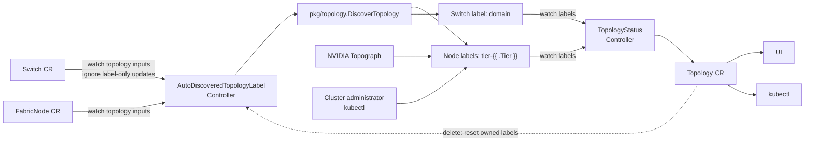

# Topology CRD Design

中文版本：[topology-crd.zh.md](./topology-crd.zh.md)

## Overview

`Topology` is Unifabric's cluster-scoped topology view for queries, visualization, diagnostics, and observability. v1beta1 reserves three fixed object names, each materialized only after that topology has data:

- `scaleout`: the scale-out network between GPU Nodes.
- `scaleup`: high-bandwidth accelerator interconnects such as NVLink.
- `storage`: the storage network containing compute Nodes and external storage endpoints.

The final API uses a read-only status model. `Topology` has no `spec` and does not actively match resources. The Controller aggregates performance domains, parent relationships, and Node paths from Kubernetes Node labels into `status`. Switch CRs enrich `members` through the shared `unifabric.io/domain` label and select the topology through `spec.role`. Built-in discovery writes this label automatically; NVIDIA Topograph and user-defined modes may leave `members` empty or let an administrator create label-only Switch resources.

This document defines the target API contract and reconciliation semantics.

## Goals and non-goals

### Goals

- Represent scale-out, scale-up, and storage topology through one read-only API.
- Use Node labels as the sole source for `domains` and `nodes`; use the fixed Switch `domain` label only to enrich `members`.
- Represent performance-domain hierarchy, network devices within each performance domain, and the complete performance-domain path of each Node.
- Support Unifabric switch discovery, NVIDIA Topograph, and administrator-managed labels.
- Keep assigned performance-domain names stable across ordinary reconciliation, device disconnection, Controller restart, and leader transition.

### Non-goals

- Topology defines no resource-matching criteria.
- Topology status content does not create or modify Node, Switch, or FabricNode labels in the reverse direction. The explicit reset triggered by deleting a Topology CR is the only exception.
- Topology does not store raw LLDP, port, link, bandwidth, latency, or routing data.
- It does not define scheduler plugins, workload placement, or hard/soft topology constraints.
- Users cannot directly maintain `status.domains` or `status.nodes`.

## API design

`Topology` is cluster-scoped. v1beta1 has no `spec`; its core status fields are:

| Field | Meaning |
| --- | --- |
| `status.domains` | Domains aggregated from labels. |
| `status.domains[*].name` | Domain name; valid as a Kubernetes label value. |
| `status.domains[*].tier` | Tier parsed from the position corresponding to the Go-template field `.Tier` in a topology label key. Every topology starts at `1` nearest to a Node and increases upward. |
| `status.domains[*].parent` | Optional direct parent Domain name; absent on a root. |
| `status.domains[*].members` | Names of the Switch CRs carrying this performance domain. |
| `status.nodes` | Kubernetes Nodes grouped by identical `domainPath`. |
| `status.nodes[*].nodes` | Node names sharing the path, sorted lexically. |
| `status.nodes[*].domainPath` | Domain names ordered from the highest to the lowest tier. |

Target status example:

```yaml
apiVersion: unifabric.io/v1beta1
kind: Topology
metadata:
  name: scaleout
status:
  domains:
    - name: tier3-group1
      tier: 3
      members:
        - core
    - name: tier2-group1
      tier: 2
      parent: tier3-group1
      members:
        - spine1
        - spine2
    - name: tier1-group1
      tier: 1
      parent: tier2-group1
      members:
        - leaf1
        - leaf2
    - name: tier1-group2
      tier: 1
      parent: tier2-group1
      members:
        - leaf3
        - leaf4
  nodes:
    - nodes: [node1, node2]
      domainPath:
        - tier3-group1
        - tier2-group1
        - tier1-group1
    - nodes: [node3, node4]
      domainPath:
        - tier3-group1
        - tier2-group1
        - tier1-group2
```

The status above is only a three-tier scale-out example. It does not fix scale-out at three tiers. Built-in LLDP discovery names performance domains with `tier${N}-group${M}`, where `N` is the tier and `M` is the group sequence within that topology and tier. Two-tier, four-tier, and deeper paths use the same data structure and naming rule.

Because `parent` explicitly expresses Domain relationships, Kubernetes Nodes live only in `status.nodes`. `members` contains only Switch CR name strings. It has no `kind` field and contains no Domain or Node references.

## Label contract

The target `chart/values.yaml` uses `topoDiscovery` to select one writer and one label-key template for each topology:

```yaml
topoDiscovery:
  scaleUp:
    mode: manual # nv-topograph or manual
    label:
      keyTemplate: "scale-up.unifabric.io/tier-{{ .Tier }}"
  scaleOut:
    mode: unifabric-roce # nv-topograph or unifabric-roce
    label:
      keyTemplate: "scale-out.unifabric.io/tier-{{ .Tier }}"
  storage:
    mode: unifabric-roce # unifabric-roce or unifabric-ib
    label:
      keyTemplate: "storage.unifabric.io/tier-{{ .Tier }}"
```

These values are Go `text/template` templates. The Controller parses each template once at startup and executes it during reconciliation with data containing only `Tier int`. Go renders `.Tier` as a canonical decimal integer greater than or equal to 1. For example, tiers 1 and 4 produce `scale-out.unifabric.io/tier-1` and `scale-out.unifabric.io/tier-4`. The Controller does not depend on fixed leaf, spine, or core names and does not limit the maximum depth of scale-up, scale-out, or storage.

A template may contain fixed text and exactly one `{{ .Tier }}` action. The action's pipeline contains exactly one command, and that command is only the `.Tier` FieldNode. Functions, multi-command pipelines, variables, conditionals, loops, and other fields are forbidden. Startup validation walks the `text/template/parse` syntax tree to enforce this restriction and renders tier 1 and a multi-digit tier to verify that both outputs are valid Kubernetes label keys. All templates are parsed and cached at Controller startup instead of being reparsed during reconciliation.

Go templates provide forward rendering but do not reverse-parse `.Tier` from output. The Controller derives an anchored matcher from the same restricted syntax tree by escaping text nodes and replacing the single `.Tier` action with `([1-9][0-9]*)`. It uses that matcher to parse tiers from Node label keys. Switch membership uses a separate fixed `domain` key and infers the tier by matching its value to an existing Node Domain.

Tiers present on one Node for a topology are contiguous from tier 1. For example, tiers 1, 2, and 3 are valid, while tiers 1 and 3 without tier 2 are invalid. Different Nodes may end at different highest tiers. Missing higher tiers is valid. This continuity rule only makes an individual path complete and does not impose a fixed depth on a topology type.

`TopologyStatusController` selects the generated internal label template by Topology name. The scale-up and scale-out modes independently decide whether NVIDIA Topograph maps that topology to the configured Unifabric label keys. Accelerator uses `topoDiscovery.scaleUp.label.keyTemplate` only when scale-up selects `nv-topograph`; leaf, spine, and core use `topoDiscovery.scaleOut.label.keyTemplate` only when scale-out selects `nv-topograph`. Topograph retains its native default keys for a topology not assigned to it by Unifabric, so it does not compete with that topology's selected writer. Strings in Helm values are not evaluated as templates a second time automatically, so a Chart helper first validates the restricted template and then invokes `tpl` with a context containing only `Tier` to produce a concrete label key. The Topology CRD maintains no separate NVIDIA label mapping.

Each label value is a performance-domain name. It allows the letters, digits, `-`, `_`, and `.` supported by Kubernetes label values, has 1–63 characters, and begins and ends with an alphanumeric character. An empty value is not valid.

Built-in LLDP discovery always uses the `tier${N}-group${M}` format and offers no other naming mode. For example, one topology may contain `tier1-group1`, `tier1-group2`, and `tier2-group1`. Group sequences start independently at 1 for every topology and tier.

The Controller stores no separate naming counter. Every reconciliation scans existing managed Node tier labels and Switch `domain` labels for that topology, parses built-in values matching `tier${N}-group${M}`, and finds the current maximum `M` for each tier. New performance domains start at `M+1`, or at `group1` when no name exists. When one reconciliation contains multiple unnamed groups, the Controller sorts by tier and then by normalized Switch-member lists and resolved lower-group lists before allocating them in order.

Naming reconciliation for one topology is serialized within the elected leader. Every allocation reads the latest API objects directly instead of relying on a possibly stale local counter. If some label Patches succeed, a retry recalculates the maximum from the written labels and reuses the locked name already present in that group.

This approach does not retain sequence history for a group that has completely disappeared. If every Node and Switch object carrying one performance domain is actually deleted, all of its labels disappear and that sequence may be reused later. A device power-off does not permit reuse while its Kubernetes object and labels remain.

### Label locking rules

For built-in LLDP discovery, once a Node carries a managed tier label or a Switch carries the managed `domain` label, that key/value is a locked performance-domain assignment. Ordinary automatic reconciliation does not overwrite, migrate, rename, or remove it. A Node, Switch, or FabricNode disconnection, health-state change, missing LLDP observation, or deleted discovery input does not clean up an existing label.

Automatic discovery only fills missing labels:

1. If members of a newly discovered group already carry one consistent domain name in their Node tier labels or Switch `domain` labels, reuse that name and label only the unlabeled members.
2. If no group member carries a label at that tier, allocate a new `tier${N}-group${M}` name.
3. If one discovered group contains multiple locked names, or a Switch `domain` encodes a different built-in tier from the discovered group, report a conflict and retain every existing label. Do not choose or overwrite one automatically.
4. Deleting one managed label is not a full-topology recomputation signal. A later reconciliation may restore it from the name locked on other members of the same group.

The following guarantees assume that the Kubernetes API and etcd still retain the resource objects and labels. Powering off a device is not the same as deleting its Node, Switch, or FabricNode object.

| Scenario | Assigned names |
| --- | --- |
| Some Nodes power off | Preserved |
| Some Switches power off | Preserved |
| All Nodes power off | Preserved |
| All Switches power off | Preserved |
| The entire region powers off | Preserved |
| Controller restart | Preserved |
| Leader transition | Preserved |
| User deletes the corresponding Topology CR | Clear managed labels and fully recompute |

Deleting the corresponding Topology CR is the only full recomputation entry point. For a topology owned by built-in LLDP discovery, deletion clears its managed Node and Switch labels. Discovery then computes the current complete result, recreates the fixed Topology CR only when that result is non-empty, and assigns names again from `group1`. Labels managed by NVIDIA Topograph or an administrator remain under their original writer. Unifabric does not use Topology deletion to force-remove labels owned by an external writer.

### Single-writer rules for labels

Each topology label key has exactly one writer at a time:

- When built-in LLDP discovery is enabled, Unifabric owns the scale-out and storage Node labels it generates and the single member label on each Switch.
- When `scaleUp.mode=nv-topograph`, NVIDIA Topograph owns the configured scale-up Node labels. Independently, when `scaleOut.mode=nv-topograph`, it owns the configured scale-out Node labels and does not produce Switch `domain` labels; administrators may add those labels to label-only Switch CRs.
- When `scaleOut.mode=unifabric-roce`, built-in LLDP discovery owns the configured scale-out labels even if scale-up uses NVIDIA Topograph. Topograph's native labels for a topology not selected for NVIDIA ownership remain outside the Unifabric label contract.
- A cluster administrator may manually manage Node labels for a topology only when no automatic writer owns it. For example, NVIDIA may manage scale-up and scale-out while storage remains user-managed.
- An automatic controller fills only label keys it owns and removes those keys only during the explicit reset triggered by deleting a Topology CR. If another field manager owns the same key or supplies a different value, report a conflict and do not force ownership.

### Node labels

A Node may carry multiple tier labels for one topology; together they describe one high-to-low path:

```yaml
metadata:
  name: node1
  labels:
    scale-out.unifabric.io/tier-3: tier3-group1
    scale-out.unifabric.io/tier-2: tier2-group1
    scale-out.unifabric.io/tier-1: tier1-group1
```

Built-in LLDP discovery assigns these names when it first labels the performance domains. Later membership or observation changes do not rewrite the existing values.

The Controller builds `domainPath` by sorting tiers parsed from label keys from highest to lowest, then combines Nodes with identical paths into one `status.nodes` entry. Node names and entries have stable ordering.

### Enriching members from a Switch label

Node labels alone cannot reveal that `tier1-group1` contains the physical switches `leaf1` and `leaf2`. All fabrics therefore share one fixed Switch membership key: `unifabric.io/domain`. `Switch.spec.role` selects scale-out, scale-up, or storage. Built-in discovery writes the key automatically. `TopologyStatusController` watches it, filters Switches by role, and uses the label value to populate `status.domains[*].members`.

Member enrichment follows these rules:

1. A Node expresses its complete highest-to-lowest path and may therefore carry multiple tier labels at the same time.
2. A Switch carries only the fixed `unifabric.io/domain` label and selects its fabric through `spec.role`. It does not carry a tier key or ancestor/descendant labels.
3. The `domain` value must exactly match one Domain already built from Node labels. Because Domain names are unique across tiers, the Controller infers the Switch tier from that Domain.
4. A missing Domain is reported as pending and the Switch is omitted until the matching Node Domain appears.
5. Switch CR names in `members` are deduplicated and sorted lexically.
6. NVIDIA Topograph and user-defined modes may leave `members` empty. To enrich them, an operator creates a Switch without `spec.mgmtIP`, sets `spec.role`, and adds only the shared `unifabric.io/domain` label. No annotation, tier, or switch-agent connection is required.

For example, a label-only Switch can join `tier1-group1` without declaring its tier:

```yaml
apiVersion: unifabric.io/v1beta1
kind: Switch
metadata:
  name: leaf1
  labels:
    unifabric.io/domain: tier1-group1
spec:
  role: ScaleOut
```

For example, if NVIDIA Topograph has already written the `tier1-group1` and `tier2-group1` domains to Nodes, label-only Switch resources can supply their physical members:

```yaml
apiVersion: unifabric.io/v1beta1
kind: Switch
metadata:
  name: leaf1
  labels:
    unifabric.io/domain: tier1-group1
spec:
  role: ScaleOut
---
apiVersion: unifabric.io/v1beta1
kind: Switch
metadata:
  name: leaf2
  labels:
    unifabric.io/domain: tier1-group1
spec:
  role: ScaleOut
---
apiVersion: unifabric.io/v1beta1
kind: Switch
metadata:
  name: spine01
  labels:
    unifabric.io/domain: tier2-group1
spec:
  role: ScaleOut
```

The same label key is used for leaf, spine, and core. Only the value changes. `TopologyStatusController` finds `tier1-group1` or `tier2-group1` in the Node-derived Domains and obtains the tier from there.

In the built-in RoCE mode, a Switch without switch-side LLDP may additionally declare physical Switch neighbors with the generic `unifabric.io/neighbors` annotation, for example `unifabric.io/neighbors: '["leaf1", "leaf2"]'`. `spec.role` selects the fabric, so the annotation key is shared across roles. Host LLDP supplies Node-to-leaf links, while this annotation supplies Switch-to-Switch links; auto-discovery then writes the Node tier labels and Switch `domain` labels. Neighbor references must resolve to same-role Switch resources, and one side of an undirected link is sufficient.

## Building status from labels

`TopologyStatusController` builds a complete in-memory snapshot on every reconciliation before replacing status atomically:

1. Select the configured Node label template by Topology name and filter Switches by `spec.role`; parse Node tiers and sort them from highest to lowest.
2. Read relevant labels from all Nodes.
3. Remove empty values, validate path continuity, and create Domains at their fixed tiers.
4. Create `parent` from adjacent values in every path. A child mapped to different parents is a conflict.
5. Group Kubernetes Nodes by complete `domainPath` to build `status.nodes`.
6. Read the fixed `domain` label on each Switch, match its value to a Node-derived Domain, and populate members using the Domain's inferred tier; leave members empty when no Switch label exists.
7. Validate Domain names, tiers, member uniqueness, and reference completeness.
8. Stably sort Domains, members, Node groups, and Node names. Do not write the API when status is unchanged.

Performance-domain relationships form a tree or forest. Each non-root domain has exactly one parent, cannot reference itself, and cannot form a cycle. A Node or Switch cannot belong to multiple performance domains at one tier.

When label input conflicts, the Controller retains the last successfully built `domains` and `nodes`, preventing insight consumers from observing a partial result. Kubernetes Events, structured logs, and metrics identify the conflicting resource, label key, and values. Status is replaced atomically after the input recovers.

## The three topologies

### Scale-out

Switch discovery invokes `pkg/topology.DiscoverTopology()` to calculate groups and parents. Switches with a shared downstream Node are combined into one Domain, whose downstream Node set is the union observed by its members. For example, when leaf1 and leaf2 both connect to node1 and node2, they form one tier 1 performance domain. If no other group has been allocated at that tier, the Controller names it `tier1-group1`, and both Nodes and Switches carry that value:

```yaml
# node1 and node2
scale-out.unifabric.io/tier-1: tier1-group1

# Switch/leaf1 and Switch/leaf2
unifabric.io/domain: tier1-group1
```

If leaf1 connects to `{node1, node2}` while leaf2 connects to `{node2, node3}`, the shared node2 places leaf1 and leaf2 in the same Domain, and node1, node2, and node3 receive that Domain's tier 1 label. Member downstream sets need not be identical because a failed NIC or link may be absent from the current LLDP observations. Leaves with no shared downstream Node form separate groups. Dual uplinks still do not give a Domain multiple parents; uplink switches with shared downstream groups are combined in the same way.

Leaf, spine, and core are device roles in a common three-tier network, not fixed tiers in the label contract. Discovery renders one label tier with `.Tier` for every valid tier returned in `DiscoverTopology().GroupsByTier`.

### Scale-up

When `scaleUp.mode=nv-topograph`, Node labels written by NVIDIA Topograph directly form scale-up performance domains and Node groups. Nodes with the same `scale-up.unifabric.io/tier-1` label value belong to one tier 1 domain. This example uses only tier 1 and does not create a Unifabric API depth limit. Higher tiers use the same template. This source normally has no Switch labels, so empty `members` is normal. Scale-out independently uses NVIDIA labels only when `scaleOut.mode=nv-topograph`.

### Storage

Storage paths also come only from Kubernetes Node labels and use the `storage.unifabric.io/tier-{{ .Tier }}` template for arbitrary depth. A large storage network can add tier 2, tier 3, or higher without changing the configuration structure or CRD. Storage uses the same contiguous-path and single-parent rules as scale-out. An external FabricNode without a Kubernetes Node cannot establish a performance domain or path by itself.

## Status and validation

Topology status contains only `domains` and `nodes`; it has no source or reconciliation-state fields. A user cannot update status through a normal resource update. The Controller does not eagerly create the three fixed `scaleout`, `scaleup`, and `storage` CRs at startup. It creates only the fixed CR whose complete, valid input produces at least one Domain and Node group, and reuses an existing object. Built-in discovery creates that CR with its reset finalizer immediately before writing the first managed labels; external Node-label sources cause `TopologyStatusController` to create it during aggregation. When a user deletes one, the Controller first completes the explicit reset for that topology and recreates the fixed CR only after topology data becomes available again. Status is replaced atomically only after the complete input passes validation. Validation failures and incomplete member data are exposed through Kubernetes Events, structured logs, and metrics.

Removing all relevant labels from Nodes and Switches is a valid empty result. If the corresponding CR already exists, the Controller clears `status.domains` and `status.nodes` but keeps the CR itself; if the CR has never been created, it remains absent. The Controller retains the last valid status only for input conflicts or read failures; a valid empty result is not treated as an error.

Primary validation rules:

- `metadata.name` is `scaleout`, `scaleup`, or `storage`.
- The CRD has no `spec` or member-matching expression.
- `topoDiscovery` contains one valid mode and one label template for `scaleUp`, `scaleOut`, and `storage`. Every template parses with Go `text/template`, has exactly one `.Tier` action in its syntax tree, and otherwise contains only fixed text. Execution with any supported positive integer produces a valid Kubernetes label key. The key sets generated by the three templates cannot overlap.
- A label value satisfies the Domain-name limits, and one name cannot occur at different tiers.
- A label value generated by built-in LLDP discovery has the form `tier${N}-group${M}`. `N` equals the tier parsed from the label key, and `M` is a decimal integer greater than or equal to 1. Group sequences are allocated independently for every topology and tier.
- A path is ordered from highest to lowest tier parsed from label keys. Tiers present on one Node are contiguous from tier 1. There is no maximum tier, and missing higher tiers is valid.
- Every child Domain has at most one parent, and Domain relationships are acyclic.
- A member resource has one `domain` assignment in a topology. A Node path naturally has one label value per tier.
- A Switch `domain` label with no corresponding Node-derived Domain does not create an orphan Domain and is reported as incomplete member data.
- Discovery fills only missing managed labels. Ordinary reconciliation does not replace, migrate, or remove existing managed labels. A conflict between a locked assignment and current discovery retains the old labels and reports an error.
- `status.domains[*].members` contains only names of existing Switch CRs, with no duplicate names.

## Decoupled controller design



| Controller | Primary input | Primary output | Does not own |
| --- | --- | --- | --- |
| `AutoDiscoveredTopologyLabelController` | `Switch` CRs, `FabricNode` CRs, and deletion signals for Topology CRs owned by built-in discovery | Multiple Node path labels and one member label per Switch | Does not derive labels from Topology status or write Topology status |
| `TopologyStatusController` | Node tier labels matching topology templates, the fixed Switch `unifabric.io/domain` label, and `Switch.spec.role` | Status of `scaleout`, `scaleup`, and `storage` | Does not run LLDP discovery or write Node or Switch labels |

NVIDIA already stores facts in Node labels, which `TopologyStatusController` reads directly, so there is no intermediate labels-to-CRD controller. Ordinary reconciliation has no reverse data flow from CRD status to labels. Only deletion of a Topology CR managed by built-in LLDP discovery acts as an explicit reset control signal to the label Controller.

### Writing automatically discovered labels

`AutoDiscoveredTopologyLabelController` watches create, update, and delete events for `Switch` and `FabricNode` CRs. Create and delete events always trigger a complete reconciliation. An update triggers reconciliation only when an input field used by topology calculation changes:

1. Fetch the latest lists of `Switch` and `FabricNode` CRs and build the current discovery input.
2. Call `pkg/topology.DiscoverTopology()` to calculate the latest complete topology. If calculation fails, preserve existing labels and return an error for retry.
3. Use `GroupsByTier` and `ParentIndex` to build every Node's complete performance-domain path and render each label key with the pre-parsed topology-label Go template and `Tier` data. Resolve performance domains bottom-up from tier 1 so an upper tier uses only resolved lower-tier results.
4. Read existing managed Node tier labels and Switch `domain` labels. An existing key/value is a locked assignment and is not regenerated from the latest discovery result.
5. For every discovered group, first reuse one consistent existing name from its members. If it has no name, scan existing Node tier labels and Switch `domain` values and allocate `tier${N}-group${M}` from the current maximum sequence plus 1. Multiple locked names in one group are a conflict, and the reconciliation writes no new label for that result.
6. Use `TopologyGroup.Members` to fill the missing `domain` label on each Switch and fill missing tier labels in each Node path. Never generate an overwrite or deletion patch for an existing managed key, even when its value differs from current discovery.
7. Write missing labels through metadata Patches only after the complete result passes path, parent, overlap, and locked-assignment conflict validation.
8. Return an error when an API update fails. The controller-runtime rate-limited queue retries after directly refetching the latest Node and Switch objects, recalculating every tier's maximum sequence, and reusing existing locked labels.

The flow is idempotent. Repeated reconciliation only fills missing labels and never rewrites an assigned name. If some object updates succeed while others fail, the next reconciliation continues from current labels. Switch or FabricNode update and delete events, as well as periodic resync, do not clean up or reassign an existing name.

### Explicit reset by deleting a Topology CR

A Topology CR managed by built-in LLDP discovery carries a finalizer owned by `AutoDiscoveredTopologyLabelController`. After computing a non-empty discovery plan and before writing its first managed label, the Controller creates the missing fixed Topology CR with the finalizer, or confirms that the finalizer is stored on an existing CR. It does not create a CR for an empty plan and does not begin label allocation before the finalizer is persisted.

Deletion resets it in this order:

1. Detect `deletionTimestamp` and stop ordinary label filling for that topology.
2. Remove Node and Switch labels owned by built-in LLDP discovery for that topology. Keep the finalizer and retry if any object update fails.
3. Remove the finalizer only after all managed labels have been cleared, allowing the old CR to be deleted.
4. Discovery recomputes the current complete topology. If the result is non-empty, it creates the missing fixed CR with its finalizer and allocates each tier again from `group1`; `TopologyStatusController` then aggregates the new labels into status.

The deletion event is a recomputation command, not ordinary observation data. The finalizer lets the same reset continue after Controller restart, leader transition, or a partial Patch failure. This flow does not remove labels owned by NVIDIA Topograph or an administrator.

### Preventing label writes from retriggering discovery

Changing a Switch label produces a Kubernetes Update event. If `AutoDiscoveredTopologyLabelController` watches `Switch` without a predicate, writing a member label enqueues the controller again. Diff-based writes prevent the second reconciliation from issuing another API write, so this normally does not become an infinite loop. It still causes a redundant reconciliation and amplifies API load and resource-version conflicts during batch updates.

The discovery controller must use update predicates based on topology inputs instead of comparing whole objects:

- The `Switch` input fingerprint contains only `spec.role`, `status.hostname`, `status.healthy`, and normalized `status.lldpNeighbors`.
- The `FabricNode` input fingerprint contains only `status.nodeRole` and the fields from `status.scaleOutNics` and `status.storageNics` that topology calculation consumes. A NIC fingerprint includes at least its state and LLDP-neighbor hostname and port.
- Create and Delete events always enqueue reconciliation. An Update event is enqueued only when the old and new input fingerprints differ. Changes to `resourceVersion`, managed topology labels, and unrelated metadata are not topology input changes.
- `GenerationChangedPredicate` alone is insufficient. Most Switch and FabricNode topology facts are in status, and status updates do not increment `metadata.generation`.

`AutoDiscoveredTopologyLabelController` does not watch the Node labels it emits. Periodic resync repairs missed events and fills missing labels. It does not treat an existing value that differs from current discovery as automatically repairable drift. Node and Switch labels are written with a metadata-only Patch carrying a resource-version precondition. After a conflict, the controller refetches the object, recalculates the diff, and retries instead of submitting a normal full-object Update with a wider field-update surface.

`TopologyStatusController` uses a different predicate. It compares Node labels matching the configured templates, the shared Switch `unifabric.io/domain` label, and Switch role between old and new objects. Any relevant add, change, removal, or role transition triggers aggregation without retriggering topology discovery.

### Aggregating Topology status

`TopologyStatusController` watches Node tier labels and Switch `domain` labels. Multiple labels on a Node generate performance domains, parent relationships, and its complete path; the single `domain` value on each Switch adds that Switch to the matching Domain and obtains its tier from that Domain. It does not create empty fixed CRs at startup. A missing CR is created only when the corresponding valid label snapshot contains topology data. After an explicit reset, it remains absent until discovery or an external writer makes topology labels available again. The Controller skips status writes while a CR has a `deletionTimestamp`, preventing consumers from observing a partial label snapshot during reset. It maps label events to the affected fixed-name Topology, applies a short debounce to coalesce label updates from one batch, reads the latest API-cache snapshot, and updates the corresponding status subresource for UI and user consumption.

This controller is the sole writer of every Topology status. Discovery, NVIDIA components, and users do not write Topology status directly, so controllers do not compete for status fields and cannot form a label-to-CRD-to-label loop.

## Reconciliation and implementation guidance

- `AutoDiscoveredTopologyLabelController`: create, delete, and topology-input-fingerprint changes for FabricNodes and Switches. It does not watch Node labels and ignores label-only Switch updates. Discovery configuration changes and periodic resync also trigger missing-label filling. It also watches deletion of Topology CRs managed by built-in discovery and performs the full reset through a finalizer.
- `TopologyStatusController`: rebuild when a Node tier label matching a topology template or a fixed Switch `domain` label is added, changed, or removed, and watch deletion events for the three fixed Topology CRs. Unrelated field changes do not rebuild the view.
- Sort every list and map before writing. Identical input produces no API update.
- Expose reconcile, error, conflict, incomplete-member, last-success-time, and stale-status metrics independently.

Suggested implementation order:

1. Implement the `Topology` v1beta1 CRD and required RBAC, then run `make crd` to generate YAML. Create each fixed CR lazily after its first non-empty topology result, add the reset finalizer before built-in discovery writes labels, recreate the CR after reset only when topology data returns, and clear status while retaining an already-created CR after labels become validly empty.
2. Introduce `topoDiscovery` in `chart/values.yaml`: put the writer mode and restricted Go `text/template` label-key template together under `scaleUp`, `scaleOut`, and `storage`. Derive built-in LLDP and NVIDIA Topograph enablement independently for each topology, update the generated Controller configuration and every Chart reference, and reject unsupported modes or multiple writers for the same label contract. NVIDIA Topograph templates conditionally map scale-up and scale-out to their configured keys through a restricted Helm `tpl` helper.
3. Implement a pure `BuildTopologyStatus(labelSnapshot)` function. Test template parsing, paths deeper than three tiers, different Nodes omitting higher tiers, tier gaps, multiple parents, stable sorting, invalid names, and empty input.
4. Extend current switch discovery to watch `Switch` and `FabricNode` CRs, filter label-only and unrelated updates with topology-input-fingerprint predicates, and invoke the topology library after valid LLDP or `unifabric.io/neighbors` input changes. Replace the current performance-domain naming logic with `tier${N}-group${M}` sequential naming. Calculate each tier's maximum group sequence from existing Node tier labels and Switch `domain` values without introducing separate persistent naming state. Reconcile existing managed labels with discovery and create metadata Patches with resource-version preconditions only for missing labels. Ordinary reconciliation does not rewrite, migrate, or clean up an existing managed label. Test leaf1 and leaf2 forming `tier1-group1`, multiple groups incrementing within one tier, depths above three tiers, reuse of existing names, filling new members, manual Switch adjacency, malformed or unresolved neighbor references, disconnection without rename, input deletion without cleanup, conflicts among locked names, serialized reconciliation, partial failure, label-only Switch updates not retriggering discovery, and ownership.
5. Add `TopologyStatusController` with diff predicates for Node tier labels and fixed Switch `domain` labels. Cover NVIDIA Node labels, user-managed Node labels, LLDP and administrator-provided Switch memberships, orphan members, dynamically added higher tiers, deletion, and recovery, and verify that a Switch label update triggers status aggregation only.
6. Keep existing tests and add only new unit tests for the new behavior: cover `BuildTopologyStatus`, Go-template parsing and caching, syntax-tree validation that permits only `.Tier`, forward rendering, reverse tier matching, template disjointness, sequential naming at dynamic tiers, maximum-sequence parsing from existing labels, existing-label locking, filling only missing labels, no writes when unchanged, failure retries, no cleanup after input deletion, single-writer conflicts, serialized reconciliation, finalizer reset and recovery after failure, lazy creation and recreation of only non-empty fixed CRs, and valid empty labels clearing status while retaining an existing CR.
7. Add one E2E test that reuses the NVAIR RoCE + Switch environment in `e2e/topology` with built-in LLDP discovery enabled. After FabricNodes, Switches, Node/Switch labels, and `Topology/scaleout` converge, verify that Node labels, Switch labels, performance-domain tiers and parents, Switch members, Node groups, and `domainPath` match the expected NVAIR topology. The scenario has no core and must still produce a valid spine/leaf path.
