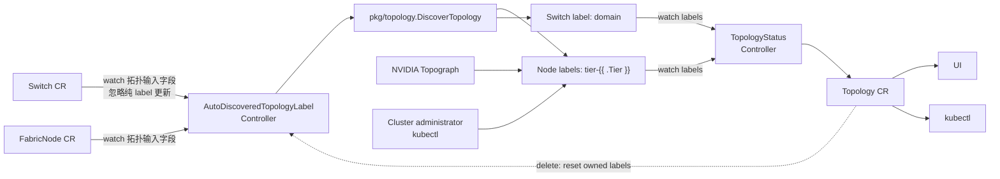

# Topology CRD 设计

English version: [topology-crd.md](./topology-crd.md)

## 概述

`Topology` 是 Unifabric 面向查询、展示、诊断和可观测性提供的集群级拓扑视图。v1beta1 固定保留三个对象名称，每个对象只在对应拓扑出现数据后才创建：

- `scaleout`：GPU 节点之间的横向扩展网络。
- `scaleup`：NVLink 等高带宽加速互联。
- `storage`：计算节点和外部存储端点所在的存储网络。

最终 API 采用只读状态模型。`Topology` 不定义 `spec`，也不主动匹配资源。
性能域、父子关系和 Node 路径统一由 Controller 从 Kubernetes Node labels 汇总到 `status`。
Switch CR 通过共用的 `unifabric.io/domain` label 补充 `members`，并由 `spec.role` 选择拓扑。内置发现会自动写入该 label；NVIDIA Topograph 和用户自定义模式可以保持 `members` 为空，也可以由管理员创建只带 label 的 Switch 资源进行补全。

本文定义目标 API 契约和协调语义。

## 目标与非目标

### 目标

- 用统一的只读 API 表达 scale-out、scale-up 和 storage 拓扑。
- 以 Node labels 作为 `domains` 和 `nodes` 的唯一事实来源，只使用固定的 Switch `domain` label 补充 `members`。
- 同时表达性能域层级、性能域内的网络设备以及 Node 的完整性能域路径。
- 兼容 Unifabric 交换机自动发现、NVIDIA Topograph 和用户手工打的 labels。
- 保证已分配的性能域名称在普通协调、设备断连、Controller 重启和 Leader 切换时保持不变。

### 非目标

- 不在 Topology 中定义资源匹配条件。
- 不根据 Topology status 内容反向创建或修改 Node、Switch、FabricNode labels。用户删除 Topology CR 触发的显式重置流程除外。
- 不保存 LLDP、端口、链路、带宽、时延或路由等原始数据。
- 不定义调度器插件、工作负载放置策略或 hard/soft 拓扑约束。
- 不允许用户直接维护 `status.domains` 或 `status.nodes`。

## API 设计

`Topology` 是 cluster-scoped 资源。v1beta1 没有 `spec`，目标状态示例：

```yaml
apiVersion: unifabric.io/v1beta1
kind: Topology
metadata:
  name: scaleout
status:
  domains:
    - name: tier3-group1
      tier: 3
      members:
        - core
    - name: tier2-group1
      tier: 2
      parent: tier3-group1
      members:
        - spine1
        - spine2
    - name: tier1-group1
      tier: 1
      parent: tier2-group1
      members:
        - leaf1
        - leaf2
    - name: tier1-group2
      tier: 1
      parent: tier2-group1
      members:
        - leaf3
        - leaf4
  nodes:
    - nodes: [node1, node2]
      domainPath:
        - tier3-group1
        - tier2-group1
        - tier1-group1
    - nodes: [node3, node4]
      domainPath:
        - tier3-group1
        - tier2-group1
        - tier1-group2
```

核心状态字段如下：

| 字段 | 说明 |
| --- | --- |
| `status.domains` | 从 labels 汇总出的性能域集合。 |
| `status.domains[*].name` | 性能域名称。 |
| `status.domains[*].tier` | 从 topology label key 中 Go 模板 `.Tier` 对应的位置解析出的层级编号。所有拓扑都从最靠近 Node 的 `1` 开始向上递增。 |
| `status.domains[*].parent` | 可选的直接上级性能域名称，根性能域不设置。 |
| `status.domains[*].members` | 承载这个性能域的 Switch CR 名称列表。 |
| `status.nodes` | 按相同 `domainPath` 合并后的 Kubernetes Node 集合。 |
| `status.nodes[*].nodes` | 具有相同路径的 Node 名称，按字典序排列。 |
| `status.nodes[*].domainPath` | 从最高层到最低层排列的性能域名称。 |

上面的 status 只是一个三层 scale-out 示例，不表示 scale-out 固定为三层。内置 LLDP 自动发现使用 `tier${N}-group${M}` 命名性能域。其中 `N` 是层级，`M` 是该拓扑、该层级内的组序号。两层、四层或更深的路径使用相同数据结构和命名规则。

`parent` 已显式表达性能域关系，Kubernetes Node 统一放在 `status.nodes`。`members` 只保存 Switch CR 名称字符串，不包含 `kind`，也不包含性能域或 Node 引用。

## Label 契约

目标 `chart/values.yaml` 使用 `topoDiscovery`，为每类拓扑选择唯一写入模式并配置一个 label key 模板：

```yaml
topoDiscovery:
  scaleUp:
    mode: manual # nv-topograph 或 manual
    label:
      keyTemplate: "scale-up.unifabric.io/tier-{{ .Tier }}"
  scaleOut:
    mode: unifabric-roce # nv-topograph 或 unifabric-roce
    label:
      keyTemplate: "scale-out.unifabric.io/tier-{{ .Tier }}"
  storage:
    mode: unifabric-roce # unifabric-roce 或 unifabric-ib
    label:
      keyTemplate: "storage.unifabric.io/tier-{{ .Tier }}"
```

这些值是 Go `text/template` 模板。Controller 启动时解析一次模板，协调时使用只包含 `Tier int` 的数据执行模板，由 Go 直接把 `.Tier` 渲染为大于等于 1 的规范十进制整数。例如 tier 1 和 tier 4 分别生成 `scale-out.unifabric.io/tier-1` 和 `scale-out.unifabric.io/tier-4`。Controller 不依赖固定的 leaf、spine、core 名称，也不限制 scale-up、scale-out 或 storage 的最大层数。

模板只开放固定文本和且仅有一个 `{{ .Tier }}` action。该 action 的 pipeline 只能包含一个 command，并且这个 command 只能是 `.Tier` FieldNode。不允许函数、多命令 pipeline、变量、条件、循环或其他字段。启动校验遍历 `text/template/parse` 语法树，确认模板满足该约束，并分别使用 tier 1 和一个多位 tier 验证输出是合法的 Kubernetes label key。所有模板在 Controller 启动时完成解析并缓存，不能在每次协调中重复解析。

Go template 只负责正向渲染，不提供从结果反向解析 `.Tier` 的能力。Controller 根据同一棵受限语法树生成锚定 matcher，将固定文本转义并把唯一的 `.Tier` action 转换为 `([1-9][0-9]*)`，再用它从 Node label keys 解析 tier。Switch 成员使用独立的固定 `domain` key，通过与已有 Node Domain 同名匹配来推断 tier。

一个 Node 在同一拓扑中已经出现的 tiers 必须从 tier 1 开始连续。例如 tier 1、2、3 合法，tier 1、3 无效。不同 Node 的最高 tier 可以不同，缺少更高层是合法的。这里的连续性约束只保证单条路径完整，不表示某类拓扑只能有固定层数。

`TopologyStatusController` 根据 Topology 名称选择生成后的内部 label 模板。Scale-up 和 scale-out mode 分别决定 NVIDIA Topograph 是否把对应拓扑映射到 Unifabric 配置的 label key：只有 scale-up 选择 `nv-topograph` 时 accelerator 才使用 `topoDiscovery.scaleUp.label.keyTemplate`，只有 scale-out 选择 `nv-topograph` 时 leaf、spine、core 才使用 `topoDiscovery.scaleOut.label.keyTemplate`。未交给 NVIDIA 管理的拓扑继续使用 Topograph 原生默认 key，因此不会与该拓扑选定的 writer 争用 Unifabric label。Helm values 中的字符串不会自动进行第二次模板求值，因此 Chart helper 必须先校验受限模板，再通过 `tpl` 和只包含 `Tier` 的上下文生成具体 label key。Topology CRD 不维护另一套 NVIDIA label 映射。

每个 label value 就是性能域名称。性能域名称允许 Kubernetes label value 支持的字母、数字、`-`、`_` 和 `.`，长度为 1–63，且必须以字母或数字开头和结尾。空值不构成有效性能域。

内置 LLDP 自动发现固定使用 `tier${N}-group${M}` 格式，不提供其他命名模式。例如同一拓扑中可以同时存在 `tier1-group1`、`tier1-group2` 和 `tier2-group1`。组序号在每个拓扑、每个 tier 内独立从 1 开始分配。

Controller 不保存额外的命名计数器。每次协调都扫描该拓扑下已有的 Node tier labels 和 Switch `domain` labels，解析内置发现生成的 `tier${N}-group${M}` 值，取每个 tier 当前最大的 `M`。新性能域从 `M+1` 开始分配。没有任何已有名称时从 `group1` 开始。同一轮中出现多个未命名组时，先按 tier，再按规范化的 Switch 成员列表和已确定的下层组列表稳定排序，然后依次分配。

同一拓扑的命名协调必须在当前 Leader 内串行执行。每轮分配前直接读取最新 API 对象，不使用可能滞后的本地计数。如果部分 label Patch 成功，重试会从已写入 labels 重新计算最大序号并复用组内已锁定名称。

这个方案不保留已经完全消失的历史序号。如果某个性能域的所有 Node 和 Switch 对象都被真正删除，其 labels 也随之全部消失，该序号以后可能被复用。设备断电但 Kubernetes 对象和 labels 仍然存在时不会发生复用。

### Label 锁定规则

对于内置 LLDP 自动发现，Node 一旦携带受管 tier label，或 Switch 一旦携带受管 `domain` label，该 key/value 就是已锁定的性能域归属。普通自动协调不覆盖、不迁移、不重命名，也不因 Node、Switch 或 FabricNode 断连、健康状态变化、LLDP 信息缺失或发现输入删除而清理已有 label。

自动发现只填充缺失的 label：

1. 新发现组内成员的 Node tier labels 或 Switch `domain` labels 已包含一个一致的性能域名称时，复用该名称，只给未打 label 的成员补齐。
2. 组内没有成员携带该 tier label 时，分配一个新的 `tier${N}-group${M}` 名称。
3. 同一发现组内出现多个不同的已锁定名称，或 Switch 的内置 `domain` 值编码出的 tier 与发现结果不一致时，报告冲突并保留所有已有 labels，不自动选择或覆盖其中一个。
4. 单独删除某个受管 label 不是整个拓扑的重算信号。后续协调可以根据同组其他成员已锁定的名称补回该 label。

以下保持性以 Kubernetes API 和 etcd 中的资源对象及 labels 没有被删除为前提。设备断电不等于删除 Node、Switch 或 FabricNode 对象。

| 场景 | 已分配名称 |
| --- | --- |
| 部分 Node 断电 | 保持 |
| 部分 Switch 断电 | 保持 |
| 全部 Node 断电 | 保持 |
| 全部 Switch 断电 | 保持 |
| 整个区域全部断电 | 保持 |
| Controller 重启 | 保持 |
| Leader 切换 | 保持 |
| 用户删除对应 Topology CR | 清理受管 labels 并全量重算 |

用户删除对应的 Topology CR 是唯一的全量重算入口。对内置 LLDP 拥有的拓扑，删除流程会清理该拓扑的受管 Node 和 Switch labels。随后自动发现基于当前完整结果重新计算；只有结果非空时才重建固定 Topology CR，并从 `group1` 开始重新分配。NVIDIA Topograph 或用户管理的 labels 仍由原写入方负责，Unifabric 不借助删除 Topology CR 强制清理外部写入方的 labels。

### Label 单写者规则

每个拓扑 label key 在同一时刻只能有一个写入方：

- 启用内置 LLDP 自动发现时，Unifabric 对它生成的 scale-out 和 storage Node labels 以及每个 Switch 上的单个 member label 拥有控制权。
- 当 `scaleUp.mode=nv-topograph` 时，NVIDIA Topograph 管理配置的 scale-up Node labels；与此独立，当 `scaleOut.mode=nv-topograph` 时，它管理配置的 scale-out Node labels，且不产生 Switch `domain` labels；管理员可以在只带 label 的 Switch CR 上补充这些 labels。
- 当 `scaleOut.mode=unifabric-roce` 时，即使 scale-up 使用 NVIDIA Topograph，配置的 scale-out labels 仍由内置 LLDP 自动发现管理。未被选为 NVIDIA writer 的拓扑所产生的 Topograph 原生 labels 不属于 Unifabric label contract。
- 只有对应拓扑没有启用自动写入方时，集群管理员才能手工管理它的 Node labels。例如 NVIDIA 可以管理 scale-up/scale-out，而 storage 仍由用户管理。
- 自动控制器只补充自己拥有的 label keys，只在用户删除 Topology CR 的显式重置中删除这些 keys。遇到其他 field manager 已拥有同一 key 或存在不同值时，报告冲突，不能强制接管。

### Node labels

Node 上可以同时存在同一拓扑的多个 tier labels，它们共同描述一条从高到低的路径。例如：

```yaml
metadata:
  name: node1
  labels:
    scale-out.unifabric.io/tier-3: tier3-group1
    scale-out.unifabric.io/tier-2: tier2-group1
    scale-out.unifabric.io/tier-1: tier1-group1
```

这些名称由内置 LLDP 自动发现在首次分配时生成。后续成员或观测输入变化不会改写已有值。

Controller 按 label key 中解析出的 tier 从高到低生成 `domainPath`，再把路径完全相同的 Node 合并为一个 `status.nodes` 条目。Node 名称和条目都稳定排序。

### Switch label 补充成员

只读取 Node labels 无法知道 `tier1-group1` 内实际包含 `leaf1` 和 `leaf2`。因此所有 fabric 共用一个固定的 Switch membership key：`unifabric.io/domain`，由 `Switch.spec.role` 选择 scale-out、scale-up 或 storage。内置发现会自动写入该 key，`TopologyStatusController` watch 该 label、按 role 过滤 Switch，并用其 value 补全 `status.domains[*].members`。

成员补充遵循以下规则：

1. Node 表达从最高层到最低层的完整路径，因此同一 Node 可以同时携带多个 tier labels。
2. Switch 只携带固定的 `unifabric.io/domain` label，并通过 `spec.role` 选择 fabric；不携带 tier key，也不携带上级或下级性能域 labels。
3. `domain` value 必须与 Node labels 已生成的某个 Domain 名称完全一致。Domain 名称不能跨 tier 重复，因此 Controller 可以从该 Domain 自动推断 Switch tier。
4. 找不到同名 Domain 时进入 pending，匹配的 Node Domain 出现前不把该 Switch 加入 members。
5. `members` 中的 Switch CR 名称按字典序去重并排序。
6. NVIDIA Topograph 和用户自定义模式可以保持 `members` 为空。如果需要补全，用户创建不含 `spec.mgmtIP` 的 Switch，设置 `spec.role`，并只添加共用的 `unifabric.io/domain` label；不需要 annotation、tier 或 switch-agent 连接。

例如只带 label 的 Switch 可以加入 `tier1-group1`，无需声明 tier：

```yaml
apiVersion: unifabric.io/v1beta1
kind: Switch
metadata:
  name: leaf1
  labels:
    unifabric.io/domain: tier1-group1
spec:
  role: ScaleOut
```

例如 NVIDIA Topograph 已在 Node 上写入 `tier1-group1` 和 `tier2-group1`，可以用只带 label 的 Switch 资源补全物理成员：

```yaml
apiVersion: unifabric.io/v1beta1
kind: Switch
metadata:
  name: leaf1
  labels:
    unifabric.io/domain: tier1-group1
spec:
  role: ScaleOut
---
apiVersion: unifabric.io/v1beta1
kind: Switch
metadata:
  name: leaf2
  labels:
    unifabric.io/domain: tier1-group1
spec:
  role: ScaleOut
---
apiVersion: unifabric.io/v1beta1
kind: Switch
metadata:
  name: spine01
  labels:
    unifabric.io/domain: tier2-group1
spec:
  role: ScaleOut
```

leaf、spine、core 都使用同一个 label key，只有 value 不同。`TopologyStatusController` 在 Node 生成的 Domains 中查找 `tier1-group1` 或 `tier2-group1`，并从匹配结果获得 tier。

在内置 RoCE 模式下，没有交换机侧 LLDP 的 Switch 还可以通过通用的 `unifabric.io/neighbors` annotation 声明物理交换机邻居，例如 `unifabric.io/neighbors: '["leaf1", "leaf2"]'`。fabric 类型由 `spec.role` 决定，所以不同 role 共用同一个 annotation key。主机 LLDP 提供 Node 到 leaf 的连接，该 annotation 提供 Switch 到 Switch 的连接；自动发现随后写入 Node tier labels 和 Switch `domain` labels。邻居必须引用同 role 的 Switch 资源，无向链路只需在一端声明。

## 从 labels 构建状态

`TopologyStatusController` 每次协调都先建立完整的内存快照，再一次性更新 status：

1. 根据 Topology 名称取得已配置的 Node label 模板，并按 `spec.role` 过滤 Switch；从 Node labels 解析 tier 并按从高到低排序。
2. 读取所有 Node 的相关 labels。
3. 删除空值并校验路径连续性，按 tier 生成性能域。
4. 从每条路径的相邻值生成 `parent`。同一 child 对应不同 parent 时判定为冲突。
5. 按完整 `domainPath` 对 Kubernetes Node 分组，生成 `status.nodes`。
6. 读取每个 Switch 上固定的 `domain` label，将 value 与 Node 生成的 Domain 匹配，再使用该 Domain 推断出的 tier 补全 members。没有 Switch label 时保持 members 为空。
7. 校验性能域名称、tier、成员唯一性和引用完整性。
8. 对 domains、members、node groups 和 nodes 稳定排序。与当前 status 无差异时不写 API。

性能域引用构成一棵树或由多棵树构成的森林。每个非根性能域只能有一个 parent，不得引用自身，也不得形成环。同一层中一个 Node 或 Switch 不能属于多个性能域。

如果 label 输入冲突，Controller 保留上一份成功构建的 `domains`、`nodes`，避免 insight 消费者读到半份结果，并通过 Kubernetes Event、结构化日志和指标指出冲突的资源、label key 和值。输入恢复后再原子替换状态。

## 三类拓扑

### Scale-out

交换机自动发现调用 `pkg/topology.DiscoverTopology()` 计算组和父子关系。具有共同下游节点的交换机合并为一个性能域，下游节点集合取各成员观测结果的并集。例如 leaf1、leaf2 都连接 node1、node2 时，两个 Switch 形成同一个 tier 1 性能域。如果该 tier 尚未分配其他组，Controller 命名为 `tier1-group1`，并给两个 Node 和两个 Switch 写入相同值：

```yaml
# node1、node2
scale-out.unifabric.io/tier-1: tier1-group1

# Switch/leaf1、Switch/leaf2
unifabric.io/domain: tier1-group1
```

如果 leaf1 连接 `{node1, node2}`，leaf2 连接 `{node2, node3}`，共同的 node2 表明 leaf1、leaf2 属于同一个性能域，node1、node2、node3 都写入该 Domain 的 tier 1 label。系统不要求成员的下游集合完全相同，因为网卡或链路故障可能使当前 LLDP 结果缺少部分连接；完全没有共同下游节点的 leaf 才会形成不同的组。一个性能域仍不允许因为双上联而出现多个 parent。具有共同下游组的上联交换机也按相同方式合并。

leaf、spine 和 core 只是常见三层网络中的设备角色，不是 label 契约中的固定层级。`DiscoverTopology()` 返回多少个有效 `GroupsByTier` 层级，自动发现就使用对应的 `.Tier` 渲染多少层 labels。

### Scale-up

当 `scaleUp.mode=nv-topograph` 时，NVIDIA Topograph 写入的 Node labels 直接形成 scale-up 性能域和 Node 分组。例如具有相同 `scale-up.unifabric.io/tier-1` label value 的 Node 属于同一 tier 1 性能域。这个例子只使用 tier 1，不构成 Unifabric API 的层数限制，更高层可以继续使用同一模板。该来源通常没有 Switch labels，因此 `members` 为空是正常状态。Scale-out 只有在 `scaleOut.mode=nv-topograph` 时才独立使用 NVIDIA labels。

### Storage

Storage 拓扑同样只从 Kubernetes Node labels 读取路径，并使用 `storage.unifabric.io/tier-{{ .Tier }}` 模板表达任意深度的层级。大型存储网络可以直接增加 tier 2、tier 3 或更高层，不需要修改配置结构或 CRD。它使用与 scale-out 相同的连续路径和单父规则。没有 Kubernetes Node 的外部 FabricNode 不能单独建立性能域或路径。

## 状态与校验

Topology status 只包含 `domains` 和 `nodes`，不包含来源或协调状态字段。用户不能通过普通资源更新写 status。Controller 启动时不再预先创建 `scaleout`、`scaleup`、`storage` 三个固定 CR；只有某个拓扑的完整合法输入至少生成一个 Domain 和 Node 分组时，才创建对应 CR，已有对象则直接复用。对于内置自动发现，Controller 在首次写入受管 labels 前创建带重置 finalizer 的 CR；对于外部 Node label 来源，由 `TopologyStatusController` 在聚合时创建 CR。用户删除 CR 后先完成显式重置，只有拓扑数据再次出现时才重建。Controller 只有在完整输入通过校验后才原子替换 status。校验失败和待补全信息统一通过 Kubernetes Event、结构化日志及指标暴露。

Node 和 Switch 上的相关 labels 全部删除是一个合法的空结果：对应 CR 已存在时，Controller 清空其 `status.domains` 和 `status.nodes` 并保留 CR；对应 CR 从未创建时则继续保持不存在。只有输入冲突或读取失败时才保留上一份有效状态，不能把合法空结果误判为失败。

主要校验规则：

- `metadata.name` 只能是 `scaleout`、`scaleup` 或 `storage`。
- CRD 不包含 `spec` 或成员匹配表达式。
- `topoDiscovery` 必须为 `scaleUp`、`scaleOut` 和 `storage` 分别包含一个合法 mode 和 label 模板。每个模板必须能够被 Go `text/template` 解析，并且语法树中必须包含且只包含一个 `.Tier` action，其他部分只能是固定文本。使用任意支持的正整数执行后必须形成合法的 Kubernetes label key。三个模板生成的 key 集合不得重叠。
- label value 必须符合性能域名称限制。同一名称不能出现在不同 tier。
- 内置 LLDP 自动发现生成的 label value 必须符合 `tier${N}-group${M}`。`N` 必须与 label key 解析出的 tier 一致，`M` 必须是大于等于 1 的十进制整数。组序号在每个拓扑、每个 tier 内独立分配。
- 路径按从 label key 解析出的 tier 从高到低排列。单个 Node 实际出现的 tiers 必须从 tier 1 开始连续，不设置最大 tier，缺少更高层合法。
- 每个子性能域最多一个 parent。性能域关系必须无环。
- 一个成员资源在同一拓扑只能有一个 `domain` 归属。同一路径中的 Node 天然每层只有一个 label value。
- Switch `domain` label 找不到对应的 Node 性能域时不创建孤立性能域，并报告待补全信息。
- 自动发现只补充缺失的受管 labels。普通协调不替换、迁移或删除已有受管 labels。已锁定归属与当前发现结果冲突时保留旧值并报错。
- `status.domains[*].members` 只允许填写已存在的 Switch CR 名称，名称不得重复。

## 控制器解耦设计



| 控制器 | 主要输入 | 主要输出 | 不负责 |
| --- | --- | --- | --- |
| `AutoDiscoveredTopologyLabelController` | `Switch` CR、`FabricNode` CR、内置自动发现 Topology CR 的删除信号 | Node 路径的多个性能域 labels、每个 Switch 的单个 member label | 不根据 Topology status 内容生成 labels，不写 Topology status |
| `TopologyStatusController` | 匹配拓扑模板的 Node tier labels、固定的 Switch `unifabric.io/domain` label 和 `Switch.spec.role` | `scaleout`、`scaleup`、`storage` 的 status | 不运行 LLDP 发现，不写 Node 或 Switch labels |

NVIDIA 已经把事实写在 Node labels 上，`TopologyStatusController` 可以直接读取，因此不设置 labels 到 CRD 的中间控制器。普通协调不存在 CRD status 到 labels 的反向数据流。只有用户删除由内置 LLDP 自动发现管理的 Topology CR 时，删除事件才作为显式重置控制信号进入 label Controller。

### 自动发现的 labels 写入

`AutoDiscoveredTopologyLabelController` watch `Switch` CR 和 `FabricNode` CR 的新增、更新与删除事件。新增和删除总是触发完整协调，更新事件只有在参与拓扑计算的输入字段发生变化时才触发：

1. 重新获取最新的 `Switch` CR 和 `FabricNode` CR 列表，构造当前发现输入。
2. 调用 `pkg/topology.DiscoverTopology()` 计算最新完整拓扑。计算失败时不修改现有 labels，并返回错误等待重试。
3. 使用 `GroupsByTier` 和 `ParentIndex` 生成每个 Node 的完整性能域路径，并使用预先解析的拓扑 label Go template 和 `Tier` 数据渲染每一层的 label key。性能域从 tier 1 开始自下向上解析，上层只使用已确定的下层结果。
4. 同时读取 Node 上已有的受管 tier labels 和 Switch 上已有的 `domain` labels。已有 key/value 作为锁定归属，不从新发现结果重新生成。
5. 对每个发现组，先复用组内已有的一致名称。没有已有名称时，扫描该拓扑的 Node tier labels 和 Switch `domain` values，从当前最大序号加 1 分配 `tier${N}-group${M}`。出现多个已锁定名称时报告冲突，本轮不分配新 label。
6. 使用 `TopologyGroup.Members` 补充每个 Switch 缺失的 `domain` label，并补充每个 Node 路径中缺失的 tier labels。对已存在的受管 key，无论当前值是否等于发现结果，都不生成覆盖或删除 patch。
7. 只有在完整结果通过路径、parent、重叠和已锁定归属冲突校验后，才通过 metadata Patch 写入缺失 labels。
8. 任一 API 更新失败时返回错误，由 controller-runtime 的限速队列重新入队。重试时直接重新获取最新 Node 和 Switch 对象，重新计算每个 tier 的最大序号，并复用已存在的锁定 labels。

该流程必须是幂等的。连续协调只会补齐缺失 labels，不会改写已分配名称。部分对象更新成功、其余对象失败时，后续协调从最新 labels 继续补齐。Switch 或 FabricNode 更新、删除以及周期性 resync 都不触发已有名称的清理或重分配。

### 删除 Topology CR 显式重置

内置 LLDP 自动发现管理的 Topology CR 携带一个由 `AutoDiscoveredTopologyLabelController` 管理的 finalizer。Controller 先计算发现计划；仅当计划非空时，才在首次写入受管 label 前创建缺失的固定 Topology CR 并携带 finalizer，或确认已有 CR 的 finalizer 已写入成功。空计划不创建 CR，finalizer 未持久化前不得开始 label 分配。

用户删除 CR 后按以下顺序重置：

1. 检测 `deletionTimestamp`，停止该拓扑的普通 label 补全。
2. 清理该拓扑上由内置 LLDP 自动发现拥有的 Node 和 Switch labels。任一对象更新失败时保留 finalizer 并重试。
3. 只有受管 labels 全部清理完成后才移除 finalizer，允许旧 CR 删除。
4. 自动发现重新计算当前完整拓扑。结果非空时，创建带 finalizer 的固定 CR，并让每个 tier 从 `group1` 重新分配；随后由 `TopologyStatusController` 把新 labels 聚合到 status。

这个删除事件是重算命令，不是普通的观测数据。finalizer 保证 Controller 重启、Leader 切换或部分 Patch 失败后可继续完成同一次重置。该流程不删除 NVIDIA Topograph 或用户管理的 labels。

### 避免 label 更新触发重复协调

修改 Switch 的 label 会产生 Kubernetes Update 事件。如果 `AutoDiscoveredTopologyLabelController` 对 `Switch` 使用无过滤 watch，它写入 member label 后会再次把自身加入协调队列。差异更新可以让第二次协调不再写 API，因此通常不会形成无限循环，但仍会产生一次无效协调，并放大批量更新时的 API 压力和资源版本冲突。

自动发现 Controller 必须使用面向拓扑输入的 Update predicate，而不是比较整个对象：

- `Switch` 的输入指纹只包含 `spec.role`、`status.hostname`、`status.healthy` 和规范化后的 `status.lldpNeighbors`。
- `FabricNode` 的输入指纹只包含 `status.nodeRole` 以及计算拓扑实际使用的 `status.scaleOutNics`、`status.storageNics` 字段。NIC 指纹至少包含状态和 LLDP 邻居的 hostname、port。
- Create 和 Delete 事件始终进入队列。Update 事件只有在新旧输入指纹不同时才进入队列。`resourceVersion`、受管拓扑 labels 及其他无关 metadata 的变化不属于拓扑输入。
- 不能只使用 `GenerationChangedPredicate`。Switch 和 FabricNode 的拓扑事实主要位于 status，而 status 更新不会增加 `metadata.generation`。

`AutoDiscoveredTopologyLabelController` 不 watch 作为输出的 Node labels。周期性 resync 负责修复漏掉的事件并补齐缺失 label，不把与当前发现结果不同的已有值当作可自动修复的漂移。写 Node 或 Switch label 时使用只修改 `metadata.labels` 的 Patch，并带资源版本前置条件。发生冲突后重新获取对象、重新计算差异并重试，不使用普通 Update 提交整个对象，避免扩大无关字段的更新面。

`TopologyStatusController` 使用另一套 predicate。它比较新旧对象中匹配已配置模板的 Node labels、共用的 Switch `unifabric.io/domain` label 和 Switch role；相关 label 新增、变化、删除或 role 切换都会触发聚合，但不会再次触发自动发现。

### Topology 状态聚合

`TopologyStatusController` watch Node tier labels 和 Switch `domain` labels。Node 上的多个 labels 生成性能域、父子关系和完整路径；每个 Switch 的单个 `domain` value 把它加入同名 Domain，并从该 Domain 推断 tier。Controller 启动时不创建空的固定 Topology CR；只有对应合法 label 快照包含拓扑数据时，才创建缺失的 CR。显式重置后，在自动发现或外部写入方重新提供拓扑 labels 之前，CR 保持不存在。CR 已设置 `deletionTimestamp` 时跳过 status 写入，避免将重置中的部分 label 快照暴露给消费者。Controller 把 label 事件映射到受影响的固定名称 Topology，使用短时间去抖合并同一轮批量 label 更新，再读取最新 API cache 快照并更新对应的 status subresource，供 UI 和用户消费。

每个 Topology status 由该控制器独占写入。自动发现控制器、NVIDIA 组件和用户都不直接写 Topology status，因此不存在多个控制器竞争 status 字段，也不会形成 label 到 CRD 再回写 label 的循环。

## 协调触发与实现建议

- `AutoDiscoveredTopologyLabelController`：监听 FabricNode 和 Switch 的新增、删除及拓扑输入指纹变化，不监听 Node labels，并忽略 Switch 的纯 label 更新。发现配置变化和周期性 resync 也会触发缺失 label 补全。另外 watch 内置自动发现 Topology CR 的删除事件，通过 finalizer 执行全量重置。
- `TopologyStatusController`：只在匹配拓扑模板的 Node tier label 或固定的 Switch `domain` label 发生增删改时重建对应拓扑，同时监听三个固定 Topology CR 的删除事件。无关字段变化不触发重建。
- 所有列表和 map 在写入前排序。相同输入不得产生 API 写入。
- 分别暴露 reconcile、错误、冲突、待补全对象数、最后成功时间和陈旧状态指标。

建议实施顺序：

1. 实现 `Topology` v1beta1 CRD 设计和操作对象所需的 RBAC，执行 `make crd` 生成 YAML。每个固定 CR 只在首次出现非空拓扑结果后按需创建；内置自动发现写 labels 前先持久化重置 finalizer；重置完成后只在拓扑数据恢复时重建 CR；已有 CR 的 labels 合法清空后保留 CR 并清空 status。
2. 在 `chart/values.yaml` 引入 `topoDiscovery`：把唯一写入模式和受限 Go `text/template` label key 模板一起放到 `scaleUp`、`scaleOut`、`storage` 下。分别由每个 topology 的 mode 推导内置 LLDP 和 NVIDIA Topograph 是否启用，同步更新生成的 Controller 配置和所有 Chart 引用，并拒绝不支持的 mode 或同一 label contract 的多写者组合。NVIDIA Topograph templates 通过受限的 Helm `tpl` helper，按各自 mode 条件映射 scale-up 和 scale-out label key。
3. 实现纯函数 `BuildTopologyStatus(labelSnapshot)`，测试模板解析、超过三层的路径、不同 Node 缺少更高层、路径断层、多个 parent、稳定排序、非法名称和空输入。
4. 扩展现有 switch discovery：watch `Switch` 和 `FabricNode` CR，使用拓扑输入指纹 predicate 过滤纯 label 和无关字段更新，对有效 LLDP 或 `unifabric.io/neighbors` 输入变化重新调用拓扑库。用 `tier${N}-group${M}` 顺序命名取代现有性能域命名逻辑。每次从 Node tier labels 和 Switch `domain` values 计算各 tier 最大组序号，不引入额外持久化命名状态。调和已有受管 labels 与新发现结果，只对缺失 labels 生成带资源版本前置条件的 metadata Patch。普通协调不改写、迁移或清理已有受管 labels。测试 leaf1/leaf2 合并为 `tier1-group1`、同 tier 的多组递增命名、超过三层、已有名称复用、新成员补齐、手工 Switch 邻接、错误格式或无法解析的邻居引用、断连不改名、输入删除不清理、已锁定名称冲突、并发协调串行化、中途失败、纯 Switch label 更新不触发自动发现和 ownership。
5. 新增 `TopologyStatusController`，使用 Node tier label 和固定 Switch `domain` label 的 diff predicate，覆盖 NVIDIA Node labels、用户 Node labels、LLDP 或管理员提供的 Switch membership、孤立 member、动态增加更高 tier、删除与恢复场景，并确认 Switch label 更新只触发状态聚合。
6. 保留已有测试，仅补充新逻辑的单元测试：覆盖 `BuildTopologyStatus`、Go template 解析与缓存、只允许 `.Tier` 的语法树校验、正向渲染、反向 tier matcher、模板互斥性、动态 tier 顺序命名、已有 label 最大序号解析、已有 label 锁定、只补缺失 label、无变化不写、失败重试、输入删除不清理、单写者冲突、协调串行化、删除 Topology CR 触发的 finalizer 重置与失败恢复、仅对非空拓扑按需创建和重建固定 CR，以及合法空 labels 清空 status 但保留已有 CR。
7. 增加一个 E2E 测试，复用 `e2e/topology` 的 NVAIR RoCE + Switch 场景并开启 LLDP 自动发现。等待 FabricNode、Switch、Node/Switch labels 和 `Topology/scaleout` 收敛后，校验 Node labels 与 Switch labels、性能域 tier 和 parent、Switch members、Node 分组及 `domainPath` 都符合 NVAIR 拓扑预期。该场景没有 core 时仍应生成合法的 spine/leaf 路径。
