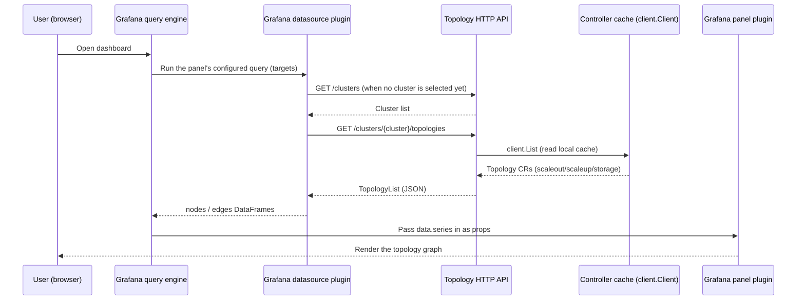

# Topology Visualization Design

中文版本：[topology-visualization.zh.md](./topology-visualization.zh.md)

## Overview

This document describes how Unifabric's `Topology` CRs (see [Topology CRD design](./topology-crd.md)) are exposed as an interactive Grafana dashboard. Three pieces work together:

- `pkg/controller/topologyapi`: a small read-only HTTP API that runs inside the existing Controller manager and exposes cluster-scoped topology and inventory resources.
- `plugin/unifabric-unifabrictopology-datasource`: a Grafana datasource plugin that queries that API and combines `scaleout`, `scaleup`, and `storage` into one graph.
- `plugin/unifabric-unifabrictopology-panel`: a Grafana panel plugin that renders the combined graph with React Flow, laying domains out by tier around a shared row of hosts.

`plugin/` also has a mock API server (`plugin/mock-topology-api`) and a local Grafana dev environment (`plugin/docker-compose.yaml`, `make grafana-plugin-dev`) used to build and test the plugins without a real cluster.

## Motivation

`kubectl get topology scaleout -o yaml` already exposes performance domains, parents, members, and Node paths as structured status (see [Topology CRD design](./topology-crd.md)). That is enough for automation and for `kubectl`-based debugging, but it does not answer a question operators keep asking during onboarding and incident review: what does this fabric actually look like, and where does a given Node or switch sit in it.

Three `Topology` objects, each read independently, do not show that either. `scaleout`, `scaleup`, and `storage` describe independent fabrics, but they all attach to the same physical Nodes. An operator comparing them by hand has to cross-reference Node names across three separate `status.nodes` lists, instead of looking at the whole combined graph directly through a graphical web interface, which is more intuitive.

### Goals

- Add a read-only HTTP API that exposes every fixed `Topology` object, so an external visualization tool can query it without a Kubernetes client or RBAC setup of its own.
- Combine `scaleout`, `scaleup`, and `storage` into one graph, sharing a single row of hosts instead of drawing each Node once per topology.
- Ship a Grafana datasource and panel plugin pair that renders that graph with a tier-aware layout: tier 1 always nearest the host row, higher tiers stacked further away, matching the CRD's own tier convention.
- Shape the API contract so a multi-cluster product can serve the same routes for several real clusters later, without a breaking change to the OSS contract or the plugins.

### Non-goals

- Authentication and authorization for the API. It is disabled by default and left to network policy or an ingress in front of it; see [Architecture](#architecture).
- Historical or time-series topology views. The API always reflects the Controller's current cached state, not a point in time.
- Editing topology from the dashboard

## Architecture



The API is not a separate Deployment. `NewTopologyAPIServer` registers a small `http.Server` with the Controller's existing `manager.Manager` via `mgr.Add(...)`, so it starts and stops with the Controller and reads through the same cached `client.Client` the rest of the Controller already uses. Every replica serves reads from its own cache, so the server reports `NeedLeaderElection() bool { return false }` and does not wait for or require the leader lease. This also means no new binary, image, Deployment, Service, or RBAC rule is needed beyond what the Controller already has (`get`/`list`/`watch` on `Topology`, `Switch`, and `FabricNode`); the chart only adds a container port and a Service port, gated by one config flag.

The API is disabled by default (`topologyAPI.enabled: false`) because it has no authentication of its own: enabling it is an explicit administrator decision, typically paired with a NetworkPolicy or ingress rule that restricts access to the Grafana instance.

## API design

| Route | Response | Notes |
| --- | --- | --- |
| `GET /healthz` | `200 OK` | Liveness check, no body. |
| `GET /clusters` | `[ {"name":"..."} ]` | Clusters this API can serve resources for. |
| `GET /clusters/{cluster}/topologies` | `v1beta1.TopologyList` | `404` when `{cluster}` is not recognized. |
| `GET /clusters/{cluster}/topologies/{name}` | `v1beta1.Topology` | `404` when the cluster or topology is not found. |
| `GET /clusters/{cluster}/switches` | `v1beta1.SwitchList` | `404` when `{cluster}` is not recognized. |
| `GET /clusters/{cluster}/switches/{name}` | `v1beta1.Switch` | `404` when the cluster or switch is not found. |
| `GET /clusters/{cluster}/fabricnodes` | `v1beta1.FabricNodeList` | `404` when `{cluster}` is not recognized. |
| `GET /clusters/{cluster}/fabricnodes/{name}` | `v1beta1.FabricNode` | `404` when the cluster or FabricNode is not found. |

Each resource list handler returns what `client.List` and standard Kubernetes JSON encoding produce for its corresponding list type. No separate DTO layer sits between the CRDs and the HTTP responses, so each resource shape follows its CRD directly; see [Topology CRD design](./topology-crd.md) for topology field semantics.

### Multi-cluster design

All resource routes are cluster-first: `/clusters/{cluster}/{resource}[/{name}]`. There is also a separate `/clusters` route, even though the open-source Controller only ever manages the cluster it runs in. This shape lets a Unifabric variant that connects to and aggregates several real clusters serve the same resource routes for more than one cluster.

In the OSS build, `defaultClusterName = "default"` is the only accepted value: `GET /clusters` always returns a single `{"name": "default"}` entry, and every `/clusters/{cluster}/...` route returns `404` for any other cluster name. The datasource and panel plugins do not know or care which build they are talking to; they call `/clusters` first (or let the dashboard's `$cluster` template variable provide the value) and the datasource then calls `/clusters/{cluster}/topologies` for the selected cluster, defaulting to the first entry `/clusters` returns.

## Grafana datasource plugin

`unifabric-unifabrictopology-datasource` (`plugin/unifabric-unifabrictopology-datasource`) is a plain HTTP-backed Grafana datasource:

- `ConfigEditor` collects one field, the API base URL (a plain `Input`, no auth yet since the backend has none). `testDatasource()` calls `GET /clusters` as a connectivity check.
- `QueryEditor` shows a "Cluster" select populated by `GET /clusters`, defaulting to the first cluster returned when a query has none set.
- `metricFindQuery()` powers a dashboard-level `$cluster` template variable, so a dashboard can offer one cluster dropdown that every panel's query reads via `getTemplateSrv().replace(...)`, instead of configuring the cluster per panel.
- `query()` fetches `GET /clusters/{cluster}/topologies` and flattens every item's `status.domains`/`status.nodes` into two combined DataFrames, `nodes` and `edges`:
  - Domain ids are namespaced by topology (`<topology>/<domain>`), since domain names are only unique within one `Topology` CR, not across `scaleout`/`scaleup`/`storage`.
  - Host ids are not namespaced: the same physical Node can appear in more than one topology's `status.nodes`, and it renders as a single shared host, with one edge per topology domain that references it, instead of one copy per topology.

## Grafana panel plugin

`unifabric-unifabrictopology-panel` (`plugin/unifabric-unifabrictopology-panel`) renders the combined `nodes`/`edges` frames with `reactflow`:

- Two node types: `domain` (a switch group, showing its topology, tier, title, and member switches) and `host` (a GPU/compute Node).
- Layout is four vertically stacked bands, top to bottom: `scaleout`, `scaleup`, a shared `hosts` row, then `storage`. `scaleout` and `scaleup` sit above the host row and `storage` sits below it, matching how `scaleout`/`scaleup` and `storage` each attach to the same Nodes from opposite sides.
- Within `scaleout`, `scaleup`, and `storage`, domains stack one row per distinct tier, tier 1 always nearest the host row, higher tiers further away, matching the CRD's own tier convention (tier 1 nearest a Node, see [Topology CRD design](./topology-crd.md)). Each band's height is driven by its own content (tier count and each domain card's member list), not a fixed fraction of the panel, so a deeper fabric gets proportionally more space.
- Edges use `reactflow`'s straight line type and are colored to stay visible in both the light and dark Grafana themes; selecting a node highlights only the edges touching it, and every other edge keeps its normal (not dimmed) color.
- Node positions are owned by `reactflow`'s own `useNodesState`, so dragging a card does not fight with re-renders when the underlying data refreshes.

## helm values design

`topologyAPI.enabled` enables the API. `controller.ports.topologyAPI` is the single port setting used
for the Controller listener, container port, Service port, and Grafana datasource URL:

```yaml
topologyAPI:
  enabled: false
controller:
  ports:
    topologyAPI: 8082
```
