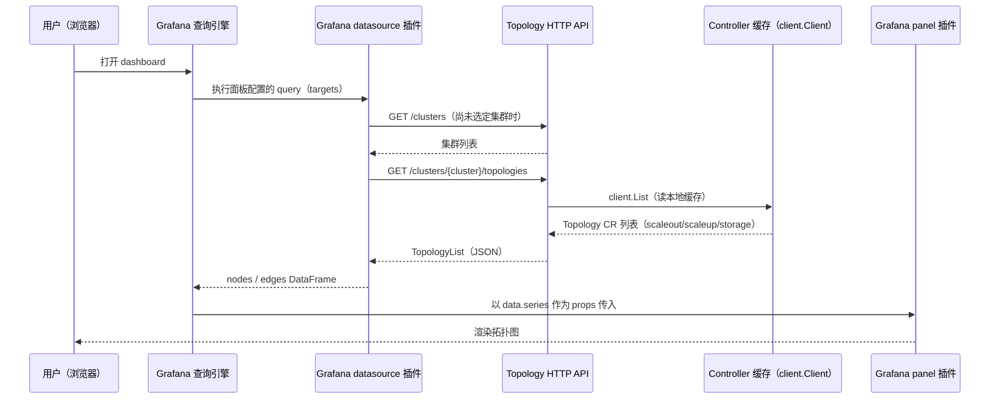

# 拓扑可视化设计

English version: [topology-visualization.md](./topology-visualization.md)

## 概述

本文说明 Unifabric 的 `Topology` CR（参见 [Topology CRD 设计](./topology-crd.zh.md)）如何呈现为一个可交互的 Grafana dashboard。三个部分共同组成这套能力：

- `pkg/controller/topologyapi`：运行在 Controller manager 内部的一个只读 HTTP API，用于暴露集群级拓扑和资源清单。
- `plugin/unifabric-unifabrictopology-datasource`：查询该 API，并把 `scaleout`、`scaleup`、`storage` 合并显示为集群拓扑的 Grafana datasource 插件。
- `plugin/unifabric-unifabrictopology-panel`：用 React Flow 渲染这张图的 Grafana panel 插件，按 tier 把各个 domain 排列在共用的 host 行两侧。

`plugin/` 目录下还有一个 mock API server（`plugin/mock-topology-api`）和一套本地 Grafana 开发环境（`plugin/docker-compose.yaml`、`make grafana-plugin-dev`），用于在没有真实集群的情况下构建和调试插件。

## 背景

`kubectl get topology -o yaml` 已经能读到性能域、父子关系、members 和 Node 路径这些结构化 status（参见 [Topology CRD 设计](./topology-crd.zh.md)）。这对自动化和基于 `kubectl` 的排查已经够用，但接入和事后复盘时经常被问到另一个问题：这张网络到底长什么样，某个 Node 或某台交换机具体在哪一层。

三个 `Topology` 对象各自读取时也回答不了这个问题。`scaleout`、`scaleup`、`storage` 描述的是三张独立的性能域，但都挂在同一批物理 Node 上。运维人员想对照着看，只能在三份 `status.nodes` 列表之间手工核对 Node 名字，而一个图形化的网页界面能直接展示整张拓扑图，会比这样手工核对更直观。

### 目标

- 增加一个只读 HTTP API，把每个固定的 `Topology` 对象暴露出去，外部可视化工具不需要自己的 Kubernetes client 或 RBAC 配置就能查询。
- 把 `scaleout`、`scaleup`、`storage` 合并成一张图，host 只画一行共用，而不是每个拓扑各画一遍同一个 Node。
- 提供一对 Grafana datasource 和 panel 插件，按 tier 排布这张图：tier 1 始终最靠近 host 行，tier 越高离 host 越远，和 CRD 本身的 tier 约定保持一致。
- 让这套 API 契约为将来的多集群产品留出空间——同一组路由未来可以服务多个真实集群，不需要对 OSS 契约或插件做破坏性改动。

### 非目标

- API 自身的认证和鉴权。当前默认关闭，交给前置的网络策略或 ingress 处理，参见[架构](#架构)。
- 历史或时间序列拓扑视图。API 始终反映 Controller 当前的缓存状态，不是某个历史时间点。
- 从 dashboard 编辑拓扑

## 架构



这个 API 不是一个独立的 Deployment。`NewTopologyAPIServer` 通过 `mgr.Add(...)` 把一个很小的 `http.Server`注册到 Controller 已有的 `manager.Manager` 上，随 Controller 一起启动和停止，读取的也是 Controller 其余部分本来就在用的同一个缓存 `client.Client`。每个副本都从自己的缓存独立提供读服务，因此这个 server 的 `NeedLeaderElection() bool` 返回 `false`，不等待也不依赖 leader lease。这也意味着除了 Controller 已有的 `Topology`、`Switch` 和 `FabricNode` 的 `get`/`list`/`watch` 权限之外，不需要新增二进制、镜像、Deployment、Service 或 RBAC 规则。chart 只是多加了一个容器端口和一个 Service 端口，由一个配置开关控制。

这个 API 默认关闭（`topologyAPI.enabled: false`），因为它没有自己的认证机制：打开它是管理员需要主动做出的决定，通常会同时配上一条限制访问范围到 Grafana 实例的 NetworkPolicy 或 ingress 规则。

## API 设计

| 路由 | 响应 | 说明 |
| --- | --- | --- |
| `GET /healthz` | `200 OK` | 存活检查，无 body。 |
| `GET /clusters` | `[ {"name":"..."} ]` | 这个 API 能提供资源的集群列表。 |
| `GET /clusters/{cluster}/topologies` | `v1beta1.TopologyList` | `{cluster}` 无法识别时返回 `404`。 |
| `GET /clusters/{cluster}/topologies/{name}` | `v1beta1.Topology` | 集群或 topology 不存在时返回 `404`。 |
| `GET /clusters/{cluster}/switches` | `v1beta1.SwitchList` | `{cluster}` 无法识别时返回 `404`。 |
| `GET /clusters/{cluster}/switches/{name}` | `v1beta1.Switch` | 集群或 switch 不存在时返回 `404`。 |
| `GET /clusters/{cluster}/fabricnodes` | `v1beta1.FabricNodeList` | `{cluster}` 无法识别时返回 `404`。 |
| `GET /clusters/{cluster}/fabricnodes/{name}` | `v1beta1.FabricNode` | 集群或 FabricNode 不存在时返回 `404`。 |

每个资源的 list handler 都直接返回 `client.List` 和标准 Kubernetes JSON 编码生成的对应 list 类型。CRD 和 HTTP 响应之间没有单独的 DTO 层，各资源的形状直接跟随对应 CRD；Topology 字段语义参见 [Topology CRD 设计](./topology-crd.zh.md)。

### 多集群设计

所有资源路由都把集群放在前面：`/clusters/{cluster}/{resource}[/{name}]`，另外提供单独的 `/clusters` 路由。即便开源版 Controller 只管理它自己所在的这一个集群，这种形状也能让连接并聚合多个真实集群的 Unifabric 版本，用同一套路由提供不同集群的资源。

在 OSS 版本里，`defaultClusterName = "default"` 是唯一接受的值：`GET /clusters` 始终只返回一条 `{"name": "default"}`，所有 `/clusters/{cluster}/...` 路由对其他任何集群名都返回 `404`。datasource 和 panel 插件不需要知道、也不关心自己连的是哪个版本：它们总是先调用 `/clusters`（或者由 dashboard 的 `$cluster` 模板变量提供集群名），然后 datasource 对选中的集群调用 `/clusters/{cluster}/topologies`，默认选中 `/clusters` 返回的第一条。

## Grafana datasource 插件

`unifabric-unifabrictopology-datasource`（`plugin/unifabric-unifabrictopology-datasource`）是一个基于 HTTP 的普通 Grafana datasource：

- `ConfigEditor` 只收集一个字段，API 的 base URL（用普通的 `Input`，暂时没有认证，因为后端本身也没有）。`testDatasource()` 用 `GET /clusters` 作为连通性检查。
- `QueryEditor` 展示一个由 `GET /clusters` 填充的 "Cluster" 下拉框，查询没有设置 cluster 时默认选中返回的第一个集群。
- `metricFindQuery()` 支撑 dashboard 级别的 `$cluster` 模板变量，让一个 dashboard 可以提供一个集群下拉框，每个面板的查询通过 `getTemplateSrv().replace(...)` 读取这个变量，而不需要在每个面板里单独配置集群。
- `query()` 请求 `GET /clusters/{cluster}/topologies`，把每个 item 的 `status.domains`/`status.nodes` 展平成两个合并后的 DataFrame，`nodes` 和 `edges`：
  - domain id 按拓扑命名空间化（`<topology>/<domain>`），因为 domain 名字只在同一个 `Topology` CR 内唯一，跨 `scaleout`/`scaleup`/`storage` 并不唯一。
  - host id 不做命名空间化：同一个物理 Node 可能出现在不止一个拓扑的 `status.nodes` 里，渲染时它是一个共享的 host，每个引用它的拓扑 domain 各贡献一条边，而不是每个拓扑各画一份。

## Grafana panel 插件

`unifabric-unifabrictopology-panel`（`plugin/unifabric-unifabrictopology-panel`）用 `reactflow` 渲染合并后的 `nodes`/`edges`：

- 两种节点类型：`domain`（一个交换机组，显示所属拓扑、tier、标题和成员交换机列表）和 `host`（一个 GPU/计算 Node）。
- 布局是纵向堆叠的四个区块，从上到下依次是 `scaleout`、`scaleup`、共用的 `hosts` 行、`storage`。`scaleout`、`scaleup` 在 host 行上方，`storage` 在下方，对应 `scaleout`/`scaleup` 和 `storage` 分别从两侧挂到同一批 Node 上这件事。
- 在 `scaleout`、`scaleup`、`storage` 内部，domain 按不同 tier 各占一行堆叠，tier 1 始终最靠近 host 行，tier 越高离 host 越远，跟 CRD 本身的 tier 约定一致（tier 1 最靠近 Node，参见 [Topology CRD 设计](./topology-crd.zh.md)）。每个区块的高度由自身内容决定（tier 数量和每张 domain 卡片的成员列表），不是面板高度的固定比例，fabric 层级越深，分到的空间也越多。
- 连线使用 `reactflow` 的直线类型，颜色在 Grafana 的 light、dark 两种主题下都保持可见。选中一个节点只高亮和它相连的边，其余边保持正常（不做变暗处理）的颜色。
- 节点位置由 `reactflow` 自己的 `useNodesState` 管理，因此拖动一张卡片不会在底层数据刷新、组件重新渲染时被打断或复位。

## helm values 设计

`topologyAPI.enabled` 用于启用 API。`controller.ports.topologyAPI` 是唯一的端口配置，同时用于
Controller 监听地址、容器端口、Service 端口和 Grafana datasource URL：

```yaml
topologyAPI:
  enabled: false
controller:
  ports:
    topologyAPI: 8082
```
