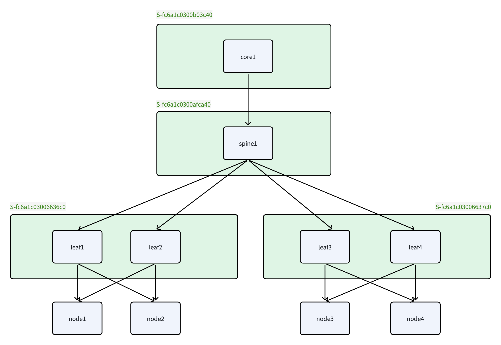

# InfiniBand Fabric

中文版: [getting-started-infiniband.zh.md](./getting-started-infiniband.zh.md)

This guide explains how to deploy Unifabric in an InfiniBand NIC cluster. This scenario is for IB networking, such as Mellanox NICs in IB mode with IB switches.

## Example Topology and Deployment Goals

The following diagram shows a three-tier topology with a tier 3 core, tier 2 spine, and tier 1
leaf switches. The four Nodes belong to two tier 1 performance domains:



After scale-out topology discovery completes, the four Nodes should have the following labels:

| Node | Expected labels |
| --- | --- |
| `node1` | `scale-out.unifabric.io/tier-1=S-fc6a1c03006636c0`<br>`scale-out.unifabric.io/tier-2=S-fc6a1c0300afca40`<br>`scale-out.unifabric.io/tier-3=S-fc6a1c0300b03c40` |
| `node2` | `scale-out.unifabric.io/tier-1=S-fc6a1c03006636c0`<br>`scale-out.unifabric.io/tier-2=S-fc6a1c0300afca40`<br>`scale-out.unifabric.io/tier-3=S-fc6a1c0300b03c40` |
| `node3` | `scale-out.unifabric.io/tier-1=S-fc6a1c03006637c0`<br>`scale-out.unifabric.io/tier-2=S-fc6a1c0300afca40`<br>`scale-out.unifabric.io/tier-3=S-fc6a1c0300b03c40` |
| `node4` | `scale-out.unifabric.io/tier-1=S-fc6a1c03006637c0`<br>`scale-out.unifabric.io/tier-2=S-fc6a1c0300afca40`<br>`scale-out.unifabric.io/tier-3=S-fc6a1c0300b03c40` |

A larger tier number indicates a position closer to the upper layers of the network. Scale-up
labels are derived from the high-speed GPU interconnect topology within each Node and are not
shown in the diagram.

After deployment, you can also use Unifabric Agent metrics and the built-in RDMA Grafana
Dashboard to observe Node RDMA state, including throughput, utilization, QoS, congestion, and
error metrics by cluster, Node, Pod, and Workload.

## Prerequisites

- Unifabric has been installed by following the [basic installation](./getting-started.md).
- The Nodes have RDMA devices running in IB mode.

## Configure InfiniBand Topology Discovery

Complete the [basic installation](./getting-started.md), then run the following Helm upgrade for
the InfiniBand scale-up and scale-out networks. It changes only the scenario-specific modes and
retains every other value from the base installation.

```bash
helm upgrade unifabric oci://ghcr.io/unifabric-io/charts/unifabric \
  --namespace unifabric-system \
  --reuse-values \
  --set topoDiscovery.scaleUp.mode=nv-topograph \
  --set topoDiscovery.scaleOut.mode=nv-topograph \
  --wait
```

## Verify the Deployment

Check topograph components, node-data-broker DaemonSet, Node annotation, and Node labels:

```bash
kubectl -n unifabric-system get pods
kubectl get pods -n unifabric-system -o wide
kubectl get fabricnodes.unifabric.io
kubectl get nodes -L scale-up.unifabric.io/tier-1,scale-out.unifabric.io/tier-1,scale-out.unifabric.io/tier-2,scale-out.unifabric.io/tier-3,kubernetes.io/hostname
```

The FabricNode list should include every target Node with `READY` set to `True`:

```text
NAME                TOTALNICS   READY   ROLE   NODEIP
node1               2           True    GPU    10.0.0.1
node2               2           True    GPU    10.0.0.2
node3               2           True    GPU    10.0.0.3
node4               2           True    GPU    10.0.0.4
```

Inspect the Agent report for an individual Node:

```bash
kubectl get fabricnode <node-name> -o yaml
```

Confirm that `status.nodeRole`, `status.scaleOutNics`, and `status.conditions`
match the expected state and that participating IB NICs are `up`. You can also
query `FabricNode` resources with the `fn` short name.

After ScaleOut topology discovery succeeds, the `scaleout` Topology is created:

```bash
kubectl get topo
```

```text
NAME       AGE
scaleout   113m
```

Inspect the complete result:

```bash
kubectl get topo scaleout -o yaml
```

The following example represents a three-tier leaf, spine, and core topology.
`status.domains` describes parent-child relationships between performance
domains, while `status.nodes[].domainPath` records each Node's complete path
from tier 3 to tier 1:

```yaml
apiVersion: unifabric.io/v1beta1
kind: Topology
metadata:
  name: scaleout
status:
  domains:
    - name: S-fc6a1c0300b03c40
      tier: 3
    - name: S-fc6a1c0300afca40
      parent: S-fc6a1c0300b03c40
      tier: 2
    - name: S-fc6a1c03006636c0
      parent: S-fc6a1c0300afca40
      tier: 1
    - name: S-fc6a1c03006637c0
      parent: S-fc6a1c0300afca40
      tier: 1
  nodes:
    - domainPath:
        - S-fc6a1c0300b03c40
        - S-fc6a1c0300afca40
        - S-fc6a1c03006636c0
      nodes:
        - node1
        - node2
    - domainPath:
        - S-fc6a1c0300b03c40
        - S-fc6a1c0300afca40
        - S-fc6a1c03006637c0
      nodes:
        - node3
        - node4
```

When configuring Kueue, Volcano, or KAI Scheduler, use only labels that are actually written to Nodes.

## Troubleshooting

For general `FabricNode` and RDMA metrics troubleshooting, see
[Basic installation troubleshooting](./getting-started.md#troubleshooting).

### Node Labels Are Not Written

- Confirm that NVIDIA topograph, node-observer, and node-data-broker are running and have permission to update Nodes.
- Confirm that node-data-broker Pods run on target GPU nodes.
- If ScaleOut labels are not written, confirm that `ibnetdiscover` is available
  in the node-data-broker Pod.
- If `topoDiscovery.*.nodeLabel.keyTemplate` values are customized, scheduler label keys must be updated accordingly.

## Uninstall

```bash
helm uninstall unifabric --namespace unifabric-system --wait
```

## Next Steps

- Return to the [documentation index](./README.md).
- Read the [Kueue TAS workload example](./usage/workload-tas.md).
- See the [Helm values reference](../chart/README.md).
