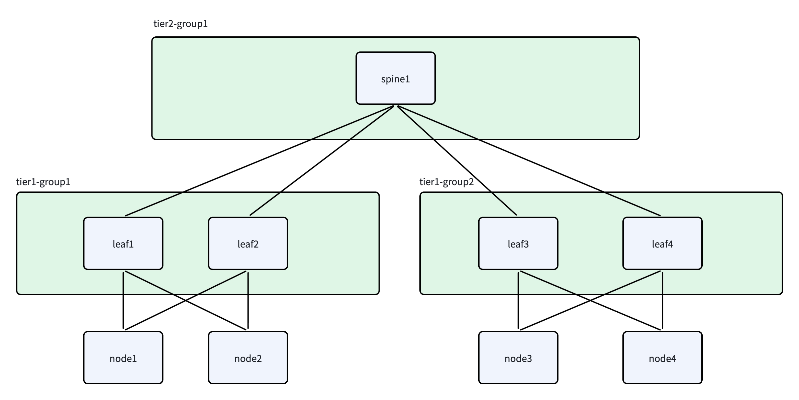

# General SONiC RoCE

中文版: [getting-started-sonic-roce.zh.md](./getting-started-sonic-roce.zh.md)

This guide explains how to deploy Unifabric in a cluster where SONiC switches carry the RoCE network. In this scenario, Unifabric discovers scale-out leaf, spine, and core topology from node RDMA NICs, `FabricNode` LLDP neighbor information, and switch-side switch-agent LLDP snapshots.

## Deployment Goals

After deployment, the cluster should achieve the following goals:

- Nodes are labeled with tiered topology labels consumed by schedulers. By default they start
  with `scale-out.unifabric.io/tier-1`, the tier nearest to a Node, followed by
  `scale-out.unifabric.io/tier-2`, `scale-out.unifabric.io/tier-3`, and so on.
- Node RDMA state is observable through Unifabric Agent metrics, including RDMA device, port,
  priority, and Pod attribution metrics.
- `FabricNode` and `Switch` CRs expose input state, `Topology` CRs expose the aggregated read-only topology, and schedulers consume the topology labels written to Nodes.

> Built-in LLDP discovery uses `tierN-groupM` label values, for example
> `scale-out.unifabric.io/tier-1=tier1-group1`.

## Prerequisites

- An accessible Kubernetes cluster.
- `kubectl` and Helm 3 installed.
- Switches have Docker or another container runtime. If a switch cannot run
  containers, use the [switch-agent systemd installation](./usage/switch-agent-systemd.md).

## Install Unifabric in the Cluster

The following commands use the latest release version. You can also specify a fixed version. See the [releases](https://github.com/unifabric-io/unifabric/releases) page for available versions.

```bash
LATEST_TAG=$(curl -fsSL https://api.github.com/repos/unifabric-io/unifabric/releases/latest | grep '"tag_name":' | cut -d '"' -f4)
CHART_VERSION="${LATEST_TAG#v}"
```

Then run the installation command.

```bash
helm upgrade --install unifabric oci://ghcr.io/unifabric-io/charts/unifabric \
  --version "${CHART_VERSION}" \
  --namespace unifabric-system \
  --create-namespace \
  --set topoDiscovery.scaleOut.mode=unifabric-roce \
  --set topoDiscovery.storage.mode=unifabric-roce \
  --set nodeMetrics.enabled=true \
  --set nodeMetrics.serviceMonitor.enabled=true \
  --set grafanaDashboard.enabled=true \
  --wait
```

Parameters:

| Helm value | Purpose |
| --- | --- |
| `topoDiscovery.scaleOut.mode` | Enables built-in scale-out discovery. With no Switch CRs, FabricNode LLDP generates tier1. If any Switch omits `unifabric.io/neighbors`, switch LLDP is used and all annotations are ignored. If every Switch has the key, annotations connect upper Switch CRs to node-discovered synthetic leaves. |
| `topoDiscovery.storage.mode` | Set to `unifabric-roce` for RoCE storage topology discovery. |
| `switchSubscription.defaultGrpcPort` | Default switch-agent gRPC port when a Switch CR omits `spec.grpcPort`. Default: `8090`. |
| `switchSubscription.ignorePortPatterns` | Optional: glob patterns for local switch ports ignored before topology calculation. Defaults to `mgmt*`, `Management*`, and `oob*`. |
| `switchSubscription.mtls.mode` | `auto` generates pinned mTLS Secrets, `existing` uses pre-created Secrets, and `disabled` uses plaintext gRPC. Default: `auto`. |
| `fabricNode.refreshInterval` | Agent refresh interval for RDMA interfaces and LLDP neighbors. Default: `1m`. |
| `fabricNode.initialScanDelay` | Delay before the first Agent scan so LLDP can learn neighbors. Default: `1m`. |
| `fabricNode.scaleOutInterfaceSelector` | Optional: restricts RDMA NICs that participate in scale-out topology discovery. When unset, all RDMA NICs not matched by storage / scale-up selectors participate. |
| `fabricNode.storageInterfaceSelector` | Optional: selects storage RDMA NICs and excludes them from scale-out topology. Metrics are labeled `kind=storage`. Supports `interface=eth9` or `cidr=172.20.0.0/16`. |
| `fabricNode.scaleUpInterfaceSelector` | Optional: selects scale-up RDMA NICs and excludes them from scale-out leaf grouping. Metrics are labeled `kind=scaleUp`. |
| `nodeMetrics.enabled` | Optional: enables Agent metrics for node RDMA observability. |
| `nodeMetrics.serviceMonitor.enabled` | Optional: creates the `ServiceMonitor` used by Prometheus Operator. |
| `grafanaDashboard.enabled` | Optional: deploys the built-in RDMA dashboard. |
| `topoDiscovery.scaleOut.label.keyTemplate` | Scale-out label key template. Default: `scale-out.unifabric.io/tier-{{ .Tier }}`. It must contain exactly one `{{ .Tier }}` action. |
| `topoDiscovery.scaleUp.label.keyTemplate` | Scale-up label key template. Default: `scale-up.unifabric.io/tier-{{ .Tier }}`. |
| `topoDiscovery.storage.label.keyTemplate` | Storage label key template. Default: `storage.unifabric.io/tier-{{ .Tier }}`. |

For more Helm parameters, see [chart/README.md](../chart/README.md).

If you are in mainland China, you can add the following parameters to speed up image pulls:

```bash
--set global.registry=m.daocloud.io \
--set controller.image.repository=ghcr.io/unifabric-io/unifabric-controller \
--set agent.image.repository=ghcr.io/unifabric-io/unifabric-agent
```

## Choose a Topology Discovery Method

Helm deploys only the controller and node agent in Kubernetes; it does not install
`switch-agent` on switches. Unifabric selects the discovery method independently for scale-out and
storage according to `spec.role`. Choose one of the following methods depending on whether
switch-side LLDP is required.

The following diagram is the shared example for both discovery methods. `node1` and `node2`
connect through `leaf1` and `leaf2` to form `tier1-group1`; `node3` and `node4` connect through
`leaf3` and `leaf4` to form `tier1-group2`; their common uplink `spine1` forms `tier2-group1`.



### Case 1: Use Node LLDP Only

This method does not require `switch-agent` on the switches:

1. When there are no same-role `Switch` CRs, Unifabric enters node-only mode. Switch hostnames
   reported by FabricNode LLDP are treated as synthetic leaves, and only tier 1 is generated.
2. To describe upper tiers such as spine or core, create only those upper-tier `Switch` CRs and add
   the `unifabric.io/neighbors` annotation to every CR. Node-discovered leaves remain synthetic,
   while the annotations declare links from upper-tier Switches to synthetic leaves or other
   upper-tier Switches.

Semi-automatic mode requires every same-role `Switch` CR to contain the
`unifabric.io/neighbors` key. Do not create CRs for the synthetic leaves, and `spec.mgmtIP` is not
required. Mode selection checks only whether the annotation key exists. An empty value or `[]`
therefore selects semi-automatic mode but supplies no neighbor link.

#### Example 1: Discover Leaves in Node-Only Mode

In the diagram, FabricNode LLDP reports that `node1` and `node2` connect to `leaf1` and `leaf2`,
while `node3` and `node4` connect to `leaf3` and `leaf4`. With no ScaleOut `Switch` CRs, all four
leaf hostnames are synthetic switches. Only the two tier 1 Domains are generated; `tier2-group1`
is absent because `spine1` has not been declared:

```yaml
apiVersion: unifabric.io/v1beta1
kind: Topology
metadata:
  name: scaleout
status:
  domains:
    - name: tier1-group1
      tier: 1
    - name: tier1-group2
      tier: 1
  nodes:
    - domainPath:
        - tier1-group1
      nodes:
        - node1
        - node2
    - domainPath:
        - tier1-group2
      nodes:
        - node3
        - node4
```

Each Node receives only its `scale-out.unifabric.io/tier-1` label. Both Domains have no `members`
because synthetic leaves do not correspond to real `Switch` CRs.

#### Example 2: Add spine1 with an Annotation

To produce `tier2-group1` from the diagram, create only the upper-tier `spine1` `Switch` CR and
reference all four leaf hostnames reported by FabricNode LLDP:

```yaml
apiVersion: unifabric.io/v1beta1
kind: Switch
metadata:
  name: spine1
  annotations:
    unifabric.io/neighbors: '["leaf1", "leaf2", "leaf3", "leaf4"]'
spec:
  role: ScaleOut
```

Do not create `Switch` CRs for `leaf1` through `leaf4`, and do not set `spec.mgmtIP` on `spine1`.
After applying the resource, all four Nodes receive both tier 1 and tier 2 labels:

```yaml
apiVersion: unifabric.io/v1beta1
kind: Topology
metadata:
  name: scaleout
status:
  domains:
    - members:
        - spine1
      name: tier2-group1
      tier: 2
    - name: tier1-group1
      parent: tier2-group1
      tier: 1
    - name: tier1-group2
      parent: tier2-group1
      tier: 1
  nodes:
    - domainPath:
        - tier2-group1
        - tier1-group1
      nodes:
        - node1
        - node2
    - domainPath:
        - tier2-group1
        - tier1-group2
      nodes:
        - node3
        - node4
```

### Case 2: Use switch-agent for Automatic Discovery

To discover complete leaf, spine, and core connectivity from switch LLDP, install `switch-agent`
on every participating physical switch and create its corresponding `Switch` CR. If any same-role
`Switch` CR omits the `unifabric.io/neighbors` key, Unifabric enters fully automatic mode:

- A real `Switch` CR must exist for every participating leaf, spine, and core.
- The controller uses LLDP snapshots reported by switch-agent.
- All `unifabric.io/neighbors` annotations are ignored. To keep the configuration unambiguous,
  omit this annotation from every Switch in fully automatic mode.

For the diagram, deploy switch-agent on `leaf1` through `leaf4` and `spine1`, and create five
same-named ScaleOut `Switch` CRs. Node LLDP supplies the Node-to-leaf links, while switch-agent
LLDP supplies the leaf-to-spine links. After discovery, the real Switch members are:

- `tier1-group1`: `leaf1`, `leaf2`
- `tier1-group2`: `leaf3`, `leaf4`
- `tier2-group1`: `spine1`

The installation and onboarding steps below apply only to Case 2.

To distribute certificates and deploy containers to multiple switches, use the project's
[automated switch-agent deployment script](./usage/deploy-switch-agent-script.md). It removes and
recreates an existing container or deploys one when absent; target addresses and credentials are
provided only at runtime. The script uses a socket mount by default and can switch to `hostProc`
through an environment variable.

## Install switch-agent and Switch Resources

Before running it, confirm the following:

- The switch management network is reachable from the in-cluster Unifabric controller.
- The switch can run the `switch-agent` container and can pull or pre-load the corresponding image.
  If Docker is not available, install the release binary with
  [systemd](./usage/switch-agent-systemd.md) instead.
- LLDP is enabled on the switch, and `lldpcli show neighbors -f json0` on the switch host shows the expected neighbors.
  - `socket` mode only requires the container to mount and access `/run/lldpd.socket`.
  - If the switch cannot mount or access `/run/lldpd.socket`, use `hostProc` mode instead. That mode requires privileged permissions and mounts the host `/proc`.

Pay attention to the following impact:

- `switch-agent` exposes a gRPC port on the switch management network through container port mapping. The default port is `8090`, and pinned mTLS is enabled by default.

### Export switch-agent pinned mTLS certificates

Run the following certificate export commands on the Kubernetes control node, or on another management host that already has `kubectl` access to the cluster.

```bash
mkdir -p ./tmp-switch-mtls

kubectl -n unifabric-system get secret switch-controller-mtls-agent -o jsonpath='{.data.tls\.crt}' | base64 -d > ./tmp-switch-mtls/tls.crt
kubectl -n unifabric-system get secret switch-controller-mtls-agent -o jsonpath='{.data.tls\.key}' | base64 -d > ./tmp-switch-mtls/tls.key
kubectl -n unifabric-system get secret switch-controller-mtls-agent -o jsonpath='{.data.peer\.crt}' | base64 -d > ./tmp-switch-mtls/peer.crt
```

After exporting the files, log in to the target switch and prepare the directory there:

```bash
sudo mkdir -p /opt/unifabric-switch-agent/mtls
```

Then copy `tls.crt`, `tls.key`, and `peer.crt` to `/opt/unifabric-switch-agent/mtls/` on the switch.

### Start switch-agent on the switch

By default, switch-agent reads LLDP through the mounted `lldpd` socket and uses the packaged `lldpcli` `1.0.16`. The following command uses Docker bridge networking and publishes the gRPC port to the switch management IP through `-p 8090:8090`. It does not require host network, host UTS, or privileged permissions.

```bash
export SWITCH_AGENT_IMAGE="ghcr.io/unifabric-io/unifabric-switch-agent:${LATEST_TAG}"
export SWITCH_NAME="$(hostname)"

docker pull "${SWITCH_AGENT_IMAGE}"

docker rm -f unifabric-switch-agent 2>/dev/null || true

docker run -d \
  --name unifabric-switch-agent \
  --restart unless-stopped \
  -p 8090:8090 \
  -e UNIFABRIC_SWITCH_AGENT_SWITCH_NAME="${SWITCH_NAME}" \
  -v /run/lldpd.socket:/run/lldpd.socket \
  -v /opt/unifabric-switch-agent/mtls:/etc/unifabric/switch-mtls:ro \
  "${SWITCH_AGENT_IMAGE}" \
  /usr/bin/unifabric/switch-agent
```

Common environment variables:

| Environment variable | Default | Meaning |
| --- | --- | --- |
| `UNIFABRIC_SWITCH_AGENT_LOG_LEVEL` | `info` | Log level. Supported values are `debug`, `info`, `warn`, and `error`. |
| `UNIFABRIC_SWITCH_AGENT_SWITCH_NAME` | `$hostname` | Local switch name reported in LLDP snapshots. |
| `UNIFABRIC_SWITCH_AGENT_LISTEN_ADDRESS` | `:8090` | gRPC listen address exposed by switch-agent. |
| `UNIFABRIC_SWITCH_AGENT_MTLS_ENABLED` | `true` | Enables pinned mTLS. It must match the controller mTLS configuration. |
| `UNIFABRIC_SWITCH_AGENT_MTLS_CERT_FILE` | `/etc/unifabric/switch-mtls/tls.crt` | Path to the switch-agent certificate. |
| `UNIFABRIC_SWITCH_AGENT_MTLS_KEY_FILE` | `/etc/unifabric/switch-mtls/tls.key` | Path to the switch-agent private key. |
| `UNIFABRIC_SWITCH_AGENT_MTLS_PEER_CERT_FILE` | `/etc/unifabric/switch-mtls/peer.crt` | Path to the pinned controller peer certificate. |
| `UNIFABRIC_SWITCH_AGENT_LLDP_REFRESH_INTERVAL` | `10s` | Local LLDP snapshot refresh interval. |
| `UNIFABRIC_SWITCH_AGENT_LLDP_COLLECTION_MODE` | `socket` | LLDP collection mode. The default is `socket`. If the switch cannot mount the `lldpd` socket, use the host `/proc` namespace collection mode instead. See [switch-agent hostProc LLDP collection](./usage/switch-agent-host-proc.md). |
| `UNIFABRIC_SWITCH_AGENT_LLDP_SOCKET_PATH` | `/run/lldpd.socket` | lldpd Unix socket path used in `socket` mode. |
| `UNIFABRIC_SWITCH_AGENT_LLDP_CLI_VERSION` | `1.0.16` | Packaged CLI version used in `socket` mode. Use `1.0.4` for SONiC 202006 through 202311. Keep the default `1.0.16` for other versions. |

After startup, first check whether the container is running and whether the logs contain errors:

```bash
docker ps | grep unifabric-switch-agent
docker logs --tail 100 unifabric-switch-agent
```

### Create Switch resources

After switch-agent is running on the switches, create one `Switch` YAML for each switch. The Unifabric Controller connects by `spec.mgmtIP` to read LLDP information.

```yaml
apiVersion: unifabric.io/v1beta1
kind: Switch
metadata:
  name: leaf1
spec:
  mgmtIP: 192.0.2.11
  role: ScaleOut
  grpcPort: 8090
```

Fields to care about in `spec`:

- `mgmtIP`: required when connecting to switch-agent; omit it for a label-only Switch used solely to enrich topology members.
- `role`: optional. Identifies whether the switch belongs to the scale-out, scale-up, or storage network. Supported values are `ScaleOut`, `ScaleUp`, and `Storage`. Defaults to `ScaleOut` when omitted.
- `grpcPort`: optional. gRPC port of switch-agent. Defaults to `8090`.

You can choose `role` based on the NICs connected to the switch and the purpose of the network:

- `ScaleOut`: the switch connects to host-side RDMA NICs used for cross-node GPU training or service traffic. These NICs participate in scale-out leaf / spine / core topology calculation.
- `ScaleUp`: the switch connects to GPU-side scale-up NICs used for GPU-to-GPU communication within the same scale-up domain. These NICs do not participate in scale-out topology calculation.
- `Storage`: the switch connects to host-side NICs used for storage access. These NICs should correspond to the storage NICs selected by `fabricNode.storageInterfaceSelector`.

After the YAML is ready, run `kubectl apply -f <switch>.yaml` on the Kubernetes control node to create the switch CR.

Then use `kubectl get switch` to check whether neighbor information has been synchronized. The deployment verification section below includes example output.

## Verify the Deployment

Wait for the controller and agent to be ready:

```bash
kubectl -n unifabric-system get pods
kubectl -n unifabric-system rollout status deployment/unifabric-controller
kubectl -n unifabric-system rollout status daemonset/unifabric-agent
```

Inspect `FabricNode`:

```bash
kubectl get fabricnodes
kubectl get fabricnode <node-name> -o yaml
```

Check:

- `status.scaleOutNics` contains the expected scale-out RDMA NICs.
- `status.storageNics` contains only storage network interfaces.
- `status.scaleOutNics[*].lldpNeighbor.hostname` is present.
- `Ready` and `LLDPNeighborsReady` in `status.conditions` are `True`.

Inspect switch status and Node labels:

```bash
kubectl get switches -o wide
kubectl get switch <switch-name> -o yaml
kubectl get nodes -L scale-out.unifabric.io/tier-1,scale-out.unifabric.io/tier-2,scale-out.unifabric.io/tier-3,kubernetes.io/hostname
```

For example, in the current test environment you may see output similar to:

```bash
$ kubectl get switch
NAME     MGMTIP            ROLE       HEALTHY   NEIGHBORS
leaf1    192.168.122.72    ScaleOut   true      2
leaf2    192.168.122.80    ScaleOut   true      2
spine1   192.168.122.163   ScaleOut   true      2
```

Check:

- `Switch.status.healthy` and conditions reflect the current connection state. Health is informational and does not filter stored topology data.
- `Switch.status.lldpNeighborCount` is greater than `0`.
- Nodes have a continuous sequence of `scale-out.unifabric.io/tier-N` labels, with tier1 nearest to the Node.

When configuring Kueue, Volcano, or KAI Scheduler, use only labels that are actually written to Nodes by the command above. If the network has only a leaf layer, or the cluster has no Switch CRs and is in node-only mode, tier1 alone is expected.

Verify RDMA metrics resources:

```bash
kubectl -n unifabric-system get service unifabric-agent-metrics
kubectl -n unifabric-system get servicemonitor unifabric-agent-metrics
```

Check the Agent metrics endpoint directly:

```bash
POD_IP=$(kubectl -n unifabric-system get pod -l app.kubernetes.io/component=unifabric-agent -o jsonpath='{.items[0].status.podIP}')
curl -s "http://${POD_IP}:8082/metrics" | grep '^unifabric_'
```

Check RDMA metric NIC classification:

```bash
curl -s "http://${POD_IP}:8082/metrics" | grep 'kind="scaleOut"'
```

### Inspect the Topology CR

The controller creates a cluster-scoped Topology CR only for a source that has produced a valid Domain and Node group. Topology has no `spec`; its `status` is a read-only view aggregated from Node and Switch labels:

```bash
kubectl get topologies
```

For example, when both scale-out and storage topology have been discovered:

```text
NAME       AGE
scaleout   34s
storage    34s
```

The absence of `scaleup` means that no valid scale-up Domain has been produced; it does not indicate a deployment failure.

Inspect the scale-out topology:

```bash
kubectl get topology scaleout -o yaml
```

The following observed output contains a tier 1 Domain formed by `leaf01` through `leaf04`, and a tier 2 Domain formed by `spine01` and `spine02`:

```yaml
apiVersion: unifabric.io/v1beta1
kind: Topology
metadata:
  name: scaleout
status:
  domains:
    - members:
        - spine01
        - spine02
      name: tier2-group1
      tier: 2
    - members:
        - leaf01
        - leaf02
        - leaf03
        - leaf04
      name: tier1-group1
      parent: tier2-group1
      tier: 1
  nodes:
    - domainPath:
        - tier2-group1
        - tier1-group1
      nodes:
        - node1
        - node2
        - node3
        - node4
```

Inspect the storage topology:

```bash
kubectl get topology storage -o yaml
```

The storage network in this environment has only one tier, so it produces a tier 1 Domain:

```yaml
apiVersion: unifabric.io/v1beta1
kind: Topology
metadata:
  name: storage
status:
  domains:
    - members:
        - storagesw
      name: tier1-group1
      tier: 1
  nodes:
    - domainPath:
        - tier1-group1
      nodes:
        - node1
        - node2
        - node3
        - node4
```

`domains[*].members` contains the Switch CR names in each performance domain. `nodes[*].domainPath` is ordered from the highest tier down to tier1. In node-only mode, only tier1 is present and `members` is empty or omitted because there are no Switch CRs.

## Troubleshooting

### `FabricNode` Has No Scale-Out NIC

- Confirm that RDMA devices are visible under `/sys/class/infiniband` on the node.
- If `fabricNode.scaleOutInterfaceSelector` is explicitly configured, confirm that it matches the real interface name or CIDR.
- Confirm that scale-out interfaces were not accidentally matched as storage or scale-up. Those interfaces are excluded from scale-out grouping.

### `LLDPNeighborsReady=False`

- Confirm that LLDP is enabled on switches.
- Confirm that node-side `lldpd` works and the Agent Pod can read LLDP information.
- Confirm that `fabricNode.initialScanDelay` is long enough, so the first Agent scan does not run before LLDP learning completes.

### No Node Label

- Confirm that `topoDiscovery.scaleOut.mode=unifabric-roce`.
- Confirm that `FabricNode.status.nodeRole` is not `Storage`.
- Confirm that at least one `scaleOutNics` entry has both `state=up` and `lldpNeighbor.hostname`.
- With no Switch CRs, confirm that FabricNode LLDP hostnames form the expected tier1 groups.
- In fully automatic mode, confirm that each FabricNode LLDP hostname matches a Switch CR name or `Switch.status.hostname` and that switch statuses contain LLDP neighbors.
- In semi-automatic mode, confirm that every same-role Switch has the annotation key and that its neighbor names resolve to node-discovered leaves or other annotated Switch CRs.
- Check controller logs:

  ```bash
  kubectl -n unifabric-system logs deployment/unifabric-controller
  ```

- Check switch-agent logs on the switch:

  ```bash
  docker logs --tail 100 unifabric-switch-agent
  ```

### RDMA Metrics Do Not Include RoCE NICs

- Confirm that the Agent Pod is running and RDMA devices are visible under `/sys/class/infiniband` on the node.
- Confirm that `nodeMetrics.enabled=true`.
- If using Prometheus Operator, confirm that `nodeMetrics.serviceMonitor.enabled=true` and that the `ServiceMonitor` is selected by the Prometheus selector.
- Query the Agent metrics endpoint directly first. If `unifabric_` metrics exist there, troubleshoot Prometheus target discovery next.

## Uninstall

```bash
helm uninstall unifabric --namespace unifabric-system --wait
```

If CRDs are no longer needed, delete them manually:

```bash
kubectl delete crd fabricnodes.unifabric.io switches.unifabric.io topologies.unifabric.io
```

## Next Steps

- Return to the [documentation index](./README.md).
- Read the [Kueue TAS workload example](./usage/workload-tas.md).
- See the [Helm values reference](../chart/README.md).
