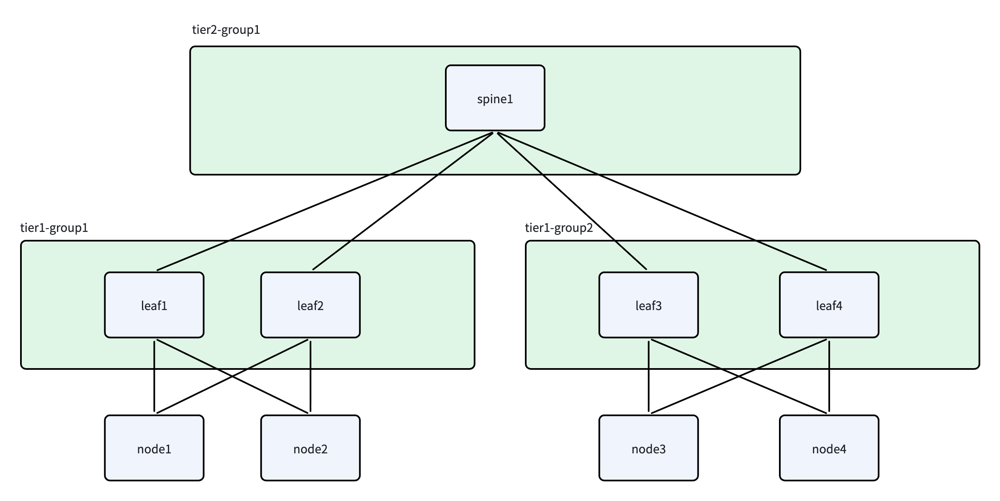

# 通用 SONiC RoCE 快速上手

本文适用于集群网络由运行 SONiC 的交换机承载、并采用 RoCE 协议的场景，说明如何使用
Unifabric 发现 scale-out leaf、spine、core 拓扑，并将性能域写入 Kubernetes Node
label。

## 场景选择

| 部署场景 | 适用情况 | 需要准备 |
| --- | --- | --- |
| 场景一：交换机运行 `switch-agent`（推荐） | 实施环境允许运维团队在 SONiC 交换机上以 Docker / 二进制 方式运行 Unifabric Switch Agent 组件，希望自动发现交换机间拓扑并减少人工维护 | 交换机启用 LLDP<br />Kubernetes 集群内运行 `unifabric-controller` 的节点可以访问交换机的 TCP `8090` 端口（switch-agent gRPC 端口） |
| 场景二：交换机不运行 `switch-agent` | 实施环境受安全策略限制，或交换机由其他团队维护，不能在交换机上运行 Unifabric Switch Agent 组件 | 集群 k8s node 已经通过节点侧的 lldp 获取到了 leaf 层的交换机信息  <br />管理员根据实际拓扑，手动创建 leaf 层级以上 `Switch` CR，并维护交换机邻居 annotation |

## 示例拓扑和预期结果

后续两个场景都使用下面的拓扑：



- `node1`、`node2` 分别双归接入 `leaf1`、`leaf2`。
- `node3`、`node4` 分别双归接入 `leaf3`、`leaf4`。
- `leaf1` 到 `leaf4` 共同上联 `spine1`。

发现完成后，四个节点预期获得以下 label：

| 节点 | 预期 label |
| --- | --- |
| `node1` | `scale-out.unifabric.io/tier-1=tier1-group1`<br>`scale-out.unifabric.io/tier-2=tier2-group1` |
| `node2` | `scale-out.unifabric.io/tier-1=tier1-group1`<br>`scale-out.unifabric.io/tier-2=tier2-group1` |
| `node3` | `scale-out.unifabric.io/tier-1=tier1-group2`<br>`scale-out.unifabric.io/tier-2=tier2-group1` |
| `node4` | `scale-out.unifabric.io/tier-1=tier1-group2`<br>`scale-out.unifabric.io/tier-2=tier2-group1` |

tier 数字越大表示越靠近网络上层。

## 部署方式

根据前面的场景选择结果，按照场景一或场景二完成部署。

## 场景一：交换机运行 switch-agent

该场景需要在每台交换机上部署 Unifabric `switch-agent`，由 Controller 通过 gRPC
获取交换机的 LLDP 邻居并自动完成拓扑发现。

### 步骤 1：启用 RoCE 拓扑发现

完成[基础安装](./getting-started.zh.md)后，在 Kubernetes 管理机执行：

```bash
helm upgrade unifabric oci://ghcr.io/unifabric-io/charts/unifabric \
  --namespace unifabric-system \
  --reuse-values \
  --set topoDiscovery.scaleOut.mode=unifabric-roce \
  --set topoDiscovery.storage.mode=unifabric-roce \
  --wait
```

### 步骤 2：检查交换机 LLDP

在 `leaf1` 到 `leaf4` 和 `spine1` 上分别执行：

```bash
lldpcli show neighbors -f json0
```

确认 leaf 能看到 Node 和 spine，spine 能看到所有 leaf。管理口等非 fabric 邻居默认会
按照 Helm 的 `switchSubscription.ignorePortPatterns` 配置过滤。

### 步骤 3：导出 switch-agent mTLS 证书

默认安装使用 pinned mTLS。先在 Kubernetes 管理机执行：

```bash
mkdir -p ./tmp-switch-mtls

kubectl -n unifabric-system get secret switch-controller-mtls-agent \
  -o jsonpath='{.data.tls\.crt}' | base64 -d > ./tmp-switch-mtls/tls.crt
kubectl -n unifabric-system get secret switch-controller-mtls-agent \
  -o jsonpath='{.data.tls\.key}' | base64 -d > ./tmp-switch-mtls/tls.key
kubectl -n unifabric-system get secret switch-controller-mtls-agent \
  -o jsonpath='{.data.peer\.crt}' | base64 -d > ./tmp-switch-mtls/peer.crt

chmod 600 ./tmp-switch-mtls/tls.crt \
  ./tmp-switch-mtls/tls.key \
  ./tmp-switch-mtls/peer.crt
```

将三个文件安全复制到每台交换机的
`/opt/unifabric-switch-agent/mtls/`。在交换机上提前创建目录：

```bash
sudo mkdir -p /opt/unifabric-switch-agent/mtls
sudo chmod 700 /opt/unifabric-switch-agent/mtls
```

### 步骤 4：在每台交换机启动 switch-agent

下面命令在每台交换机上执行。将 `<release-tag>` 替换为与 Unifabric 安装版本一致的
tag，并将 `SWITCH_NAME` 替换为该交换机的 LLDP hostname：

```bash
export SWITCH_AGENT_IMAGE="ghcr.io/unifabric-io/unifabric-switch-agent:<release-tag>"
export SWITCH_NAME="leaf1"

docker pull "${SWITCH_AGENT_IMAGE}"
docker rm -f unifabric-switch-agent 2>/dev/null || true

docker run -d \
  --name unifabric-switch-agent \
  --restart unless-stopped \
  -p 8090:8090 \
  -e UNIFABRIC_SWITCH_AGENT_SWITCH_NAME="${SWITCH_NAME}" \
  -v /run/lldpd.socket:/run/lldpd.socket \
  -v /opt/unifabric-switch-agent/mtls:/etc/unifabric/switch-mtls:ro \
  "${SWITCH_AGENT_IMAGE}" \
  /usr/bin/unifabric/switch-agent
```

该方式使用镜像内置的 `lldpcli` 通过宿主机 `/run/lldpd.socket` 读取 LLDP，不需要
host network、host UTS 或 privileged 权限。启动后检查：

```bash
docker ps | grep unifabric-switch-agent
docker logs --tail 100 unifabric-switch-agent
```

如果交换机不能使用 Docker，请使用
[switch-agent systemd 安装方式](./usage/switch-agent-systemd.zh.md)。如果不能挂载
`/run/lldpd.socket`，请使用
[hostProc LLDP 采集方式](./usage/switch-agent-host-proc.zh.md)。需要批量部署时，可以使用
[switch-agent 自动化部署脚本](./usage/deploy-switch-agent-script.zh.md)。

### 步骤 5：创建全部 Switch CR

下面的 `192.0.2.0/24` 地址仅用于示例。替换为各交换机实际的管理 IP 后，在
Kubernetes 管理机执行：

```bash
kubectl apply -f - <<'EOF'
apiVersion: unifabric.io/v1beta1
kind: Switch
metadata:
  name: leaf1
spec:
  mgmtIP: 192.0.2.11
  role: ScaleOut
  grpcPort: 8090
---
apiVersion: unifabric.io/v1beta1
kind: Switch
metadata:
  name: leaf2
spec:
  mgmtIP: 192.0.2.12
  role: ScaleOut
  grpcPort: 8090
---
apiVersion: unifabric.io/v1beta1
kind: Switch
metadata:
  name: leaf3
spec:
  mgmtIP: 192.0.2.13
  role: ScaleOut
  grpcPort: 8090
---
apiVersion: unifabric.io/v1beta1
kind: Switch
metadata:
  name: leaf4
spec:
  mgmtIP: 192.0.2.14
  role: ScaleOut
  grpcPort: 8090
---
apiVersion: unifabric.io/v1beta1
kind: Switch
metadata:
  name: spine1
spec:
  mgmtIP: 192.0.2.21
  role: ScaleOut
  grpcPort: 8090
EOF
```

`metadata.name` 不要求与交换机 hostname 完全相同，但示例保持一致，便于运维。
Controller 会使用 `Switch.status.hostname` 关联交换机侧数据和节点 LLDP hostname。

### 步骤 6：验证

1. 检查 `Switch` 状态：

```bash
kubectl get switch -o wide
```

```text
NAME     MGMTIP       ROLE       HEALTHY   NEIGHBORS
leaf1    192.0.2.11   ScaleOut   true      3
leaf2    192.0.2.12   ScaleOut   true      3
leaf3    192.0.2.13   ScaleOut   true      3
leaf4    192.0.2.14   ScaleOut   true      3
spine1   192.0.2.21   ScaleOut   true      4
```

2. 检查汇总拓扑：

```bash
kubectl get topo scaleout -o yaml
```

```yaml
apiVersion: unifabric.io/v1beta1
kind: Topology
metadata:
  name: scaleout
status:
  domains:
    - members:
        - spine1
      name: tier2-group1
      tier: 2
    - members:
        - leaf1
        - leaf2
      name: tier1-group1
      parent: tier2-group1
      tier: 1
    - members:
        - leaf3
        - leaf4
      name: tier1-group2
      parent: tier2-group1
      tier: 1
  nodes:
    - domainPath:
        - tier2-group1
        - tier1-group1
      nodes:
        - node1
        - node2
    - domainPath:
        - tier2-group1
        - tier1-group2
      nodes:
        - node3
        - node4
```

3. 检查 Node label：

```bash
kubectl get nodes \
  -L scale-out.unifabric.io/tier-1,scale-out.unifabric.io/tier-2
```

```text
NAME    STATUS   ROLES    AGE   VERSION   SCALE-OUT.UNIFABRIC.IO/TIER-1   SCALE-OUT.UNIFABRIC.IO/TIER-2
node1   Ready    <none>   30d   v1.32.0   tier1-group1                    tier2-group1
node2   Ready    <none>   30d   v1.32.0   tier1-group1                    tier2-group1
node3   Ready    <none>   30d   v1.32.0   tier1-group2                    tier2-group1
node4   Ready    <none>   30d   v1.32.0   tier1-group2                    tier2-group1
```

## 场景二：交换机不运行 switch-agent

该场景不在交换机上部署 `switch-agent`。节点 LLDP 发现 leaf，spine、core 之间的连接
通过 `Switch` CR 配置。

### 步骤 1：启用 RoCE 拓扑发现

完成[基础安装](./getting-started.zh.md)后，在 Kubernetes 管理机执行：

```bash
helm upgrade unifabric oci://ghcr.io/unifabric-io/charts/unifabric \
  --namespace unifabric-system \
  --reuse-values \
  --set topoDiscovery.scaleOut.mode=unifabric-roce \
  --set topoDiscovery.storage.mode=unifabric-roce \
  --wait
```

### 步骤 2：配置交换机邻居

此方式需要手动创建 `Switch` CR，并通过 `unifabric.io/switch-neighbors` annotation
填写直连的交换机邻居，以替代 `switch-agent` 自动发现拓扑。以下示例声明 `spine1`
连接 `leaf1` 到 `leaf4`：

```bash
kubectl apply -f - <<'EOF'
apiVersion: unifabric.io/v1beta1
kind: Switch
metadata:
  name: spine1
  annotations:
    unifabric.io/switch-neighbors: '["leaf1", "leaf2", "leaf3", "leaf4"]'
spec:
  role: ScaleOut
EOF
```

### 步骤 3：验证

1. 检查 Topology CR：

   ```bash
   kubectl get topo scaleout -o yaml
   ```

   ```yaml
   apiVersion: unifabric.io/v1beta1
   kind: Topology
   metadata:
     name: scaleout
   status:
     domains:
       - members:
           - spine1
         name: tier2-group1
         tier: 2
       - name: tier1-group1
         parent: tier2-group1
         tier: 1
       - name: tier1-group2
         parent: tier2-group1
         tier: 1
     nodes:
       - domainPath:
           - tier2-group1
           - tier1-group1
         nodes:
           - node1
           - node2
       - domainPath:
           - tier2-group1
           - tier1-group2
         nodes:
           - node3
           - node4
   ```

2. 检查 Node label：

   ```bash
   kubectl get nodes \
     -L scale-out.unifabric.io/tier-1,scale-out.unifabric.io/tier-2
   ```

   ```text
   NAME    STATUS   ROLES    AGE   VERSION   SCALE-OUT.UNIFABRIC.IO/TIER-1   SCALE-OUT.UNIFABRIC.IO/TIER-2
   node1   Ready    <none>   30d   v1.32.0   tier1-group1                    tier2-group1
   node2   Ready    <none>   30d   v1.32.0   tier1-group1                    tier2-group1
   node3   Ready    <none>   30d   v1.32.0   tier1-group2                    tier2-group1
   node4   Ready    <none>   30d   v1.32.0   tier1-group2                    tier2-group1
   ```

## 常见问题

### 场景一没有 Node label

- 确认每台参与计算的物理交换机都有 `Switch` CR 和 switch-agent。
- 确认没有残留 `unifabric.io/switch-neighbors` annotation。
- 确认 `Switch.status.hostname` 或 CR name 能与节点 LLDP 发现的交换机 hostname 匹配。
- 检查 `Switch` 的 `Connected`、`Ready` condition 和 `status.lldpNeighbors`。
- 检查 Controller 和交换机日志：

  ```bash
  kubectl -n unifabric-system logs deployment/unifabric-controller
  docker logs --tail 100 unifabric-switch-agent
  ```

### 场景二没有 Node label

- 确认同 role 的每个 `Switch` 都存在
  `unifabric.io/switch-neighbors` annotation key。
- 确认没有为节点发现出的虚拟 leaf 创建同名 `Switch` CR。
- 确认 annotation 是带引号的 JSON 字符串数组。
- 确认数组中只有交换机名称，没有 Kubernetes Node 名称。
- 确认每个邻居名称都能解析到节点 LLDP 发现的 leaf，或另一个同 role 的
  `Switch` CR。

### 场景二 Node label 只有 tier 1

如果没有创建任何 `Switch` CR，或物理网络只有 leaf 层，Node label 只有 tier 1 是预期
结果。如果预期存在 spine，检查是否已经创建 spine `Switch` CR，并正确声明其 leaf
邻居。

## 下一步

- 查看 [Switch CR 参考](./reference/switch.zh.md)。
- 查看 [Topology CR 参考](./reference/topology.zh.md)。
- 阅读 [Kueue TAS 工作负载示例](./usage/workload-tas.zh.md)。
- 返回 [文档索引](./README.zh.md)。
