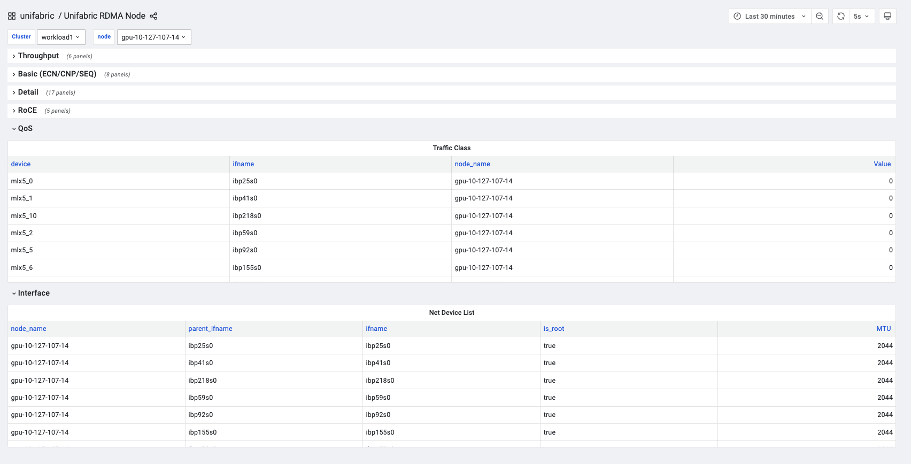

# 基础安装

English version: [getting-started.md](./getting-started.md)

## 前置条件

- 可以访问目标 Kubernetes 集群。
- 已安装 `kubectl` 和 Helm。

## 安装

下面的命令可以安装最新版本的 unifabric。也可以访问 [releases](https://github.com/unifabric-io/unifabric/releases) 页面选择特定版本。

```bash
LATEST_TAG=$(curl -fsSL https://api.github.com/repos/unifabric-io/unifabric/releases/latest | grep '"tag_name":' | cut -d '"' -f4)
CHART_VERSION="${LATEST_TAG#v}"

helm upgrade --install unifabric oci://ghcr.io/unifabric-io/charts/unifabric \
  --version "${CHART_VERSION}" \
  --namespace unifabric-system \
  --create-namespace \
  --wait
```

默认情况下，节点的 RDMA 网卡都会归类为 scale-out。
如果节点上存在不同用途的 RDMA 网卡，需要在安装时通过 `--set` 配置对应的 selector。

例如，一个节点有 `eth1` 到 `eth5` 五张 RDMA 网卡，其中 `eth1` 到 `eth4` 用于
scale-out，`eth5` 用于 storage，只需在安装命令中增加：

```bash
--set fabricNode.storageInterfaceSelector="interface=eth5"
```

`eth5` 会归类为 storage，其余四张 RDMA 网卡仍按默认规则归类为 scale-out。
选择器的完整语法请参阅 [Helm values 参考](../chart/README.md)。

如果集群没有 Prometheus Operator 或 Grafana Operator，在安装命令中增加对应参数：

```bash
--set nodeMetrics.serviceMonitor.enabled=false \
--set grafanaDashboard.enabled=false
```

如果位于中国大陆，可以增加以下参数加速镜像拉取：

```bash
--set global.registry=m.daocloud.io \
--set controller.image.repository=ghcr.io/unifabric-io/unifabric-controller \
--set agent.image.repository=ghcr.io/unifabric-io/unifabric-agent \
--set nvidiaTopograph.image.repository=ghcr.io/nvidia/topograph
```

## 验证基础安装

### 1. 检查 FabricNode 网卡信息

确认 Controller 和 Agent Pod 正常运行，并且每个节点都创建了对应的 `FabricNode`：

```bash
kubectl -n unifabric-system get pods
kubectl get fabricnodes
kubectl get fabricnode <node-name> -o yaml
```

重点检查 `status.totalNics`、`status.scaleOutNics` 和 `status.storageNics` 是否符合
节点的实际网卡配置。以前面的五张 RDMA 网卡为例，结果应类似：

```yaml
apiVersion: unifabric.io/v1beta1
kind: FabricNode
metadata:
  name: node1
status:
  totalNics: 5
  scaleOutNics:
    - name: eth1
      rdmaDeviceName: mlx5_0
      rdma: true
      state: up
    - name: eth2
      rdmaDeviceName: mlx5_1
      rdma: true
      state: up
    - name: eth3
      rdmaDeviceName: mlx5_2
      rdma: true
      state: up
    - name: eth4
      rdmaDeviceName: mlx5_3
      rdma: true
      state: up
  storageNics:
    - name: eth5
      rdmaDeviceName: mlx5_4
      rdma: true
      state: up
```

### 2. 查看节点 RDMA 指标

打开 Grafana 的 `Unifabric RDMA Node` 看板，在页面顶部选择集群和节点。展开
`Throughput`、`Basic`、`RoCE`、`QoS` 或 `Interface` 等分组，确认看板能够列出该节点的
RDMA device、网络接口及对应指标。



看板中能够看到目标节点的 device、`ifname` 和指标数据，说明 Agent 指标已经被
Prometheus 采集并可以正常查询。

## 下一步

基础安装完成后，根据物理网络继续配置拓扑发现：

- 使用 sonic 系统的交换机组网的集群，参考 [通用 SONiC RoCE](./getting-started-sonic-roce.zh.md)
- 使用 Spectrum-X 交换机组网和 netq 网络管理软件的情况，参考 [Spectrum-X fabric](./getting-started-spectrum-x.zh.md)
- 使用英伟达 InfiniBand 组网的集群，参考 [InfiniBand fabric](./getting-started-infiniband.zh.md)

这些场景文档使用 `helm upgrade --reuse-values`，只修改与当前网络场景相关的 Helm
values。其他基础安装配置保持不变。

## 常见问题

### FabricNode 没有发现预期的 RDMA 网卡

- 确认 Agent Pod 正常运行：

  ```bash
  kubectl -n unifabric-system get daemonset unifabric-agent
  kubectl -n unifabric-system logs daemonset/unifabric-agent -c agent
  ```

- 确认节点上的 RDMA 设备对 Agent 可见：

  ```bash
  kubectl -n unifabric-system exec daemonset/unifabric-agent -c agent -- \
    ls /sys/class/infiniband
  ```

- 检查 `fabricNode.scaleOutInterfaceSelector`、`storageInterfaceSelector` 和
  `scaleUpInterfaceSelector` 是否匹配实际接口名或 CIDR。
- 检查网卡是否被错误归类。storage 和 scale-up selector 匹配的网卡不会出现在
  `status.scaleOutNics` 中。

### Agent 指标或 Grafana 看板没有数据

确认 Agent metrics 已启用，并检查 Service 和 ServiceMonitor：

```bash
helm get values unifabric -n unifabric-system
kubectl -n unifabric-system get service unifabric-agent-metrics
kubectl -n unifabric-system get servicemonitor unifabric-agent-metrics
```

如果安装时关闭了 `nodeMetrics.serviceMonitor.enabled`，没有 `ServiceMonitor` 属于正常
情况。可以直接访问 Agent metrics 端点，确认采集器是否已经产生指标：

```bash
POD_IP=$(kubectl -n unifabric-system get pod \
  -l app.kubernetes.io/component=unifabric-agent \
  -o jsonpath='{.items[0].status.podIP}')

curl -s "http://${POD_IP}:8082/metrics" | grep '^unifabric_'
```

- 如果没有返回指标，确认 `nodeMetrics.enabled=true`，并检查 Agent 日志和
  `/sys/class/infiniband` 下的 RDMA 设备。
- 如果端点有指标，但 Grafana 看板没有数据，检查 Prometheus 是否发现
  `unifabric-agent-metrics` target，以及 Grafana 数据源、集群和节点变量是否选择正确。
