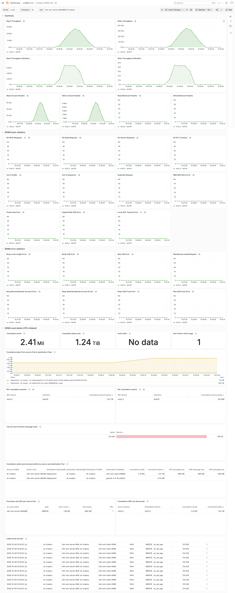
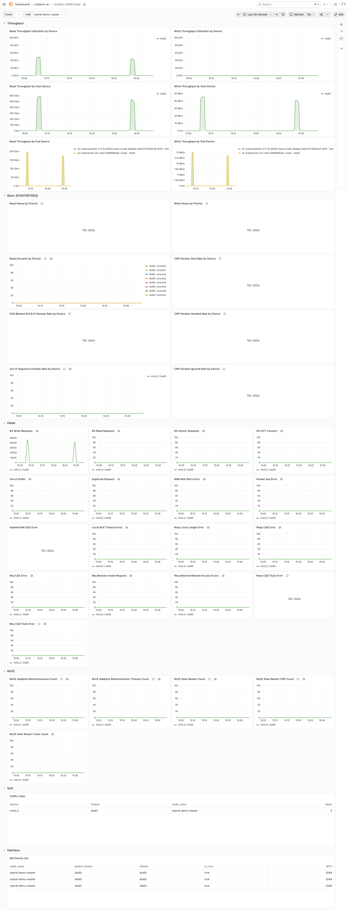

# eBPF RDMA Flow Observability

Chinese: [rdma-flow.zh.md](./rdma-flow.zh.md)

## Introduction

Host RDMA counters show how much a device or Pod has sent, but not where the
traffic went. eBPF-level flow observability attributes RDMA send traffic to
Pod-to-Pod flows without modifying applications. Operators can see which
training or inference workload communicates with each peer and the size of
its messages.

### Scope

This feature observes only **CPU-initiated RDMA**. The single criterion is
whether the CPU submits send WRs through `libibverbs`. Data in GPU memory does
not affect observability, so GPUDirect RDMA remains visible as long as the CPU
submits the WR. **GPU-initiated** paths such as GDAKI, GPUDirect Async, and
IBGDA, where a GPU kernel drives the NIC directly, bypass `libibverbs` and are
not observable.

A single framework may use both kinds of paths, so judge by the communication
mode actually in use.

#### Inference framework view

| Inference framework | Communication scenario | Underlying library | RDMA flow observable |
| --- | --- | --- | --- |
| SGLang | TP | NCCL | Supported |
| | PP | NCCL | Supported |
| | EP | `none` (default), DeepEP, Mooncake, NIXL-EP, FlashInfer | Selected by `--moe-a2a-backend`. Only `none` communicates through NCCL and is observable. DeepEP, Mooncake, NIXL-EP, and FlashInfer are unsupported. |
| | KV cache transfer in Prefill/Decode disaggregation | | |
| vLLM | TP | NCCL | Supported |
| | PP | NCCL | Supported |
| | EP (MoE communication) | `allgather_reducescatter`, `naive`, DeepEP (high-throughput / low-latency), FlashInfer | Selected by `--all2all-backend`. Only `allgather_reducescatter` and `naive` are observable. |
| | KV cache transfer in Prefill/Decode disaggregation | NixlConnector (NIXL), MooncakeConnector (Mooncake), P2pNcclConnector (NCCL), LMCacheConnector | Supported. LMCacheConnector requires the environment variable `UCX_TLS=rc` to use RDMA. |

#### Communication library view

| Communication library | RDMA flow observable |
| --- | --- |
| NCCL | Regular collectives such as `ncclAllReduce` go through the CPU proxy thread in [`src/transport/net_ib.cc`](https://github.com/NVIDIA/nccl/blob/v2.29.2-1/src/transport/net_ib.cc), which calls `ibv_post_send`, and are observable. The GIN path in [`src/gin/gin_host.cc`](https://github.com/NVIDIA/nccl/blob/v2.29.2-1/src/gin/gin_host.cc) is entered only when the application uses GIN through the NCCL Device API (symmetric memory kernels), and is decided by two environment variables: `NCCL_GIN_ENABLE` (default `1`, set `0` to disable GIN) and `NCCL_GIN_TYPE` (default `-1` for automatic selection, `2` for Proxy, `3` for GDAKI). Proxy submits through the CPU proxy thread and is observable. GDAKI is GPU-initiated and is not observable. TP and PP in vLLM and SGLang use regular collectives and are observable. |
| NIXL | Supported when the UCX backend uses host IB/RoCE verbs. DOCA GPUNetIO and the UCX GPU Device API are unsupported. |
| Mooncake | Supported. |
| LMCache | Supported. Requires `UCX_TLS=rc`. |
| DeepEP | Unsupported. |
| FlashInfer | Unsupported. |
| verbs, MPI, perftest | Supported. |

## Requirements

- Linux nodes with BPF ring buffer and uprobe support, kernel 5.8 or later.
- Applications must use the host `libibverbs` path. Merely using RDMA or GPU
  buffers does not make a workload observable.

## Enable

### Basic functionality

The basic functionality periodically aggregates RDMA flows from BPF maps and
exports Prometheus metrics through the Agent metrics Service, including
cumulative bytes, WRs, and active QPs for each flow. It does not produce
per-send events and does not require an event storage backend.

```bash
helm upgrade unifabric oci://ghcr.io/unifabric-io/charts/unifabric \
  --namespace unifabric-system \
  --reuse-values \
  --set agent.ebpfFlow.enabled=true \
  --wait
```

On InfiniBand fabrics, also set
`--set agent.ebpfFlow.endpoint.allPods=true`, because peers are addressed by
LID and every RDMA Pod must publish an `RDMAEndpoint`.

All settings and their defaults are listed under `agent.ebpfFlow` in the
[Helm values reference](../../chart/README.md). They map one to one onto the
`ebpfFlow` section of the Agent config file.

#### Verify

Open Grafana and view the Unifabric RDMA Pods and Nodes dashboards. Verify that
the panels under RDMA send details (CPU initiated) display data.





### Detailed events

The basic functionality exports pre-aggregated Prometheus metrics. Detailed
events instead capture every RDMA `post_send` as an event record containing
the source and destination Pods, QP, devices, bytes, WR count, and timestamp.
The Agent sends these records over OTLP to the Event Collector, which writes
them to an event storage backend.

`flowEvents` is disabled by default. Enabling detailed events requires at
least one storage backend. The chart currently supports **ClickHouse** and
**Elasticsearch**; either one or both can be enabled. Kafka is not currently
supported.

#### Bundled ClickHouse

The following command enables detailed events, the Event Collector, and the
bundled ClickHouse instance:

```bash
helm upgrade unifabric oci://ghcr.io/unifabric-io/charts/unifabric \
  --namespace unifabric-system \
  --reuse-values \
  --set agent.ebpfFlow.enabled=true \
  --set agent.ebpfFlow.flowEvents.enabled=true \
  --set ebpfFlowEventCollector.clickhouse.enabled=true \
  --wait
```

When `clickhouse.endpoint` is empty, the chart deploys a bundled single-replica
ClickHouse. The default user is `rdma`, the default password is `rdma-flow`,
and records are stored in `rdma.rdma_sends`. It uses a 20Gi PVC with the
cluster's default StorageClass. This instance has no replication or backups
and is intended only for testing and evaluation.

#### Bundled Elasticsearch

```bash
helm upgrade unifabric oci://ghcr.io/unifabric-io/charts/unifabric \
  --namespace unifabric-system \
  --reuse-values \
  --set agent.ebpfFlow.enabled=true \
  --set agent.ebpfFlow.flowEvents.enabled=true \
  --set ebpfFlowEventCollector.elasticsearch.enabled=true \
  --wait
```

When `elasticsearch.endpoints` is empty, the chart deploys a bundled
single-node Elasticsearch. The default user is `elastic`, the default password
is `rdma-flow`, and records are written to the `rdma-sends` data stream. Data
uses an `emptyDir` by default and is lost when the Pod is recreated, so this
instance is intended only for testing and evaluation.

#### External ClickHouse

Provide a native protocol endpoint and either a password or a Secret containing
a `password` key:

```bash
kubectl -n unifabric-system create secret generic clickhouse-credentials \
  --from-literal=password='<clickhouse-password>'
```

Add the backend configuration to a values file:

```yaml
agent:
  ebpfFlow:
    enabled: true
    flowEvents:
      enabled: true
ebpfFlowEventCollector:
  clickhouse:
    enabled: true
    endpoint: tcp://clickhouse.data.svc:9000
    database: rdma
    table: rdma_sends
    username: rdma
    existingSecret: clickhouse-credentials
```

`clickhouse.password` can be set directly, but a Secret is recommended for
production. Setting `endpoint` prevents deployment of the bundled ClickHouse.

#### External Elasticsearch

First create a Secret containing a `password` key:

```bash
kubectl -n unifabric-system create secret generic elasticsearch-credentials \
  --from-literal=password='<elasticsearch-password>'
```

Add the backend configuration to a values file:

```yaml
agent:
  ebpfFlow:
    enabled: true
    flowEvents:
      enabled: true
ebpfFlowEventCollector:
  elasticsearch:
    enabled: true
    endpoints:
      - http://elasticsearch.data.svc:9200
    user: elastic
    index: rdma-sends
    existingSecret: elasticsearch-credentials
```

`elasticsearch.password` can be set directly. Setting `endpoints` prevents
deployment of the bundled Elasticsearch. When both backends are enabled they
receive the same event records; one being unavailable does not affect the
other.

Save the external backend configuration as `rdma-flow-events.yaml`, then run:

```bash
helm upgrade unifabric oci://ghcr.io/unifabric-io/charts/unifabric \
  --namespace unifabric-system \
  --reuse-values \
  -f rdma-flow-events.yaml \
  --wait
```

#### Event settings and verification

- The Agent automatically connects to the Event Collector Service deployed by
  the chart; no OTLP endpoint configuration is required.
- `flowEvents.aggregate` merges identical submissions on one QP within the
  window into one event record with a `count`; `flowEvents.sample` retains one
  event in every N.
- Elasticsearch generally uses more disk and is useful for correlation with
  logs; ClickHouse is better suited to aggregate analysis.

Use Prometheus to verify the event collection rate and message-size
distribution:

```promql
sum by (src_pod_name, dst_pod_name) (rate(rdma_flow_sends_total[1m]))
histogram_quantile(0.5, sum by (le) (rate(rdma_flow_send_bytes_bucket[5m])))
```

Example ClickHouse query:

```sql
SELECT src_pod_name, dst_pod_name, sum(count), sum(bytes * count),
       quantileWeighted(0.5)(bytes, count)
FROM rdma.rdma_sends
WHERE Timestamp > now() - INTERVAL 5 MINUTE
GROUP BY 1, 2 ORDER BY 3 DESC
```

## Owner resolution for other workload controllers

Flow labels carry the top-level owner of each Pod. The agent follows a
Pod's `ownerReferences` only through kinds it is allowed to read, so a
controller such as Argo Workflows needs a read rule before its Pods are
labelled with the workflow instead of the intermediate resource. Rules for
third-party kinds are defined in values as `agent.workloadOwnerRules`, a
map keyed by API group with the plural resources as value. User values
merge with the defaults, so adding a controller is one extra key:

```yaml
agent:
  workloadOwnerRules:
    argoproj.io: [workflows]
```

The chart renders this map into the `<release>-agent-workload-owners`
ClusterRole. The kinds followed by the flow resolver are listed in
`pkg/agent/ebpfflow/owners.go`; a new API group also needs an entry there.

## Troubleshooting

### No data in the Pods Grafana dashboard

1. First verify that the application meets the observability prerequisites:

   - The communication library actually uses a CPU-initiated host
     `libibverbs` path. Refer to the compatibility table above and confirm the
     path in NCCL, UCX, or application logs. GPU-initiated paths are not
     observable.
   - The application actually produces RDMA traffic during troubleshooting.
     Confirm traffic through application logs, communication test results, or
     RDMA device counters.

   If either condition is false, no flow data will be produced, so there is no
   reason to continue checking the Agent or Grafana.

The commands below assume the namespace is `unifabric-system`. If you installed
the chart in another namespace, adjust `NAMESPACE` accordingly.

2. Verify that the Agent is running on every target node, then select an Agent
   Pod on a node that has RDMA traffic:

   ```bash
   NAMESPACE=unifabric-system
   kubectl -n "$NAMESPACE" get daemonset,pod \
     -l app.kubernetes.io/component=unifabric-agent -o wide

   AGENT_POD=$(kubectl -n "$NAMESPACE" get pod \
     -l app.kubernetes.io/component=unifabric-agent \
     --field-selector=status.phase=Running \
     -o jsonpath='{.items[0].metadata.name}')
   echo "$AGENT_POD"
   ```

   The DaemonSet `DESIRED`, `CURRENT`, and `READY` values should match. Also
   verify that `agent.ebpfFlow.enabled=true`; when disabled, the Agent does not
   register `rdma_flow_*` metrics.

3. Inspect metrics directly from that Agent to distinguish collection issues
   from Grafana or Prometheus issues. In one terminal, start port forwarding:

   ```bash
   kubectl -n "$NAMESPACE" port-forward "pod/$AGENT_POD" 8082:8082
   ```

   In another terminal, run:

   ```bash
   curl -s http://127.0.0.1:8082/metrics | grep '^rdma_flow_'
   curl -s http://127.0.0.1:8082/metrics | \
     grep -E '^rdma_flow_agent_(qp_infos|qp_stats|qp_matched|qp_unmatched|qp_unresolved) '
   ```

   - No `rdma_flow_*` metrics: verify that the feature is enabled, then inspect
     the BPF loading logs in the next step.
   - `rdma_flow_agent_qp_stats` is `0`: the Agent has not observed any sends.
     Verify that the application is producing host-initiated RDMA traffic and
     that the data plane probes are attached.
   - `rdma_flow_agent_qp_stats` is greater than `0`, but `qp_matched` is `0`:
     inspect `qp_infos` and the provider callback.
   - `rdma_flow_agent_qp_unresolved` is greater than `0`: the Agent found QPs
     but cannot resolve the source or destination to a Pod. On InfiniBand,
     verify `agent.ebpfFlow.endpoint.allPods=true` and check that all required
     `RDMAEndpoint` objects exist.
   - `rdma_flow_bytes_total`, `rdma_flow_wrs_total`, or `rdma_flow_qps` has
     data: Agent collection works; continue with the Prometheus and Grafana
     checks.

4. Check the BPF object, probes, and pinned maps:

   ```bash
   kubectl -n "$NAMESPACE" logs "$AGENT_POD" -c agent | \
     grep -E 'bpf_collection_loaded|bootstrap_probes_attached|provider_callback_restored|callback_received|load bpf collection|attach_bootstrap_probes'

   kubectl -n "$NAMESPACE" exec "$AGENT_POD" -c agent -- \
     ls -l /sys/fs/bpf/unifabric
   ```

   The logs should contain `bpf_collection_loaded` and
   `bootstrap_probes_attached`. After the workload creates a QP,
   `provider_callback_restored` should appear; `callback_received` is emitted
   only at debug log level. `/sys/fs/bpf/unifabric` should contain `qp_infos`
   and `qp_stats`. If `bpftool` is installed on the node, inspect the maps:

   ```bash
   bpftool map dump pinned /sys/fs/bpf/unifabric/qp_infos
   bpftool map dump pinned /sys/fs/bpf/unifabric/qp_stats
   ```

   An empty `qp_infos` usually means that no QP has reached RTR or the provider
   callback was not captured. An empty `qp_stats` usually means that the
   application did not submit sends through a supported `libibverbs` path.

5. If the Agent exposes flow metrics locally, inspect the Prometheus scrape
   path:

   ```bash
   kubectl -n "$NAMESPACE" get service,servicemonitor \
     -l app.kubernetes.io/component=unifabric-agent
   ```

   By default, the chart creates an Agent metrics Service and ServiceMonitor.
   Verify that the corresponding target is `UP` on the Prometheus Targets page.
   If Prometheus selects ServiceMonitors by label, ensure that
   `nodeMetrics.serviceMonitor.labels` matches its selector. Then run this query
   in Prometheus or Grafana Explore:

   ```promql
   sum(rate(rdma_flow_bytes_total[5m]))
   ```

   If the query returns data but the dashboard is empty, verify the dashboard
   time range and ensure that the namespace, workload, and Pod variables select
   the objects that are generating RDMA traffic.
