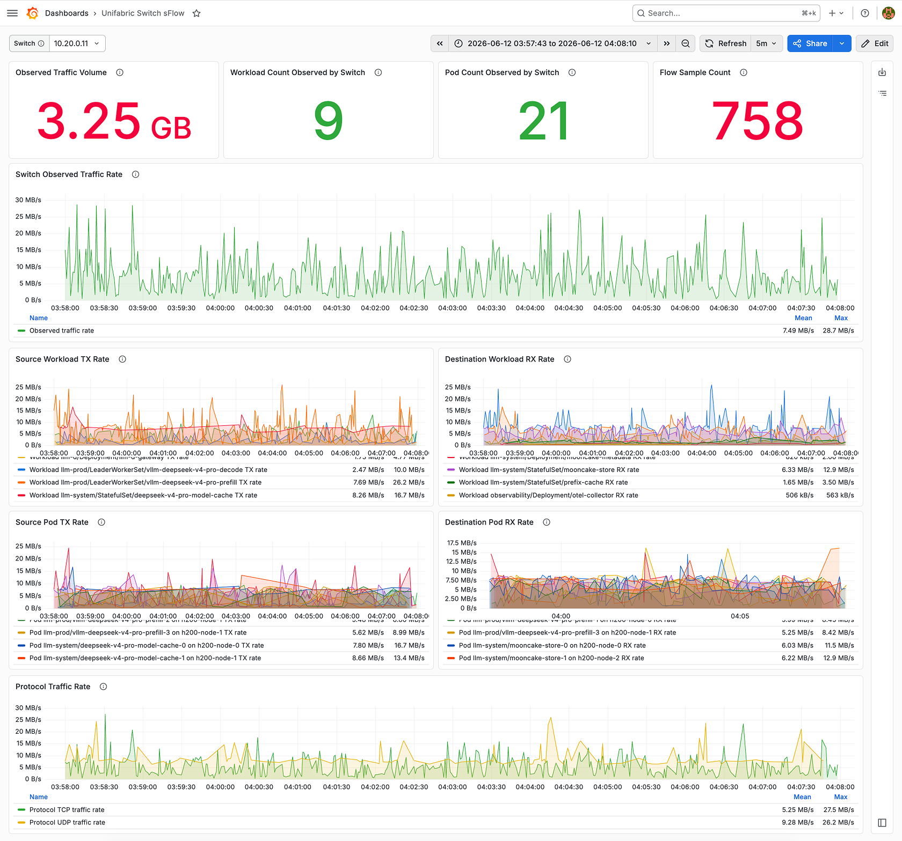
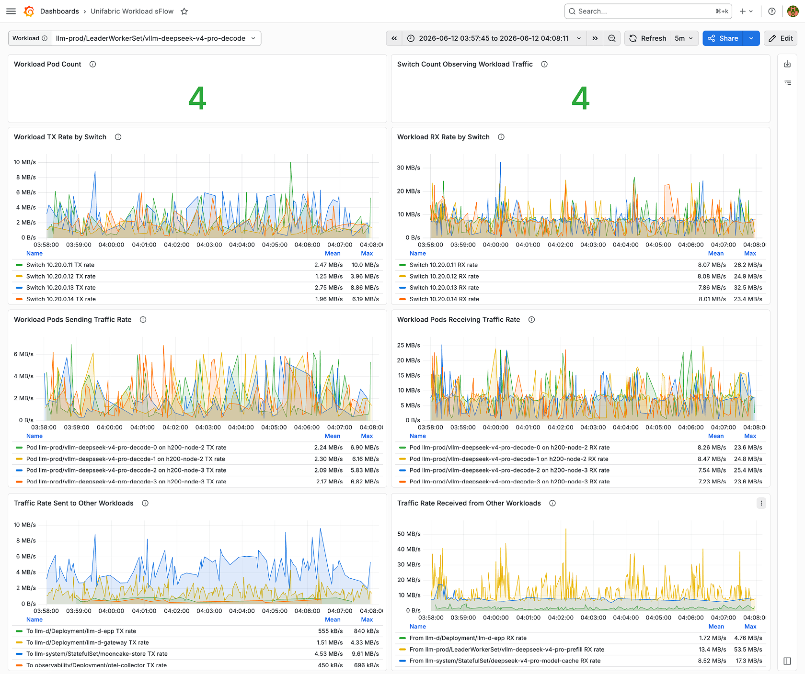

# Application Flow Observability Guide

This guide explains how Unifabric provides application flow observability. When enabled, Unifabric receives sampled traffic reported by multiple switches, decodes samples into queryable flow records, and enriches source and destination endpoints with Kubernetes Pod, Node, and workload owner metadata. Operators can inspect which applications communicate, which switches observe the traffic, and which Pods account for the main transmit and receive traffic from either the switch or workload perspective.

sFlow is the switch-side sampling input for this path. Users mainly need to work with application flow records written to `flows_raw` and the switch / workload dashboards built on those records. For sFlow decoding, enrichment, and overload handling details, see [sFlow processing design](../design/sflow.md).

## Observation Model

The input for this capability is sFlow v5 datagrams pushed by switches. The collector extracts source address, destination address, protocol, ports, sampled bytes, sampled packets, sampling rate, and sampler address from datagrams, then converts each valid sample into a normalized flow record.

Before writing to ClickHouse, the collector matches source and destination IPs against the current Kubernetes Pod cache. A matched endpoint is enriched with Pod namespace, Pod name, Node name, and top-level workload owner. In this guide, "application" is represented by the Kubernetes top-level workload owner, such as Deployment, StatefulSet, DaemonSet, Job, and training or compute job objects that the current RBAC permissions allow the collector to read.

Endpoints that do not match a Pod IP are still written with the base flow fields, while Kubernetes fields remain empty. These records can still be used for switch, IP, protocol, and time-range troubleshooting. If one side of the flow involves an in-cluster Pod, that side keeps the application attribution fields.

## Prerequisites

- A Kubernetes cluster where the Unifabric chart can be installed.
- When using chart-managed ClickHouse with PVC storage, the cluster needs a usable default StorageClass, or `sflow.clickhouse.managed.persistence.storageClassName` must be set in values. When using host-path storage, choose a fixed node for the ClickHouse Pod and ensure the node directory has enough capacity and write permission.
- Switches that can send sFlow v5 datagrams to a Kubernetes Service address.
- Grafana dashboard import support if `grafanaDashboard.enabled=true`.

## Install Paths

Choose one of the following three install paths based on the ClickHouse source and data persistence mode. In all three paths, the collector checks and prepares the required `flows_raw` table during startup, so you do not need to run `clickhouse-client` initialization SQL manually.

### 1. Use Chart-Managed ClickHouse with PVC

Use this path when the cluster already has a default StorageClass, or when you can specify a StorageClass for chart-managed ClickHouse. ClickHouse data is stored in a PVC, which makes this the recommended default install mode.

Create a values file:

```yaml
sflow:
  enabled: true
  service:
    type: NodePort
    port: 6343
    # Optional. Omit or set to 0 to let Kubernetes allocate a nodePort.
    nodePort: 0
  clickhouse:
    database: default
    username: default
    table: flows_raw
    managed:
      enabled: true
      persistence:
        enabled: true
        type: pvc
        size: 20Gi
        # Optional. Empty uses the cluster default StorageClass.
        storageClassName: ""
    schema:
      retentionDays: 3
```

This configuration renders the sFlow collector, UDP Service, ClickHouse `StatefulSet`, and ClickHouse Service. The collector ClickHouse address automatically points to the chart-managed ClickHouse Service, and the collector prepares the required `flows_raw` table during startup. `retentionDays` controls flow record retention, must be at least 1, and defaults to 3 when omitted.

If `sflow.replicaCount` is greater than 1, no extra table initialization step is required; the chart configures the permissions the collector needs.

Save the content above as `sflow-pvc-values.yaml`, then run the following command. The same command works for both first-time install and updating an existing release. For an existing release, `--reuse-values` keeps the existing Helm values and applies the sFlow settings from this file.

```bash
helm upgrade --install unifabric ./chart \
  --namespace unifabric-system \
  --create-namespace \
  --reuse-values \
  --values sflow-pvc-values.yaml \
  --wait
```

### 2. Use Chart-Managed ClickHouse with hostPath for Testing

Use this path for test clusters, single-node environments, or environments that do not currently have a usable StorageClass. ClickHouse data is written to a host directory. If the Pod is scheduled to another node, that node will not automatically have the previous node's data. For production environments that require cross-node movement or higher availability, use PVC, local PV, or an external ClickHouse instead.

Create a values file:

```yaml
sflow:
  enabled: true
  service:
    type: NodePort
    port: 6343
    nodePort: 0
  clickhouse:
    database: default
    username: default
    table: flows_raw
    managed:
      enabled: true
      # Pin the ClickHouse Pod to the node that stores the hostPath data.
      # Check the target node name with `kubectl get nodes`, then replace this value.
      nodeSelector:
        kubernetes.io/hostname: worker-1
      persistence:
        enabled: true
        type: hostPath
        hostPath:
          path: /var/lib/unifabric/clickhouse
          type: DirectoryOrCreate
    schema:
      retentionDays: 3
```

`worker-1` is only an example. Replace it with the actual node name that stores `/var/lib/unifabric/clickhouse`. If you later move ClickHouse to another node, migrate or recreate the data in that directory first.

Save the content above as `sflow-hostpath-values.yaml`, then run the following command. The same command works for both first-time install and updating an existing release. For an existing release, `--reuse-values` keeps the existing Helm values and applies the sFlow settings from this file.

```bash
helm upgrade --install unifabric ./chart \
  --namespace unifabric-system \
  --create-namespace \
  --reuse-values \
  --values sflow-hostpath-values.yaml \
  --wait
```

### 3. Use External ClickHouse

Use this path when production already has ClickHouse, or when ClickHouse capacity, backup, and high availability are managed by an external system. This path does not install chart-managed ClickHouse; it only passes connection details and credentials to the collector.

Create a values file:

```yaml
sflow:
  enabled: true
  service:
    type: NodePort
    port: 6343
    nodePort: 0
  clickhouse:
    address: clickhouse-clickhouse.clickhouse.svc.cluster.local:9000
    database: default
    username: default
    passwordSecret:
      name: clickhouse-auth
      key: password
    table: flows_raw
    managed:
      enabled: false
    schema:
      retentionDays: 3
```

The target ClickHouse user needs `CREATE DATABASE`, `CREATE TABLE`, `ALTER TABLE`, and write permissions. If an existing table has a different structure, an administrator should review and handle it first; the collector does not automatically rewrite existing table definitions.

Save the content above as `sflow-external-clickhouse-values.yaml`, then run the following command. The same command works for both first-time install and updating an existing release. For an existing release, `--reuse-values` keeps the existing Helm values and applies the sFlow settings from this file.

```bash
helm upgrade --install unifabric ./chart \
  --namespace unifabric-system \
  --create-namespace \
  --reuse-values \
  --values sflow-external-clickhouse-values.yaml \
  --wait
```

`NodePort` is used by default because switch sFlow traffic usually arrives from outside the cluster. Set `sflow.service.nodePort` when switches need a fixed UDP node port. Keep it as `0` to let Kubernetes allocate one automatically. If the environment supports external UDP load balancing, set `sflow.service.type` to `LoadBalancer`.

## Configure Switch Sampling Data

Configure the sFlow collector address and port on the switch. The following example enables sFlow on all ports on SONiC and sends sampled data to the Unifabric sFlow Service:

```bash
sudo config sflow collector add collector1 192.168.122.172 --port 6343
sudo config sflow interface enable all
sudo config sflow enable
sudo show sflow
```

Replace `192.168.122.172` and `6343` with the actual sFlow Service address and port. Check the Service first:

```bash
kubectl get svc -n unifabric-system unifabric-sflow
```

If the Service is `NodePort`, use a Kubernetes Node IP reachable from the switch and the nodePort shown in the output. If the Service is `LoadBalancer`, use the LoadBalancer IP and Service port shown in the output.

## Verify the Ingest and Write Path

Check rendered resources:

```bash
kubectl -n unifabric-system get deploy,statefulset,svc,cm \
  -l 'app.kubernetes.io/component in (unifabric-sflow,unifabric-sflow-clickhouse)'
kubectl -n unifabric-system get clusterrole,clusterrolebinding -l app.kubernetes.io/component=unifabric-sflow
```

When chart-managed ClickHouse is enabled, the `unifabric-sflow-clickhouse` StatefulSet should be ready. The collector prepares the ClickHouse write environment during startup. If ClickHouse permissions or connectivity fail, the collector does not become ready and logs the related error.

Check Pod status and logs:

```bash
kubectl -n unifabric-system get pods \
  -l 'app.kubernetes.io/component in (unifabric-sflow,unifabric-sflow-clickhouse)'
kubectl -n unifabric-system logs deploy/unifabric-sflow -c sflow
```

Check the metrics endpoint from inside the cluster:

```bash
POD_IP=$(kubectl -n unifabric-system get pod -l app.kubernetes.io/component=unifabric-sflow -o jsonpath='{.items[0].status.podIP}')
kubectl -n unifabric-system run sflow-metrics-check --rm -i --restart=Never --image=curlimages/curl -- \
  "http://${POD_IP}:8084/metrics"
```

Useful metrics:

- `unifabric_sflow_datagrams_accepted_total`: datagrams received by the collector.
- `unifabric_sflow_decode_errors_total`: malformed or unsupported datagrams.
- `unifabric_sflow_records_decoded_total`: normalized records produced.
- `unifabric_sflow_records_written_total`: records written to ClickHouse.
- `unifabric_sflow_records_dropped_total`: records dropped because the writer queue was full.
- `unifabric_sflow_write_errors_total`: ClickHouse write failures.
- `unifabric_sflow_queue_depth`: records currently queued for writing.

## Verify Application Flow Records

Query recent traffic by source workload, destination workload, and switch:

```sql
SELECT
  src_k8s_top_owner_namespace AS src_namespace,
  src_k8s_top_owner_kind AS src_kind,
  src_k8s_top_owner_name AS src_workload,
  dst_k8s_top_owner_namespace AS dst_namespace,
  dst_k8s_top_owner_kind AS dst_kind,
  dst_k8s_top_owner_name AS dst_workload,
  IPv4NumToString(reinterpretAsUInt32(reverse(substring(sampler_address, 13, 4)))) AS switch,
  count() AS samples,
  sum(bytes * if(sampling_rate = 0, toUInt64(1), sampling_rate)) AS observed_bytes,
  sum(packets * if(sampling_rate = 0, toUInt64(1), sampling_rate)) AS observed_packets
FROM flows_raw
WHERE time_flow_start > now() - INTERVAL 10 MINUTE
  AND (src_k8s_top_owner_name != '' OR dst_k8s_top_owner_name != '')
GROUP BY
  src_namespace,
  src_kind,
  src_workload,
  dst_namespace,
  dst_kind,
  dst_workload,
  switch
ORDER BY observed_bytes DESC
LIMIT 20;
```

Expected result: records involving current cluster Pods include workload owner fields on the matched source or destination side. When both endpoints match Pod IPs, you can see workload-to-workload traffic. When only one side matches, you can see traffic between in-cluster applications and external endpoints.

To inspect specific Pods, query recent raw records:

```sql
SELECT
  time_flow_start,
  IPv4NumToString(reinterpretAsUInt32(reverse(substring(sampler_address, 13, 4)))) AS switch,
  src_k8s_pod_namespace,
  src_k8s_pod_name,
  src_k8s_node_name,
  dst_k8s_pod_namespace,
  dst_k8s_pod_name,
  dst_k8s_node_name,
  bytes,
  packets,
  sampling_rate
FROM flows_raw
WHERE time_flow_start > now() - INTERVAL 10 MINUTE
ORDER BY time_flow_start DESC
LIMIT 20;
```

## Verify Dashboards

When `grafanaDashboard.enabled=true` and `sflow.enabled=true`, the chart renders:

- `switch-sflow.json`
- `workload-sflow.json`

The switch dashboard starts from the switch sampler address and shows workloads, Pods, samples, protocols, and top talkers observed by that switch.



The workload dashboard starts from the workload owner and shows transmit and receive traffic for the selected application, the switches that observed the traffic, related Pod distribution, and traffic from the selected application to other workloads or from other workloads to the selected application.



If dashboards are empty, first confirm ClickHouse has rows in the selected time range, then check the dashboard data source and variables.

## Troubleshooting

If the collector does not become ready after installation:

- Check `unifabric-sflow` logs and confirm it can connect to ClickHouse and that the configured user has `CREATE DATABASE`, `CREATE TABLE`, `ALTER TABLE`, and `INSERT` permissions.
- When using chart-managed ClickHouse, confirm the PVC is bound and the `unifabric-sflow-clickhouse` Pod is ready.
- When using external ClickHouse, confirm `sflow.clickhouse.address` is a collector-reachable `host:port`, and that the Secret password key matches `sflow.clickhouse.passwordSecret.key`.

If the collector is not receiving datagrams:

- Confirm the Service type and address are reachable from switches.
- Confirm switch exporters target UDP `6343`, or the configured `sflow.service.port`.
- Confirm Kubernetes NetworkPolicy or external firewalls allow UDP traffic.

If rows are written without Pod fields:

- Confirm the endpoint IP in the sampled record is a Pod IP, not only a Node address or a post-NAT address.
- Confirm the target Pod is running and already has a Pod IP.
- Confirm the collector RBAC can list Pods and read owner objects.
- Wait one Pod cache refresh interval after Pod creation, then check again.

If ClickHouse writes fail:

- Confirm `sflow.clickhouse.address` includes host and port.
- Confirm the collector completed ClickHouse initialization and the table structure matches the built-in `flows_raw` table structure.
- Confirm the configured username and Secret password are valid.
- Check `unifabric_sflow_write_errors_total` and collector logs.

If records are dropped:

- Check `unifabric_sflow_queue_depth` and `unifabric_sflow_records_dropped_total`.
- Increase the switch sampling rate to reduce input volume.
- Increase `sflow.writer.queueSize` or `sflow.writer.batchSize`.
- Check ClickHouse insert latency and resource usage.
