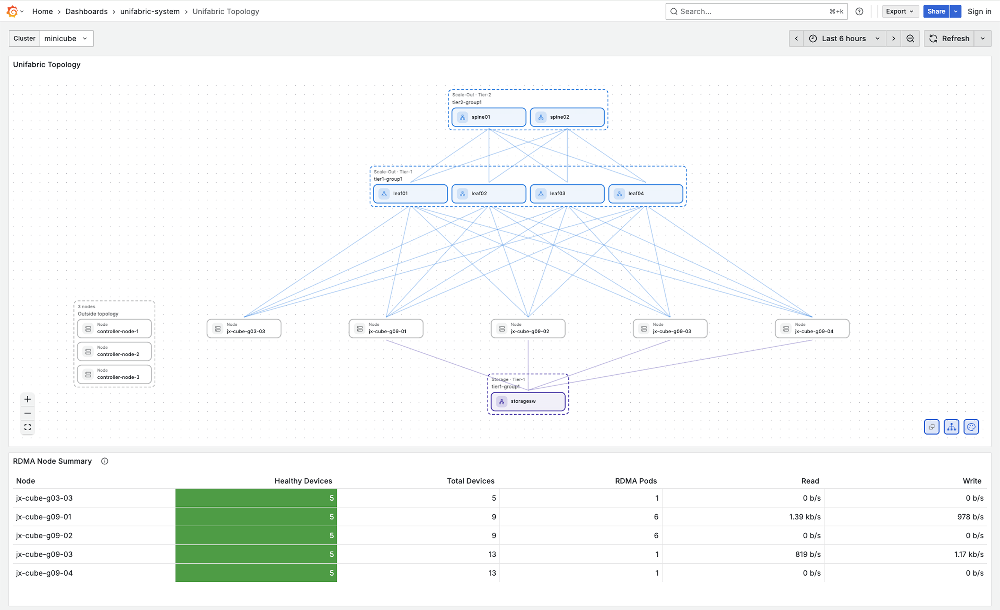

# Topology Visualization Usage Guide

中文版: [topology-visualization.zh.md](./topology-visualization.zh.md)

This guide explains how to enable and use Unifabric topology visualization. The feature uses a
Grafana datasource plugin and panel plugin to present the cluster's Scale-out, Scale-up, and Storage
network topologies in one graph.

## Prerequisites

1. Unifabric is installed in the cluster.
2. Grafana Operator and its CRDs are installed in the cluster.
3. The following command returns at least one Topology CR:

```bash
kubectl get topologies.unifabric.io
NAME       AGE
scaleout   4h27m
scaleup    4h27m
storage    4h27m
```

## Enable Topology Visualization

### Use the Bundled Grafana Instance

Run the following Helm upgrade to retain the existing values while enabling the Topology API and
the bundled Grafana instance:

```bash
helm upgrade unifabric oci://ghcr.io/unifabric-io/charts/unifabric \
  --namespace unifabric-system \
  --reuse-values \
  --set topologyAPI.enabled=true \
  --set grafanaInstance.enabled=true \
  --wait
```

The Chart creates a `Grafana`, `GrafanaDatasource`, and `GrafanaDashboard`. The Topology datasource
automatically connects to the Controller Topology API from the same release. After the settings
take effect, open Grafana and search for the **Unifabric Topology** dashboard.

The bundled instance uses the `ghcr.io/unifabric-io/unifabric-grafana:<version>` image. It contains
both the topology datasource and panel plugins; its tag follows the Chart `appVersion` by default.

### Use an External Grafana Instance

When using a Grafana instance managed by another Chart or component, enable only the Topology API:

```bash
helm upgrade unifabric oci://ghcr.io/unifabric-io/charts/unifabric \
  --namespace unifabric-system \
  --reuse-values \
  --set topologyAPI.enabled=true \
  --wait
```

`grafanaInstance.enabled` defaults to `false`. With the default Grafana dashboard settings, the
Chart creates a `GrafanaDatasource` and `GrafanaDashboard`, using
`grafanaDashboard.instanceSelector` to select the external Grafana instance. The default selector is
`{}`. If the cluster contains multiple Grafana instances, set the selector to match the intended
instance.

For example, when the external `Grafana` CR has a `dashboards: grafana` label, set:

```yaml
grafanaDashboard:
  instanceSelector:
    matchLabels:
      dashboards: grafana
```

If the external instance can use the Unifabric Grafana image, update `spec.version` in its `Grafana`
CR:

```yaml
spec:
  version: ghcr.io/unifabric-io/unifabric-grafana:<version>
```

If the external instance must retain its current image, install the plugins with an init container.
The following configuration assumes that the `grafana-plugins` shared volume is mounted at
`/var/lib/grafana/plugins` in the Grafana container. It also allows Grafana to load the two unsigned
plugins:

```yaml
spec:
  config:
    plugins:
      allow_loading_unsigned_plugins: unifabric-unifabrictopology-datasource,unifabric-unifabrictopology-panel
  deployment:
    spec:
      template:
        spec:
          initContainers:
            - name: unifabric-plugins-init
              image: ghcr.io/unifabric-io/unifabric-grafana:<version>
              command:
                - /bin/sh
                - -c
              args:
                - |
                  set -eu
                  for plugin in \
                    unifabric-unifabrictopology-datasource \
                    unifabric-unifabrictopology-panel
                  do
                    test -f "/var/lib/grafana/plugins/${plugin}/plugin.json"
                    rm -rf "/opt/plugins/${plugin}"
                    cp -a "/var/lib/grafana/plugins/${plugin}" /opt/plugins/
                  done
              volumeMounts:
                - name: grafana-plugins
                  mountPath: /opt/plugins
```

If the shared volume has a different name, update `volumeMounts[].name` in the init
container to match it. After applying the CR, wait for Grafana Operator to reconcile it and confirm
that both plugin directories exist in the Grafana Pod.

## Topology Dashboard Overview



The graph uses four vertical regions:

1. **Scale-Out** domains appear above the Nodes. Tier 1 is closest to the Node row; higher tiers are
   placed farther away.
2. **Scale-Up** domains appear between Scale-Out and the Node row.
3. **Node** cards form the shared row used by all topology types.
4. **Storage** domains appear below the Node row.

Each domain card shows its topology type, tier, domain name, and member switches. Lines show domain
parent relationships and Node membership. Select a domain, switch, or Node to emphasize its direct
connections. Select it again, or select the empty canvas, to clear the selection.

Cards can be dragged for temporary inspection. Use the controls in the lower-left corner to zoom in,
zoom out, or fit the graph back into the panel.

### View Resource Details

Hover over a card to inspect the resource represented by it:

- A Node card loads the corresponding `FabricNode` resource.
- A switch card in Switch View loads the corresponding `Switch` resource.
- A domain or switch group shows fields from the corresponding `Topology` domain.

The detail popover includes a **View raw JSON** action. A `Not found` message means the name appears
in the topology but the corresponding FabricNode or Switch resource is not currently available.

## Troubleshooting

### The dashboard is not imported

- Confirm `topologyAPI.enabled=true`.
- `grafanaDashboard.enabled` defaults to `true`; enable it again if it was explicitly disabled during
  installation.
- Confirm `grafanaDashboard.kind=GrafanaDashboard` and that its instance selector matches
  `grafanaDashboard.instanceSelector`.

### The graph has no topology domains

- Check `kubectl get topologies` and inspect each resource's `status.domains` and `status.nodes`.
- Confirm that topology discovery has completed and the Controller cache has synchronized.
- Confirm that the dashboard's Cluster selection matches the API cluster name.

### Nodes appear under Outside topology

The panel builds this group by comparing `FabricNode.metadata.name` with every Node name in
`Topology.status.nodes`. Check the affected Node's topology labels and the current Topology resources.
After discovery updates the Topology status, refresh the dashboard.

### A switch or Node detail shows Not found

The domain can remain visible from a Topology resource even when its referenced `Switch` or
`FabricNode` resource is absent. Check the referenced name with `kubectl get switch <name>` or
`kubectl get fabricnode <name>`.

For API and plugin architecture details, see
[Topology visualization design](../design/topology-visualization.md).