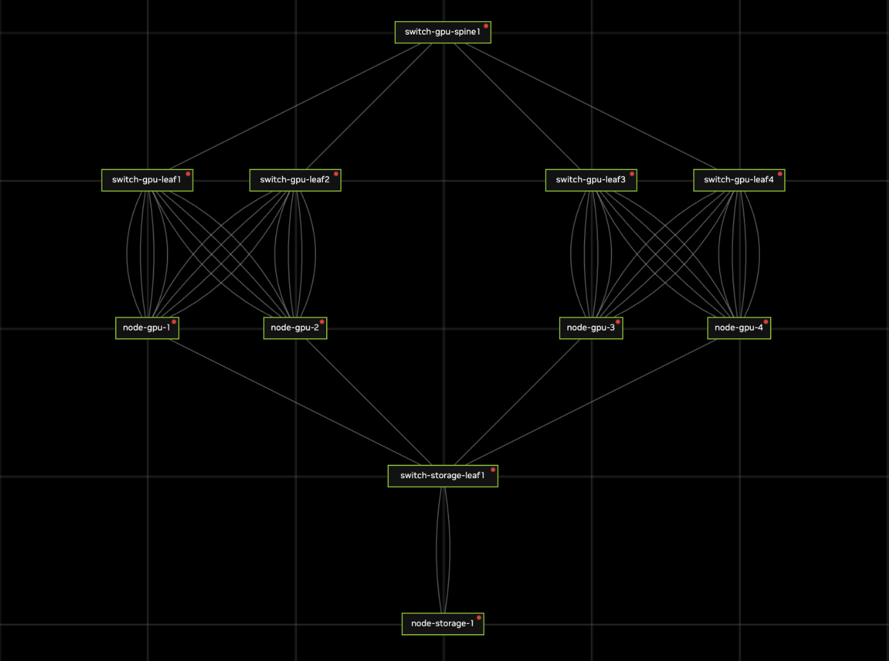

# GPU Cluster Topology

## Overview

AI/GPU cluster topology exported from NVIDIA Air, designed for AI/ML training workloads with GPU nodes connected via spine-leaf fabric.

## Architecture



## Specifications

### GPU Compute Nodes (4 nodes)
- **Names**: node-gpu-1, node-gpu-2, node-gpu-3, node-gpu-4
- **OS**: Ubuntu 24.04
- **NICs**: 9 interfaces per node (eth1-eth9)
  - eth1-eth8: Connected to GPU leaf switches (dual-homed across 2 leaf groups)
  - eth9: Connected to storage network

### GPU Network Fabric

**Spine Layer**:
- 1x switch-gpu-spine1 (Cumulus VX 5.15.0)

**Leaf Layer** (4 leaf switches):
- switch-gpu-leaf1, switch-gpu-leaf2, switch-gpu-leaf3, switch-gpu-leaf4
- OS: Cumulus VX 5.15.0
- Each leaf forms a "Leaf Group" with redundant connections to GPU nodes

**Connection Pattern**:
- Each GPU node connects to 2 leaf groups (8 NICs for GPU fabric)
- Each leaf group connects to 2 GPU nodes
- All leaf switches connect to spine switch (full mesh)

### Storage Network

**Storage Leaf Switch**:
- switch-storage-leaf1 (Cumulus VX 5.15.0)

**Storage Node**:
- node-storage-1 (Ubuntu 24.04)
- 2x storage network connections

### Network Topology Details

| GPU Node | Leaf Group 1 (leaf1) | Leaf Group 2 (leaf2) | Leaf Group 3 (leaf3) | Leaf Group 4 (leaf4) | Storage |
|------------|----------------|----------------|----------------|----------------|------|
| node-gpu-1 | eth1-eth4 (4x) | eth5-eth8 (4x) | -              | -              | eth9 |
| node-gpu-2 | eth1-eth4 (4x) | eth5-eth8 (4x) | -              | -              | eth9 |
| node-gpu-3 | -              | -              | eth1-eth4 (4x) | eth5-eth8 (4x) | eth9 |
| node-gpu-4 | -              | -              | eth1-eth4 (4x) | eth5-eth8 (4x) | eth9 |

Each GPU node has 8 NICs for GPU communication, organized into 2 leaf groups. Each GPU node also has 1 NIC for the storage network.

### Files

- **topology.json**: NVIDIA Air simulation topology (defines VMs and network)
- **node-gpu-1.yaml** to **node-gpu-4.yaml**: Netplan configuration for GPU nodes
- **node-storage-1.yaml**: Netplan configuration for storage node
- **switch-gpu-leaf1.yaml** to **switch-gpu-leaf4.yaml**: GPU leaf switch NVUE configuration exports
- **switch-gpu-spine1.yaml**: GPU spine switch NVUE configuration export
- **switch-storage-leaf1.yaml**: Storage leaf switch NVUE configuration export
- **topology.png**: Network diagram
- **README.md**: This documentation

## Usage

Before running the following command, you must log in to your NVIDIA Air account using
`nvair login -u user@example.com -p <api-token>`.

For GitHub Actions, configure `NVAIR_USER`, `NVAIR_API_TOKEN`,
`NVAIR_SSH_PRIVATE_KEY`, and `NVAIR_SSH_PUBLIC_KEY`. The SSH key pair should be
the contents of `~/.ssh/nvair.unifabric.io` and
`~/.ssh/nvair.unifabric.io.pub` for the same NVIDIA Air account, so CI does not
generate a different key during `nvair login`.

For more details, please refer to the [quickstart](../../docs/quickstart.md).

### Create Simulation and Supporting Services

```bash
CONTROLLER_REGISTRY="ghcr.io" CONTROLLER_REPOSITORY="unifabric-io/unifabric-controller" CONTROLLER_TAG="YOU_TAG" \
AGENT_REGISTRY="ghcr.io" AGENT_REPOSITORY="unifabric-io/unifabric-agent" AGENT_TAG="YOU_TAG" \
SWITCH_AGENT_IMAGE="ghcr.io/unifabric-io/unifabric-switch-agent:YOU_TAG" \
HSFLOWD_IMAGE="ghcr.io/unifabric-io/unifabric-hsflowd:YOU_TAG" \
  bash e2e/topology/setup.sh all --delete-if-exists
```

Run individual stages when needed:

```bash
bash e2e/topology/setup.sh step1-install-topology --delete-if-exists
bash e2e/topology/setup.sh step2-setup-rdma-rxe --simulation unifable-e2e-topology
SIMULATION_NAME=unifable-e2e-topology bash e2e/topology/setup.sh step3-install-monitoring-operators
CONTROLLER_REGISTRY="ghcr.io" CONTROLLER_REPOSITORY="unifabric-io/unifabric-controller" CONTROLLER_TAG="YOU_TAG" \
  AGENT_REGISTRY="ghcr.io" AGENT_REPOSITORY="unifabric-io/unifabric-agent" AGENT_TAG="YOU_TAG" \
  bash e2e/topology/setup.sh step4-install-unifabric
SWITCH_AGENT_IMAGE="ghcr.io/unifabric-io/unifabric-switch-agent:YOU_TAG" \
  bash e2e/topology/setup.sh step5-deploy-switch-agent
HSFLOWD_IMAGE="ghcr.io/unifabric-io/unifabric-hsflowd:YOU_TAG" \
  bash e2e/topology/setup.sh step7-deploy-hsflowd
```

### E2E Coverage

CI runs three isolated flows against the same NVAIR infrastructure:

1. **roce-lldp-full-auto**
   - Install the Chart with pinned mTLS.
   - Deploy switch-agent on the switches.
   - Verify switch-agent LLDP through `Switch.status`, FabricNode LLDP, generated Node/Switch
     labels, and the final `Topology/scaleout`.
   - Restart the Controller and confirm that locked domain names remain stable.
   - Delete `Topology/scaleout` and verify finalizer cleanup, recreation, and allocation restarting
     at `group1`.
2. **RoCE LLDP node-only**
   - Uninstall the first release and remove its CRs and managed labels.
   - Reinstall the Chart with switch subscription disabled.
   - Apply only the upper-layer spine Switch resource. Its
     `unifabric.io/switch-neighbors` annotation references the four leaf switches discovered from
     Node LLDP; no leaf Switch CR is created.
   - Verify that Node LLDP plus the annotations regenerate the same Node/Switch labels and
     `Topology/scaleout` without switch-agent status.
3. **nv-topograph**
   - Uninstall the `roce-lldp-node-only` release and clean its CRs and managed labels.
   - Reinstall with `scaleUp.mode=manual` and without NVIDIA Topograph.
   - Apply Scale-up accelerator labels to simulate the labels that an InfiniBand Topograph source
     would write.
   - Verify `Topology/scaleup` domains, Node groups, and empty-status behavior, then uninstall and
     clean again.

The `nv-topograph` flow validates the label-to-Topology contract in a fresh installation. It
simulates Topograph's labels and does not claim to validate a real InfiniBand fabric or a running
NVIDIA Topograph deployment.

Between flows, `step6-uninstall-unifabric` uninstalls the Helm release. Because the Controller is
no longer running, the cleanup removes finalizers from the disposable E2E Topology objects before
deleting them. It then removes FabricNode, Switch, Topology, managed Node-label state, and finally
the three Unifabric CRD definitions. The next installation recreates the CRDs and starts from an
empty API state.

### Access Nodes

```bash
# Get simulation details
nvair get simulation

# Get nodes (shows all GPU nodes, switches, storage)
nvair get node -s <simulation-name>

# SSH to GPU node
nvair exec node-gpu-1 -s <simulation-name> -- hostname

# Check GPU node connectivity (netplan configuration applied)
nvair exec node-gpu-1 -s <simulation-name> -- ip addr show
```

### Access Switch

```bash
# Check leaf switch configuration (automatically applied from YAML files)
nvair exec switch-gpu-leaf1 -s <simulation-name> -- net show interface

# Check storage network
nvair exec switch-storage-leaf1 -s <simulation-name> -- net show interface
```

### Delete Simulation

```bash
nvair delete simulation <simulation-name>
```

## Custom Topologies

For more read [nvair docs](https://github.com/unifabric-io/nvair-cli)
